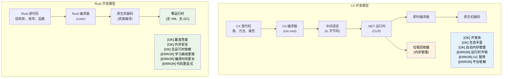

# 1. 导论与学习动机

## 讲师介绍与整体方式

- 讲师介绍
	- Microsoft SCHIE（Silicon and Cloud Hardware Infrastructure Engineering，硅与云硬件基础设施工程）团队的 Principal Firmware Architect
	- 资深行业从业者，专长覆盖安全、系统编程（固件、操作系统、虚拟机监控器）、CPU 与平台架构，以及 C++ 系统开发
	- 2017 年在 AWS EC2 开始使用 Rust 编程，此后一直非常喜欢这门语言
- 本课程会尽可能保持互动
	- 默认前提：你了解 C# 和 .NET 开发
	- 示例会刻意把 C# 概念映射到 Rust 中的对应概念
	- **任何时候都欢迎提出澄清问题**

---

## 面向 C# 开发者的 Rust 价值

> **你将学到什么：** 为什么 Rust 对 C# 开发者有意义：托管代码与原生代码之间的性能差距，Rust 如何在编译期消除空引用异常和隐藏控制流，以及 Rust 适合补充或替代 C# 的关键场景。
>
> **难度：** 🟢 初级

### 没有运行时税的性能

```csharp
// C# - 生产力很高，但有运行时开销
public class DataProcessor
{
	private List<int> data = new List<int>();
    
	public void ProcessLargeDataset()
	{
		// 分配会触发 GC
		for (int i = 0; i < 10_000_000; i++)
		{
			data.Add(i * 2); // GC 压力
		}
		// 处理过程中可能出现不可预测的 GC 暂停
	}
}
// 运行时间：可变（因 GC 约 50-200ms）
// 内存：约 80MB（包括 GC 开销）
// 可预测性：低（GC 暂停）
```

```rust
// Rust - 同样有表达力，但没有运行时开销
struct DataProcessor {
	data: Vec<i32>,
}

impl DataProcessor {
	fn process_large_dataset(&mut self) {
		// 零成本抽象
		for i in 0..10_000_000 {
			self.data.push(i * 2); // 没有 GC 压力
		}
		// 确定性的性能
	}
}
// 运行时间：稳定（约 30ms）
// 内存：约 40MB（精确分配）
// 可预测性：高（没有 GC）
```

### 没有运行时检查的内存安全

```csharp
// C# - 运行时安全，但有开销
public class RuntimeCheckedOperations
{
	public string? ProcessArray(int[] array)
	{
		// 每次访问都有运行时边界检查
		if (array.Length > 0)
		{
			return array[0].ToString(); // 安全：int 是值类型，永远不为 null
		}
		return null; // 可空返回值（C# 8+ 可空引用类型中的 string?）
	}
    
	public void ProcessConcurrently()
	{
		var list = new List<int>();
        
		// 可能发生数据竞争，需要小心加锁
		Parallel.For(0, 1000, i =>
		{
			lock (list) // 运行时开销
			{
				list.Add(i);
			}
		});
	}
}
```

```rust
// Rust - 编译期安全，零运行时成本
struct SafeOperations;

impl SafeOperations {
	// 编译期空值安全，没有运行时检查
	fn process_array(array: &[i32]) -> Option<String> {
		array.first().map(|x| x.to_string())
		// 不可能出现空引用
		// 在可以证明安全时，边界检查会被优化掉
	}
    
	fn process_concurrently() {
		use std::sync::{Arc, Mutex};
		use std::thread;
        
		let data = Arc::new(Mutex::new(Vec::new()));
        
		// 编译期阻止数据竞争
		let handles: Vec<_> = (0..1000).map(|i| {
			let data = Arc::clone(&data);
			thread::spawn(move || {
				data.lock().unwrap().push(i);
			})
		}).collect();
        
		for handle in handles {
			handle.join().unwrap();
		}
	}
}
```

***

## Rust 解决的常见 C# 痛点

### 1. 十亿美元错误：空引用

```csharp
// C# - 空引用异常是运行时炸弹
public class UserService
{
	public string GetUserDisplayName(User user)
	{
		// 这些位置任意一个都可能抛出 NullReferenceException
		return user.Profile.DisplayName.ToUpper();
		//     ^^^^^ ^^^^^^^ ^^^^^^^^^^^ ^^^^^^^
		//     运行时可能为 null
	}
    
	// 可空引用类型（C# 8+）有帮助，但 null 仍然可能漏进来
	public string GetDisplayName(User? user)
	{
		return user?.Profile?.DisplayName?.ToUpper() ?? "Unknown";
		// 这一行依靠 ?. 和 ?? 实现了空值安全，
		// 但 NRT 只是建议性约束，编译器可以被 `!` 覆盖
	}
}
```

```rust
// Rust - 编译期保证空值安全
struct UserService;

impl UserService {
	fn get_user_display_name(user: &User) -> Option<String> {
		user.profile.as_ref()?
			.display_name.as_ref()
			.map(|name| name.to_uppercase())
		// 编译器强制你处理 None 情况
		// 不可能出现空指针异常
	}
    
	fn get_display_name_safe(user: Option<&User>) -> String {
		user.and_then(|u| u.profile.as_ref())
			.and_then(|p| p.display_name.as_ref())
			.map(|name| name.to_uppercase())
			.unwrap_or_else(|| "Unknown".to_string())
		// 显式处理，没有意外
	}
}
```

### 2. 隐藏异常与控制流

```csharp
// C# - 异常可能从任何地方抛出
public async Task<UserData> GetUserDataAsync(int userId)
{
	// 每一行都可能抛出不同异常
	var user = await userRepository.GetAsync(userId);        // SqlException
	var permissions = await permissionService.GetAsync(user); // HttpRequestException  
	var preferences = await preferenceService.GetAsync(user); // TimeoutException
    
	return new UserData(user, permissions, preferences);
	// 调用方不知道应该预期哪些异常
}
```

```rust
// Rust - 所有错误都显式出现在函数签名中
#[derive(Debug)]
enum UserDataError {
	DatabaseError(String),
	NetworkError(String),
	Timeout,
	UserNotFound(i32),
}

async fn get_user_data(user_id: i32) -> Result<UserData, UserDataError> {
	// 所有错误都显式且已处理
	let user = user_repository.get(user_id).await
		.map_err(UserDataError::DatabaseError)?;
    
	let permissions = permission_service.get(&user).await
		.map_err(UserDataError::NetworkError)?;
    
	let preferences = preference_service.get(&user).await
		.map_err(|_| UserDataError::Timeout)?;
    
	Ok(UserData::new(user, permissions, preferences))
	// 调用方准确知道可能出现哪些错误
}
```

### 3. 正确性：把类型系统当作证明引擎

Rust 的类型系统可以在编译期捕获整类逻辑错误，而这些错误在 C# 中只能到运行时才能发现，甚至完全发现不了。

#### ADT 与 sealed class 权宜方案

```csharp
// C# — 判别联合需要 sealed class 样板代码。
// 只有没有 _ 兜底分支时，编译器才会警告缺失情况（CS8524）。
// 实践中，大多数 C# 代码会用 _ 作为默认分支，这会消除警告。
public abstract record Shape;
public sealed record Circle(double Radius)   : Shape;
public sealed record Rectangle(double W, double H) : Shape;
public sealed record Triangle(double A, double B, double C) : Shape;

public static double Area(Shape shape) => shape switch
{
	Circle c    => Math.PI * c.Radius * c.Radius,
	Rectangle r => r.W * r.H,
	// 忘了 Triangle？_ 兜底分支会屏蔽所有编译器警告。
	_           => throw new ArgumentException("Unknown shape")
};
// 六个月后新增一个变体，_ 模式会隐藏缺失分支。
// 编译器不会告诉你还有 47 个 switch 表达式需要更新。
```

```rust
// Rust — ADT + 穷尽匹配 = 编译期证明
enum Shape {
	Circle { radius: f64 },
	Rectangle { w: f64, h: f64 },
	Triangle { a: f64, b: f64, c: f64 },
}

fn area(shape: &Shape) -> f64 {
	match shape {
		Shape::Circle { radius }    => std::f64::consts::PI * radius * radius,
		Shape::Rectangle { w, h }   => w * h,
		// 忘了 Triangle？错误：非穷尽模式
		Shape::Triangle { a, b, c } => {
			let s = (a + b + c) / 2.0;
			(s * (s - a) * (s - b) * (s - c)).sqrt()
		}
	}
}
// 新增一个变体后，编译器会指出每一个需要更新的 match。
```

#### 默认不可变与选择性可变

```csharp
// C# — 默认一切都可变
public class Config
{
	public string Host { get; set; }   // 默认可变
	public int Port { get; set; }
}

// "readonly" 和 "record" 有帮助，但无法阻止深层可变：
public record ServerConfig(string Host, int Port, List<string> AllowedOrigins);

var config = new ServerConfig("localhost", 8080, new List<string> { "*.example.com" });
// record 看似“不可变”，但引用类型字段不是：
config.AllowedOrigins.Add("*.evil.com"); // 编译通过并发生变更！← bug
// 编译器不会给出任何警告。
```

```rust
// Rust — 默认不可变，修改必须显式且可见
struct Config {
	host: String,
	port: u16,
	allowed_origins: Vec<String>,
}

let config = Config {
	host: "localhost".into(),
	port: 8080,
	allowed_origins: vec!["*.example.com".into()],
};

// config.allowed_origins.push("*.evil.com".into()); // 错误：不能以可变方式借用

// 修改需要显式选择：
let mut config = config;
config.allowed_origins.push("*.safe.com".into()); // OK — 可变性清晰可见

// 签名里的 "mut" 告诉每个读者：“这个函数会修改数据”
fn add_origin(config: &mut Config, origin: String) {
	config.allowed_origins.push(origin);
}
```

#### 函数式编程：一等公民与事后补上的能力

```csharp
// C# — 函数式能力是后加的；LINQ 很有表达力，但语言本身并不总是配合
public IEnumerable<Order> GetHighValueOrders(IEnumerable<Order> orders)
{
	return orders
		.Where(o => o.Total > 1000)   // Func<Order, bool> — 堆分配的委托
		.Select(o => new OrderSummary  // 匿名类型或额外类
		{
			Id = o.Id,
			Total = o.Total
		})
		.OrderByDescending(o => o.Total);
	// 结果上没有穷尽匹配
	// null 可能在管道任意位置混进来
	// 无法强制纯函数：任何 lambda 都可能有副作用
}
```

```rust
// Rust — 函数式编程是一等公民
fn get_high_value_orders(orders: &[Order]) -> Vec<OrderSummary> {
	orders.iter()
		.filter(|o| o.total > 1000)      // 零成本闭包，无堆分配
		.map(|o| OrderSummary {           // 经过类型检查的结构体
			id: o.id,
			total: o.total,
		})
		.sorted_by(|a, b| b.total.cmp(&a.total)) // itertools
		.collect()
	// 管道中完全没有 null
	// 闭包会被单态化：与手写循环相比没有额外开销
	// 纯度得到约束：&[Order] 表示函数不能修改 orders
}
```

#### 继承：理论上优雅，实践中脆弱

```csharp
// C# — 脆弱基类问题
public class Animal
{
	public virtual string Speak() => "...";
	public void Greet() => Console.WriteLine($"I say: {Speak()}");
}

public class Dog : Animal
{
	public override string Speak() => "Woof!";
}

public class RobotDog : Dog
{
	// Greet() 调用的是哪个 Speak()？如果 Dog 改了会怎样？
	// 接口 + 默认方法也会遇到菱形问题
	// 紧耦合：修改 Animal 可能静默破坏 RobotDog
}

// 常见 C# 反模式：
// - 拥有 20 个虚方法的上帝基类
// - 深层级继承（5 层以上），没人能完整推理
// - "protected" 字段制造隐藏耦合
// - 基类变化静默改变派生类行为
```

```rust
// Rust — 语言层面鼓励组合优于继承
trait Speaker {
	fn speak(&self) -> &str;
}

trait Greeter: Speaker {
	fn greet(&self) {
		println!("I say: {}", self.speak());
	}
}

struct Dog;
impl Speaker for Dog {
	fn speak(&self) -> &str { "Woof!" }
}
impl Greeter for Dog {} // 使用默认 greet()

struct RobotDog {
	voice: String, // 组合：拥有自己的数据
}
impl Speaker for RobotDog {
	fn speak(&self) -> &str { &self.voice }
}
impl Greeter for RobotDog {} // 清晰、显式的行为

// 没有脆弱基类问题，因为根本没有基类
// 没有隐藏耦合，trait 是显式契约
// 没有菱形问题，trait 一致性规则会阻止歧义
// 给 Speaker 添加方法？编译器会告诉你每个需要实现的位置。
```

> **关键洞察**：在 C# 中，正确性是一种纪律：你希望开发者遵守约定、编写测试，并在代码审查中发现边界情况。  
> 在 Rust 中，正确性是**类型系统的属性**：空引用、遗忘变体、意外修改、数据竞争等整类 bug 在结构上就不可能出现。

***

### 4. GC 导致的不可预测性能

```csharp
// C# - GC 可能在任何时候暂停
public class HighFrequencyTrader
{
	private List<Trade> trades = new List<Trade>();
    
	public void ProcessMarketData(MarketTick tick)
	{
		// 分配可能在最糟糕的时间点触发 GC
		var analysis = new MarketAnalysis(tick);
		trades.Add(new Trade(analysis.Signal, tick.Price));
        
		// GC 可能在关键市场时刻暂停这里
		// 暂停时长：取决于堆大小，可能是 1-100ms
	}
}
```

```rust
// Rust - 可预测、确定性的性能
struct HighFrequencyTrader {
	trades: Vec<Trade>,
}

impl HighFrequencyTrader {
	fn process_market_data(&mut self, tick: MarketTick) {
		// 在把 `tick` 移入 analysis 之前先取出 Copy 字段
		let price = tick.price;

		// 零分配，可预测性能
		let analysis = MarketAnalysis::from(tick);
		self.trades.push(Trade::new(analysis.signal(), price));
        
		// 没有 GC 暂停，延迟稳定在亚微秒级
		// 性能由类型系统保证
	}
}
```

***

## 何时选择 Rust 而不是 C#

### 选择 Rust 的场景

- **正确性很重要**：状态机、协议实现、金融逻辑等，一处遗漏就是生产事故，而不只是测试失败
- **性能至关重要**：实时系统、高频交易、游戏引擎
- **内存使用很重要**：嵌入式系统、云成本、移动应用
- **需要可预测性**：医疗设备、汽车、金融系统
- **安全性最关键**：密码学、网络安全、系统级代码
- **长时间运行的服务**：GC 暂停会造成问题的场景
- **资源受限环境**：IoT、边缘计算
- **系统编程**：CLI 工具、数据库、Web 服务器、操作系统

### 继续使用 C# 的场景

- **快速应用开发**：业务应用、CRUD 应用
- **大型既有代码库**：迁移成本过高
- **团队专长**：Rust 学习曲线无法抵消收益
- **企业集成**：重度依赖 .NET Framework 或 Windows
- **GUI 应用**：WPF、WinUI、Blazor 生态
- **上市时间优先**：开发速度比性能更重要

### 同时考虑两者：混合方式

- **性能关键组件使用 Rust**：通过 P/Invoke 从 C# 调用
- **业务逻辑使用 C#**：熟悉、高效的开发体验
- **渐进式迁移**：从新的服务开始使用 Rust

***

## 现实影响：为什么公司选择 Rust

### Dropbox：存储基础设施

- **之前（Python）**：CPU 使用率高，内存开销大
- **之后（Rust）**：性能提升 10 倍，内存减少 50%
- **结果**：节省数百万基础设施成本

### Discord：语音/视频后端

- **之前（Go）**：GC 暂停导致音频丢失
- **之后（Rust）**：稳定的低延迟性能
- **结果**：更好的用户体验，更低的服务器成本

### Microsoft：Windows 组件

- **Windows 中的 Rust**：文件系统、网络栈组件
- **收益**：不牺牲性能的内存安全
- **影响**：更少的安全漏洞，同样的性能

### 这对 C# 开发者意味着什么

1. **互补技能**：Rust 和 C# 解决的问题不同
2. **职业成长**：系统编程能力越来越有价值
3. **性能理解**：学习零成本抽象
4. **安全思维**：把所有权思维应用到任何语言中
5. **云成本**：性能会直接影响基础设施支出

***

## 语言哲学对比

### C# 的哲学

- **生产力优先**：丰富工具、庞大框架、“成功之坑”
- **托管运行时**：垃圾回收自动处理内存
- **面向企业**：强类型配合反射，标准库丰富
- **面向对象**：类、继承、接口是主要抽象

### Rust 的哲学

- **不牺牲性能**：零成本抽象，没有运行时开销
- **内存安全**：编译期保证防止崩溃和安全漏洞
- **系统编程**：用高级抽象直接访问硬件
- **函数式 + 系统级**：默认不可变，基于所有权管理资源



***

## 速查：Rust 与 C#

| **概念** | **C#** | **Rust** | **关键差异** |
|----------|--------|----------|--------------|
| 内存管理 | 垃圾回收器 | 所有权系统 | 零成本、确定性清理 |
| 空引用 | 到处都可能有 `null` | `Option<T>` | 编译期空值安全 |
| 错误处理 | 异常 | `Result<T, E>` | 显式，没有隐藏控制流 |
| 可变性 | 默认可变 | 默认不可变 | 选择性开启修改 |
| 类型系统 | 引用类型/值类型 | 所有权类型 | 移动语义、借用 |
| 程序集 | GAC、应用程序域（.NET Framework）；并行版本（.NET 5+） | crate | 静态链接，无运行时 |
| 命名空间 | `using System.IO` | `use std::fs` | 模块系统 |
| 接口 | `interface IFoo` | `trait Foo` | 默认实现 |
| 泛型 | `List<T>`（可用 `where` 添加可选约束） | `Vec<T>`（如 `T: Clone` 的 trait bound） | 零成本抽象 |
| 线程 | 锁、async/await | 所有权 + Send/Sync | 防止数据竞争 |
| 性能 | JIT 编译 | AOT 编译 | 可预测，没有 GC 暂停 |

***
