# 真正的不可变性与 record 的错觉

<a id="true-immutability-vs-record-illusions"></a>

## 真正的不可变性与 record 的错觉

> **你将学到什么：** 为什么 C# 的 `record` 类型并不是真正不可变（可变字段、反射绕过），Rust 如何在编译期强制真正的不可变性，以及什么时候使用内部可变性模式。
>
> **难度：** 🟡 中级

### C# Record：不可变性的表演

```csharp
// C# record 看起来不可变，但仍有逃逸口
public record Person(string Name, int Age, List<string> Hobbies);

var person = new Person("John", 30, new List<string> { "reading" });

// 这些写法看起来都会创建新实例：
var older = person with { Age = 31 };  // 新 record
var renamed = person with { Name = "Jonathan" };  // 新 record

// 但引用类型仍然可变！
person.Hobbies.Add("gaming");  // 修改了原始对象！
Console.WriteLine(older.Hobbies.Count);  // 2 - older 也受影响！
Console.WriteLine(renamed.Hobbies.Count); // 2 - renamed 也受影响！

// init-only 属性仍然可以通过反射设置
typeof(Person).GetProperty("Age")?.SetValue(person, 25);

// 集合表达式有帮助，但不能解决根本问题
public record BetterPerson(string Name, int Age, IReadOnlyList<string> Hobbies);

var betterPerson = new BetterPerson("Jane", 25, new List<string> { "painting" });
// 仍然可以通过类型转换修改：
((List<string>)betterPerson.Hobbies).Add("hacking the system");

// 即便是“不可变”集合，也不是真正意义上的语言级不可变
using System.Collections.Immutable;
public record SafePerson(string Name, int Age, ImmutableList<string> Hobbies);
// 这更好，但需要纪律，也有性能开销
```

### Rust：默认真正不可变

```rust
#[derive(Debug, Clone)]
struct Person {
	name: String,
	age: u32,
	hobbies: Vec<String>,
}

let person = Person {
	name: "John".to_string(),
	age: 30,
	hobbies: vec!["reading".to_string()],
};

// 这些代码根本不会通过编译：
// person.age = 31;  // 错误：不能给不可变字段赋值
// person.hobbies.push("gaming".to_string());  // 错误：不能以可变方式借用

// 如果要修改，必须显式用 'mut' 选择加入：
let mut older_person = person.clone();
older_person.age = 31;  // 现在很清楚：这是修改

// 或者使用函数式更新模式：
let renamed = Person {
	name: "Jonathan".to_string(),
	..person  // 复制其他字段（会应用移动语义）
};

// 原始值保证保持不变（直到被移动）：
println!("{:?}", person.hobbies);  // 永远是 ["reading"]，不可变

// 使用高效不可变数据结构进行结构共享
use std::rc::Rc;

#[derive(Debug, Clone)]
struct EfficientPerson {
	name: String,
	age: u32,
	hobbies: Rc<Vec<String>>,  // 共享的不可变引用
}

// 创建新版本时可以高效共享数据
let person1 = EfficientPerson {
	name: "Alice".to_string(),
	age: 30,
	hobbies: Rc::new(vec!["reading".to_string(), "cycling".to_string()]),
};

let person2 = EfficientPerson {
	name: "Bob".to_string(),
	age: 25,
	hobbies: Rc::clone(&person1.hobbies),  // 共享引用，不做深拷贝
};
```



```mermaid
graph TD
	subgraph "C# Record：浅层不可变"
		CS_RECORD["record Person(...)"]
		CS_WITH["with 表达式"]
		CS_SHALLOW["⚠️ 只有顶层不可变"]
		CS_REF_MUT["❌ 引用类型仍然可变"]
		CS_REFLECTION["❌ 反射可以绕过"]
		CS_RUNTIME["❌ 运行时意外"]
		CS_DISCIPLINE["😓 需要团队纪律"]
        
		CS_RECORD --> CS_WITH
		CS_WITH --> CS_SHALLOW
		CS_SHALLOW --> CS_REF_MUT
		CS_RECORD --> CS_REFLECTION
		CS_REF_MUT --> CS_RUNTIME
		CS_RUNTIME --> CS_DISCIPLINE
	end
    
	subgraph "Rust：真正不可变"
		RUST_STRUCT["struct Person { ... }"]
		RUST_DEFAULT["✅ 默认不可变"]
		RUST_COMPILE["✅ 编译期强制"]
		RUST_MUT["🔒 必须显式使用 'mut'"]
		RUST_MOVE["🔄 移动语义"]
		RUST_LOW_COST["⚡ 无额外运行时检查"]
		RUST_SAFE["🛡️ 内存安全"]
        
		RUST_STRUCT --> RUST_DEFAULT
		RUST_DEFAULT --> RUST_COMPILE
		RUST_COMPILE --> RUST_MUT
		RUST_MUT --> RUST_MOVE
		RUST_MOVE --> RUST_LOW_COST
		RUST_LOW_COST --> RUST_SAFE
	end
    
	style CS_REF_MUT fill:#ffcdd2,color:#000
	style CS_REFLECTION fill:#ffcdd2,color:#000
	style CS_RUNTIME fill:#ffcdd2,color:#000
	style RUST_COMPILE fill:#c8e6c9,color:#000
	style RUST_ZERO fill:#c8e6c9,color:#000
	style RUST_SAFE fill:#c8e6c9,color:#000
```

---

## 练习

<details>
<summary><strong>🏋️ 练习：证明不可变性</strong>（点击展开）</summary>

一位 C# 同事声称他们的 `record` 是不可变的。把下面这段 C# 代码翻译成 Rust，并解释为什么 Rust 版本是真正不可变的：

```csharp
public record Config(string Host, int Port, List<string> AllowedOrigins);

var config = new Config("localhost", 8080, new List<string> { "example.com" });
// “不可变”的 record……但是：
config.AllowedOrigins.Add("evil.com"); // 能编译！List 是可变的。
```

1. 创建一个等价的 Rust 结构体，并让它**真正**不可变。
2. 展示尝试修改 `allowed_origins` 会产生**编译错误**。
3. 编写一个函数，在不修改原值的情况下创建一个改了 host 的副本。

<details>
<summary>🔑 参考答案</summary>

```rust
#[derive(Debug, Clone)]
struct Config {
	host: String,
	port: u16,
	allowed_origins: Vec<String>,
}

impl Config {
	fn with_host(&self, host: impl Into<String>) -> Self {
		Config {
			host: host.into(),
			..self.clone()
		}
	}
}

fn main() {
	let config = Config {
		host: "localhost".into(),
		port: 8080,
		allowed_origins: vec!["example.com".into()],
	};

	// config.allowed_origins.push("evil.com".into());
	// ❌ 错误：不能以可变方式借用 `config.allowed_origins`

	let production = config.with_host("prod.example.com");
	println!("Dev: {:?}", config);       // 原始值未改变
	println!("Prod: {:?}", production);  // 使用不同 host 的新副本
}
```

**关键洞察**：在 Rust 中，`let config = ...`（没有 `mut`）会让**整个值树**不可变，包括嵌套的 `Vec`。C# record 只让**引用**不可变，而不是让引用指向的内容不可变。

</details>
</details>

***
