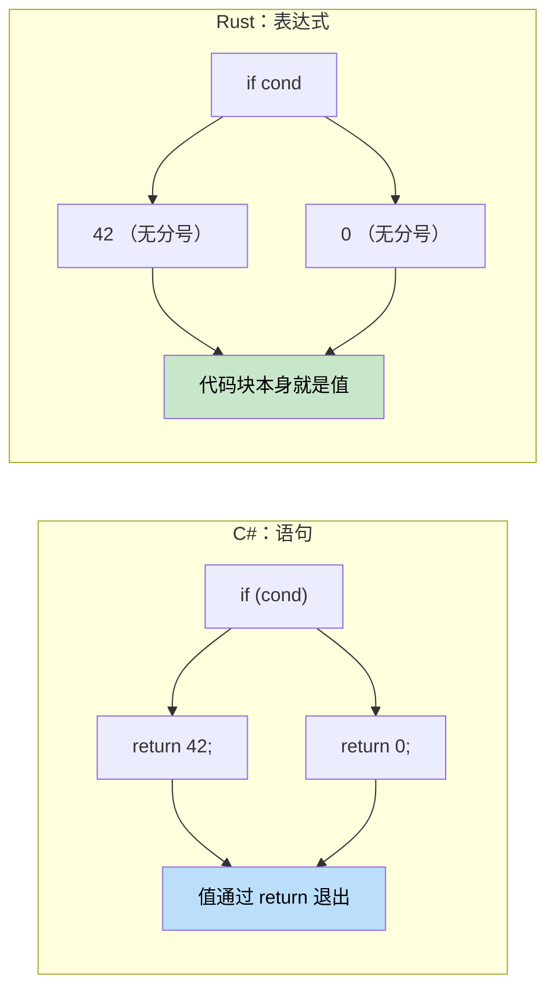

# 4. 控制流

<a id="functions-vs-methods"></a>

## 函数与方法

> **你将学到什么：** Rust 与 C# 中函数和方法的差异，表达式与语句之间的关键区别，`if`/`match`/`loop`/`while`/`for` 语法，以及 Rust 面向表达式的设计如何消除对三元运算符的需求。
>
> **难度：** 🟢 初级

### C# 函数声明

```csharp
// C# - 类中的方法
public class Calculator
{
	// 实例方法
	public int Add(int a, int b)
	{
		return a + b;
	}
    
	// 静态方法
	public static int Multiply(int a, int b)
	{
		return a * b;
	}
    
	// 带 ref 参数的方法
	public void Increment(ref int value)
	{
		value++;
	}
}
```

### Rust 函数声明

```rust
// Rust - 独立函数
fn add(a: i32, b: i32) -> i32 {
	a + b  // 最后一个表达式不需要 'return'
}

fn multiply(a: i32, b: i32) -> i32 {
	return a * b;  // 显式 return 也可以
}

// 带可变引用的函数
fn increment(value: &mut i32) {
	*value += 1;
}

fn main() {
	let result = add(5, 3);
	println!("5 + 3 = {}", result);
    
	let mut x = 10;
	increment(&mut x);
	println!("After increment: {}", x);
}
```

<a id="expression-vs-statement-important"></a>

### 表达式与语句（很重要！）



```csharp
// C# - 语句与表达式
public int GetValue()
{
	if (condition)
	{
		return 42;  // 语句
	}
	return 0;       // 语句
}
```

```rust
// Rust - 几乎所有东西都可以是表达式
fn get_value(condition: bool) -> i32 {
	if condition {
		42  // 表达式（没有分号）
	} else {
		0   // 表达式（没有分号）
	}
	// if-else 代码块本身是一个返回值的表达式
}

// 甚至可以更简单
fn get_value_ternary(condition: bool) -> i32 {
	if condition { 42 } else { 0 }
}
```

### 函数参数与返回类型

```rust
// 无参数、无返回值（返回 unit 类型 ()）
fn say_hello() {
	println!("Hello!");
}

// 多个参数
fn greet(name: &str, age: u32) {
	println!("{} is {} years old", name, age);
}

// 使用元组返回多个值
fn divide_and_remainder(dividend: i32, divisor: i32) -> (i32, i32) {
	(dividend / divisor, dividend % divisor)
}

fn main() {
	let (quotient, remainder) = divide_and_remainder(10, 3);
	println!("10 ÷ 3 = {} remainder {}", quotient, remainder);
}
```

***

## 控制流基础

<a id="conditional-statements"></a>

### 条件语句

```csharp
// C# if 语句
int x = 5;
if (x > 10)
{
	Console.WriteLine("Big number");
}
else if (x > 5)
{
	Console.WriteLine("Medium number");
}
else
{
	Console.WriteLine("Small number");
}

// C# 三元运算符
string message = x > 10 ? "Big" : "Small";
```

```rust
// Rust if 表达式
let x = 5;
if x > 10 {
	println!("Big number");
} else if x > 5 {
	println!("Medium number");
} else {
	println!("Small number");
}

// Rust 把 if 当作表达式使用（类似三元运算符）
let message = if x > 10 { "Big" } else { "Small" };

// 多个条件
let message = if x > 10 {
	"Big"
} else if x > 5 {
	"Medium"
} else {
	"Small"
};
```

<a id="loops"></a>

### 循环

```csharp
// C# 循环
// for 循环
for (int i = 0; i < 5; i++)
{
	Console.WriteLine(i);
}

// foreach 循环
var numbers = new[] { 1, 2, 3, 4, 5 };
foreach (var num in numbers)
{
	Console.WriteLine(num);
}

// while 循环
int count = 0;
while (count < 3)
{
	Console.WriteLine(count);
	count++;
}
```

```rust
// Rust 循环
// 基于范围的 for 循环
for i in 0..5 {  // 0 到 4（不包含结束值）
	println!("{}", i);
}

// 遍历集合
let numbers = vec![1, 2, 3, 4, 5];
for num in numbers {  // 取得所有权
	println!("{}", num);
}

// 遍历引用（更常见）
let numbers = vec![1, 2, 3, 4, 5];
for num in &numbers {  // 借用元素
	println!("{}", num);
}

// while 循环
let mut count = 0;
while count < 3 {
	println!("{}", count);
	count += 1;
}

// 使用 break 的无限循环
let mut counter = 0;
loop {
	if counter >= 3 {
		break;
	}
	println!("{}", counter);
	counter += 1;
}
```

### 循环控制

```csharp
// C# 循环控制
for (int i = 0; i < 10; i++)
{
	if (i == 3) continue;
	if (i == 7) break;
	Console.WriteLine(i);
}
```

```rust
// Rust 循环控制
for i in 0..10 {
	if i == 3 { continue; }
	if i == 7 { break; }
	println!("{}", i);
}

// 循环标签（用于嵌套循环）
'outer: for i in 0..3 {
	'inner: for j in 0..3 {
		if i == 1 && j == 1 {
			break 'outer;  // 跳出外层循环
		}
		println!("i: {}, j: {}", i, j);
	}
}
```

***

<details>
<summary><strong>🏋️ 练习：温度转换器</strong>（点击展开）</summary>

**挑战**：把下面的 C# 程序转换为惯用 Rust。使用表达式、模式匹配和合适的错误处理。

```csharp
// C# — 把这段转换为 Rust
public static double Convert(double value, string from, string to)
{
	double celsius = from switch
	{
		"F" => (value - 32.0) * 5.0 / 9.0,
		"K" => value - 273.15,
		"C" => value,
		_ => throw new ArgumentException($"Unknown unit: {from}")
	};
	return to switch
	{
		"F" => celsius * 9.0 / 5.0 + 32.0,
		"K" => celsius + 273.15,
		"C" => celsius,
		_ => throw new ArgumentException($"Unknown unit: {to}")
	};
}
```

<details>
<summary>🔑 参考答案</summary>

```rust
#[derive(Debug, Clone, Copy)]
enum TempUnit { Celsius, Fahrenheit, Kelvin }

fn parse_unit(s: &str) -> Result<TempUnit, String> {
	match s {
		"C" => Ok(TempUnit::Celsius),
		"F" => Ok(TempUnit::Fahrenheit),
		"K" => Ok(TempUnit::Kelvin),
		_   => Err(format!("Unknown unit: {s}")),
	}
}

fn convert(value: f64, from: TempUnit, to: TempUnit) -> f64 {
	let celsius = match from {
		TempUnit::Fahrenheit => (value - 32.0) * 5.0 / 9.0,
		TempUnit::Kelvin     => value - 273.15,
		TempUnit::Celsius    => value,
	};
	match to {
		TempUnit::Fahrenheit => celsius * 9.0 / 5.0 + 32.0,
		TempUnit::Kelvin     => celsius + 273.15,
		TempUnit::Celsius    => celsius,
	}
}

fn main() -> Result<(), String> {
	let from = parse_unit("F")?;
	let to   = parse_unit("C")?;
	println!("212°F = {:.1}°C", convert(212.0, from, to));
	Ok(())
}
```

**关键要点**：

- enum 取代魔法字符串，穷尽匹配会在编译期捕获遗漏的单位。
- `Result<T, E>` 取代异常，调用者能从签名中看到可能失败。
- `match` 是会返回值的表达式，因此不需要 `return` 语句。

</details>
</details>
