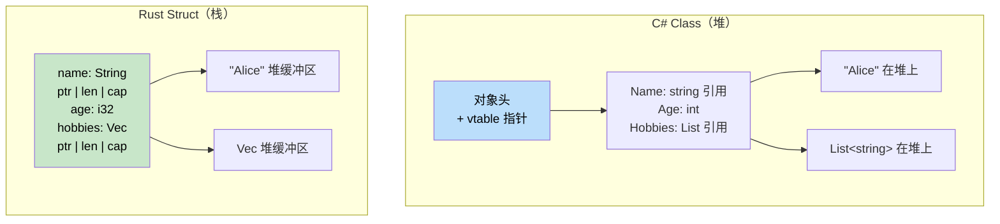

# 5. 数据结构与集合

<a id="tuples-and-destructuring"></a>

## 元组与解构

> **你将学到什么：** Rust 元组与 C# `ValueTuple` 的对比，数组与切片，结构体与类，使用 newtype 模式以零成本类型安全进行领域建模，以及解构语法。
>
> **难度：** 🟢 初级

C# 从 C# 7 开始提供 `ValueTuple`。Rust 元组与它类似，但更深地集成在语言中。

### C# 元组

```csharp
// C# ValueTuple（C# 7+）
var point = (10, 20);                         // (int, int)
var named = (X: 10, Y: 20);                   // 命名元素
Console.WriteLine($"{named.X}, {named.Y}");

// 元组作为返回类型
public (int Quotient, int Remainder) Divide(int a, int b)
{
	return (a / b, a % b);
}

var (q, r) = Divide(10, 3);    // 解构
Console.WriteLine($"{q} remainder {r}");

// 丢弃值
var (_, remainder) = Divide(10, 3);  // 忽略 quotient
```

### Rust 元组

```rust
// Rust 元组：默认不可变，没有命名元素
let point = (10, 20);                // (i32, i32)
let point3d: (f64, f64, f64) = (1.0, 2.0, 3.0);

// 按索引访问（从 0 开始）
println!("x={}, y={}", point.0, point.1);

// 元组作为返回类型
fn divide(a: i32, b: i32) -> (i32, i32) {
	(a / b, a % b)
}

let (q, r) = divide(10, 3);       // 解构
println!("{q} remainder {r}");

// 用 _ 丢弃值
let (_, remainder) = divide(10, 3);

// Unit 类型 ()：“空元组”（类似 C# void）
fn greet() {          // 隐式返回类型是 ()
	println!("hi");
}
```

### 关键差异

| 特性 | C# `ValueTuple` | Rust 元组 |
|------|-----------------|-----------|
| 命名元素 | `(int X, int Y)` | 不支持，使用结构体 |
| 最大元素数 | 约 8 个（更多时嵌套） | 无固定上限（实践中约 12 个以内） |
| 比较 | 自动 | 12 个以内元素的元组可自动比较 |
| 用作字典键 | 可以 | 可以（如果元素实现 `Hash`） |
| 从函数返回 | 常见 | 常见 |
| 可变元素 | 总是可变 | 只有 `let mut` 时可变 |

### 元组结构体（Newtype）

```rust
// 当普通元组不够描述语义时，使用元组结构体：
struct Meters(f64);     // 单字段 “newtype” 包装器
struct Celsius(f64);
struct Fahrenheit(f64);

// 编译器会把这些视为不同类型：
let distance = Meters(100.0);
let temp = Celsius(36.6);
// distance == temp;  // ❌ 错误：不能比较 Meters 和 Celsius

// Newtype 模式可以在编译期防止单位混淆 bug！
// 在 C# 中，你需要完整 class/struct 才能获得同样的安全性。
```

```csharp
// C# 等价写法需要更多仪式感：
public readonly record struct Meters(double Value);
public readonly record struct Celsius(double Value);
// 不可互换，但 record 相比 Rust 零成本 newtype 有更多开销
```

### 深入 Newtype 模式：以零成本进行领域建模

Newtype 不只是防止单位混淆。它是 Rust 把**业务规则编码进类型系统**的主要工具，可以替代 C# 中常见的“guard clause”和“validation class”模式。

#### C# 校验方式：运行时 guard

```csharp
// C# — 校验发生在运行时，而且每次都要做
public class UserService
{
	public User CreateUser(string email, int age)
	{
		if (string.IsNullOrWhiteSpace(email) || !email.Contains('@'))
			throw new ArgumentException("Invalid email");
		if (age < 0 || age > 150)
			throw new ArgumentException("Invalid age");

		return new User { Email = email, Age = age };
	}

	public void SendEmail(string email)
	{
		// 必须重新校验，还是信任调用者？
		if (!email.Contains('@')) throw new ArgumentException("Invalid email");
		// ...
	}
}
```

#### Rust Newtype 方式：编译期证明

```rust
/// 已校验的邮箱地址：这个类型本身就是有效性的证明。
#[derive(Debug, Clone, PartialEq, Eq, Hash)]
pub struct Email(String);

impl Email {
	/// 创建 Email 的唯一方式：只在构造时校验一次。
	pub fn new(raw: &str) -> Result<Self, &'static str> {
		if raw.contains('@') && raw.len() > 3 {
			Ok(Email(raw.to_lowercase()))
		} else {
			Err("invalid email format")
		}
	}

	/// 安全访问内部值
	pub fn as_str(&self) -> &str { &self.0 }
}

/// 已校验年龄：不可能创建无效值。
#[derive(Debug, Clone, Copy, PartialEq, Eq, PartialOrd, Ord)]
pub struct Age(u8);

impl Age {
	pub fn new(raw: u8) -> Result<Self, &'static str> {
		if raw <= 150 { Ok(Age(raw)) } else { Err("age out of range") }
	}
	pub fn value(&self) -> u8 { self.0 }
}

// 现在函数接收的是已经被证明过的类型，不需要重新校验！
fn create_user(email: Email, age: Age) -> User {
	// email 保证有效，这是类型不变量
	User { email, age }
}

fn send_email(to: &Email) {
	// 不需要校验，Email 类型已经证明它有效
	println!("Sending to: {}", to.as_str());
}
```

#### C# 开发者常见 Newtype 用法

| C# 模式 | Rust Newtype | 能防止什么 |
|---------|--------------|------------|
| 用 `string` 表示 UserId、Email 等 | `struct UserId(Uuid)` | 把错误字符串传给错误参数 |
| 用 `int` 表示 Port、Count、Index | `struct Port(u16)` | Port 和 Count 被混用 |
| 到处写 guard clause | 构造时校验一次 | 重复校验、漏校验 |
| 用 `decimal` 表示 USD、EUR | `struct Usd(Decimal)` | 意外把 USD 和 EUR 相加 |
| 用 `TimeSpan` 表示不同语义 | `struct Timeout(Duration)` | 把连接超时当成请求超时传入 |

```rust
// 零成本：newtype 会编译成与内部类型相同的汇编。
// 这段 Rust 代码：
struct UserId(u64);
fn lookup(id: UserId) -> Option<User> { /* ... */ }

// 生成的机器码等同于：
fn lookup(id: u64) -> Option<User> { /* ... */ }
// 但在编译期拥有完整类型安全！
```

***

<a id="arrays-and-slices"></a>

## 数组与切片

理解数组、切片和 vector 之间的区别非常关键。

### C# 数组

```csharp
// C# 数组
int[] numbers = new int[5];         // 固定大小，分配在堆上
int[] initialized = { 1, 2, 3, 4, 5 }; // 数组字面量

// 访问
numbers[0] = 10;
int first = numbers[0];

// 长度
int length = numbers.Length;

// 数组作为参数（引用类型）
void ProcessArray(int[] array)
{
	array[0] = 99;  // 修改原数组
}
```

### Rust 数组、切片与 Vector

```rust
// 1. 数组：固定大小，分配在栈上
let numbers: [i32; 5] = [1, 2, 3, 4, 5];  // 类型：[i32; 5]
let zeros = [0; 10];                       // 10 个 0

// 访问
let first = numbers[0];
// numbers[0] = 10;  // ❌ 错误：数组默认不可变

let mut mut_array = [1, 2, 3, 4, 5];
mut_array[0] = 10;  // ✅ 使用 mut 后可以修改

// 2. 切片：数组或 vector 的视图
let slice: &[i32] = &numbers[1..4];  // 元素 1、2、3
let all_slice: &[i32] = &numbers;    // 整个数组作为切片

// 3. Vector：动态大小，分配在堆上（前面已经介绍）
let mut vec = vec![1, 2, 3, 4, 5];
vec.push(6);  // 可以增长
```

### 切片作为函数参数

```csharp
// C# - 处理数组的方法
public void ProcessNumbers(int[] numbers)
{
	for (int i = 0; i < numbers.Length; i++)
	{
		Console.WriteLine(numbers[i]);
	}
}

// 只适用于数组
ProcessNumbers(new int[] { 1, 2, 3 });
```

```rust
// Rust - 适用于任何序列的函数
fn process_numbers(numbers: &[i32]) {  // 切片参数
	for (i, num) in numbers.iter().enumerate() {
		println!("Index {}: {}", i, num);
	}
}

fn main() {
	let array = [1, 2, 3, 4, 5];
	let vec = vec![1, 2, 3, 4, 5];
    
	// 同一个函数同时适用于二者！
	process_numbers(&array);      // 数组作为切片
	process_numbers(&vec);        // Vector 作为切片
	process_numbers(&vec[1..4]);  // 部分切片
}
```

### 再看字符串切片（&str）

```rust
// String 与 &str 的关系
fn string_slice_example() {
	let owned = String::from("Hello, World!");
	let slice: &str = &owned[0..5];      // "Hello"
	let slice2: &str = &owned[7..];      // "World!"
    
	println!("{}", slice);   // "Hello"
	println!("{}", slice2);  // "World!"
    
	// 接受任意字符串类型的函数
	print_string("String literal");      // &str
	print_string(&owned);               // String 作为 &str
	print_string(slice);                // &str 切片
}

fn print_string(s: &str) {
	println!("{}", s);
}
```

### 现代 C#：`Span<T>` 与 Inline Arrays

C# 已经不只有传统数组了。`Span<T>` 提供类型安全的连续内存视图，可以引用栈上或托管内存中的数据；Inline Arrays（C# 12）则提供固定大小的内联缓冲区，当值本身位于栈上时可以避免额外堆分配。

```csharp
// C# Span<T> - 连续内存视图
Span<int> span = stackalloc int[] { 1, 2, 3, 4, 5 };
span[0] = 10;

ReadOnlySpan<char> text = "Hello".AsSpan();

// 接受任意连续内存视图的方法
void ProcessSpan(ReadOnlySpan<int> data)
{
	for (int i = 0; i < data.Length; i++)
		Console.WriteLine(data[i]);
}

// Inline Arrays（C# 12）- 固定大小内联缓冲区
[InlineArray(5)]
struct IntBuffer
{
	private int _element;
}
```

```rust
// Rust &[T] / &mut [T] - 指向连续内存的借用视图
let mut array = [1, 2, 3, 4, 5];
let slice: &mut [i32] = &mut array;
slice[0] = 10;

let slice: &[i32] = &array;
let text: &str = "Hello";

// 接受任意顺序数据的函数
fn process_slice(data: &[i32]) {
	for (i, num) in data.iter().enumerate() {
		println!("Index {}: {}", i, num);
	}
}

// 固定大小数组（分配在栈上）
let buffer: [i32; 5] = [0; 5];
```

| C# | Rust |
|----|------|
| `Span<T>`（ref struct，不能装箱或存入普通堆对象字段） | `&mut [T]` / `&[T]`（借用切片） |
| `ReadOnlySpan<T>` | `&[T]`（不可变切片） |
| `ReadOnlySpan<char>` / `string.AsSpan()` | `&str`（字符串切片） |
| `[InlineArray(N)]` struct（C# 12） | `[T; N]`（固定大小数组） |
| 搭配 `Span<T>` 的 `stackalloc T[]` | `let arr: [T; N] = ...`（局部数组） |

> **关键洞察：** Rust 的 `&[T]` 结合了 C# 中 `ArraySegment<T>`、`Span<T>` 和 `ReadOnlySpan<T>` 的角色。它是一个胖指针（指针 + 长度），可用于数组、vector 和子切片。C# 的 Inline Arrays 与 Rust 的 `[T; N]` 都表达固定大小的内联存储；Rust 局部数组通常位于当前栈帧，放入堆分配结构时则随宿主值一起存放。

***

<a id="structs-vs-classes"></a>

## 结构体与类

Rust 中的结构体类似 C# 中的类，但在所有权和方法方面有一些关键差异。



> **关键洞察**：C# class 的常见实例模型是通过引用访问托管对象；对象通常位于托管堆上，并由 GC 管理。Rust 结构体默认按值保存，局部值通常直接位于当前栈帧中，只有动态大小的数据（例如 `String` 和 `Vec` 的缓冲区）进入堆。这能减少小型、频繁创建对象的分配和 GC 压力，但具体布局与优化仍取决于编译器和运行时。

### C# 类定义

```csharp
// 带属性和方法的 C# 类
public class Person
{
	public string Name { get; set; }
	public int Age { get; set; }
	public List<string> Hobbies { get; set; }
    
	public Person(string name, int age)
	{
		Name = name;
		Age = age;
		Hobbies = new List<string>();
	}
    
	public void AddHobby(string hobby)
	{
		Hobbies.Add(hobby);
	}
    
	public string GetInfo()
	{
		return $"{Name} is {Age} years old";
	}
}
```

### Rust 结构体定义

```rust
// 带关联函数和方法的 Rust 结构体
#[derive(Debug)]  // 自动实现 Debug trait
pub struct Person {
	pub name: String,    // 公开字段
	pub age: u32,        // 公开字段
	hobbies: Vec<String>, // 私有字段（没有 pub）
}

impl Person {
	// 关联函数（类似静态方法）
	pub fn new(name: String, age: u32) -> Person {
		Person {
			name,
			age,
			hobbies: Vec::new(),
		}
	}
    
	// 方法（接收 &self、&mut self 或 self）
	pub fn add_hobby(&mut self, hobby: String) {
		self.hobbies.push(hobby);
	}
    
	// 不可变借用的方法
	pub fn get_info(&self) -> String {
		format!("{} is {} years old", self.name, self.age)
	}
    
	// 私有字段的 getter
	pub fn hobbies(&self) -> &Vec<String> {
		&self.hobbies
	}
}
```

### 创建与使用实例

```csharp
// C# 对象创建和使用
var person = new Person("Alice", 30);
person.AddHobby("Reading");
person.AddHobby("Swimming");

Console.WriteLine(person.GetInfo());
Console.WriteLine($"Hobbies: {string.Join(", ", person.Hobbies)}");

// 直接修改属性
person.Age = 31;
```

```rust
// Rust 结构体创建和使用
let mut person = Person::new("Alice".to_string(), 30);
person.add_hobby("Reading".to_string());
person.add_hobby("Swimming".to_string());

println!("{}", person.get_info());
println!("Hobbies: {:?}", person.hobbies());

// 直接修改公开字段
person.age = 31;

// 调试打印整个结构体
println!("{:?}", person);
```

### 结构体初始化模式

```csharp
// C# 对象初始化
var person = new Person("Bob", 25)
{
	Hobbies = new List<string> { "Gaming", "Coding" }
};

// 匿名类型
var anonymous = new { Name = "Charlie", Age = 35 };
```

```rust
// Rust 结构体初始化
let person = Person {
	name: "Bob".to_string(),
	age: 25,
	hobbies: vec!["Gaming".to_string(), "Coding".to_string()],
};

// 结构体更新语法（类似 object spread）
let older_person = Person {
	age: 26,
	..person  // 使用 person 的其余字段（会移动 person！）
};

// 元组结构体（类似匿名类型）
#[derive(Debug)]
struct Point(i32, i32);

let point = Point(10, 20);
println!("Point: ({}, {})", point.0, point.1);
```

***

## 方法与关联函数

理解方法和关联函数之间的区别很关键。

### C# 方法类型

```csharp
public class Calculator
{
	private int memory = 0;
    
	// 实例方法
	public int Add(int a, int b)
	{
		return a + b;
	}
    
	// 使用状态的实例方法
	public void StoreInMemory(int value)
	{
		memory = value;
	}
    
	// 静态方法
	public static int Multiply(int a, int b)
	{
		return a * b;
	}
    
	// 静态工厂方法
	public static Calculator CreateWithMemory(int initialMemory)
	{
		var calc = new Calculator();
		calc.memory = initialMemory;
		return calc;
	}
}
```

### Rust 方法类型

```rust
#[derive(Debug)]
pub struct Calculator {
	memory: i32,
}

impl Calculator {
	// 关联函数（类似静态方法），没有 self 参数
	pub fn new() -> Calculator {
		Calculator { memory: 0 }
	}
    
	// 带参数的关联函数
	pub fn with_memory(initial_memory: i32) -> Calculator {
		Calculator { memory: initial_memory }
	}
    
	// 不可变借用方法（&self）
	pub fn add(&self, a: i32, b: i32) -> i32 {
		a + b
	}
    
	// 可变借用方法（&mut self）
	pub fn store_in_memory(&mut self, value: i32) {
		self.memory = value;
	}
    
	// 取得所有权的方法（self）
	pub fn into_memory(self) -> i32 {
		self.memory  // Calculator 被消耗
	}
    
	// getter 方法
	pub fn memory(&self) -> i32 {
		self.memory
	}
}

fn main() {
	// 关联函数使用 :: 调用
	let mut calc = Calculator::new();
	let calc2 = Calculator::with_memory(42);
    
	// 方法使用 . 调用
	let result = calc.add(5, 3);
	calc.store_in_memory(result);
    
	println!("Memory: {}", calc.memory());
    
	// 消耗 self 的方法
	let memory_value = calc.into_memory();  // calc 之后不能再使用
	println!("Final memory: {}", memory_value);
}
```

### 方法接收者类型说明

```rust
impl Person {
	// &self - 不可变借用（最常见）
	// 只需要读取数据时使用
	pub fn get_name(&self) -> &str {
		&self.name
	}
    
	// &mut self - 可变借用
	// 需要修改数据时使用
	pub fn set_name(&mut self, name: String) {
		self.name = name;
	}
    
	// self - 取得所有权（较少见）
	// 想要消耗结构体时使用
	pub fn consume(self) -> String {
		self.name  // Person 被移动，之后不可访问
	}
}

fn method_examples() {
	let mut person = Person::new("Alice".to_string(), 30);
    
	// 不可变借用
	let name = person.get_name();  // person 仍然可以继续使用
	println!("Name: {}", name);
    
	// 可变借用
	person.set_name("Alice Smith".to_string());  // person 仍然可以继续使用
    
	// 取得所有权
	let final_name = person.consume();  // person 之后不能再使用
	println!("Final name: {}", final_name);
}
```

---

## 练习

<details>
<summary><strong>🏋️ 练习：切片窗口平均值</strong>（点击展开）</summary>

**挑战**：编写一个函数，接收一个 `f64` 切片和窗口大小，返回滚动平均值组成的 `Vec<f64>`。例如，`[1.0, 2.0, 3.0, 4.0, 5.0]` 搭配窗口大小 3，结果为 `[2.0, 3.0, 4.0]`。

```rust
fn rolling_average(data: &[f64], window: usize) -> Vec<f64> {
	// 在这里实现
	todo!()
}

fn main() {
	let data = vec![1.0, 2.0, 3.0, 4.0, 5.0];
	let avgs = rolling_average(&data, 3);
	println!("{avgs:?}"); // [2.0, 3.0, 4.0]
}
```

<details>
<summary>🔑 参考答案</summary>

```rust
fn rolling_average(data: &[f64], window: usize) -> Vec<f64> {
	data.windows(window)
		.map(|w| w.iter().sum::<f64>() / w.len() as f64)
		.collect()
}

fn main() {
	let data = vec![1.0, 2.0, 3.0, 4.0, 5.0];
	let avgs = rolling_average(&data, 3);
	assert_eq!(avgs, vec![2.0, 3.0, 4.0]);
	println!("{avgs:?}");
}
```

**关键要点**：切片自带 `.windows()`、`.chunks()` 和 `.split()` 等强大方法，可以替代手写索引计算。在 C# 中，你通常会使用 `Enumerable.Range` 或 LINQ 的 `.Skip().Take()`。

</details>
</details>

<details>
<summary><strong>🏋️ 练习：迷你通讯录</strong>（点击展开）</summary>

使用结构体、枚举和方法构建一个小通讯录：

1. 定义 enum `PhoneType { Mobile, Home, Work }`。
2. 定义结构体 `Contact`，包含 `name: String` 和 `phones: Vec<(PhoneType, String)>`。
3. 实现 `Contact::new(name: impl Into<String>) -> Self`。
4. 实现 `Contact::add_phone(&mut self, kind: PhoneType, number: impl Into<String>)`。
5. 实现 `Contact::mobile_numbers(&self) -> Vec<&str>`，只返回手机号。
6. 在 `main` 中创建联系人，添加两个号码，并打印手机号。

<details>
<summary>🔑 参考答案</summary>

```rust
#[derive(Debug, PartialEq)]
enum PhoneType { Mobile, Home, Work }

#[derive(Debug)]
struct Contact {
	name: String,
	phones: Vec<(PhoneType, String)>,
}

impl Contact {
	fn new(name: impl Into<String>) -> Self {
		Contact { name: name.into(), phones: Vec::new() }
	}

	fn add_phone(&mut self, kind: PhoneType, number: impl Into<String>) {
		self.phones.push((kind, number.into()));
	}

	fn mobile_numbers(&self) -> Vec<&str> {
		self.phones
			.iter()
			.filter(|(kind, _)| *kind == PhoneType::Mobile)
			.map(|(_, num)| num.as_str())
			.collect()
	}
}

fn main() {
	let mut alice = Contact::new("Alice");
	alice.add_phone(PhoneType::Mobile, "+1-555-0100");
	alice.add_phone(PhoneType::Work, "+1-555-0200");
	alice.add_phone(PhoneType::Mobile, "+1-555-0101");

	println!("{}'s mobile numbers: {:?}", alice.name, alice.mobile_numbers());
}
```

</details>
</details>

***
