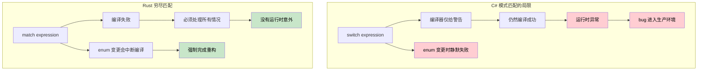
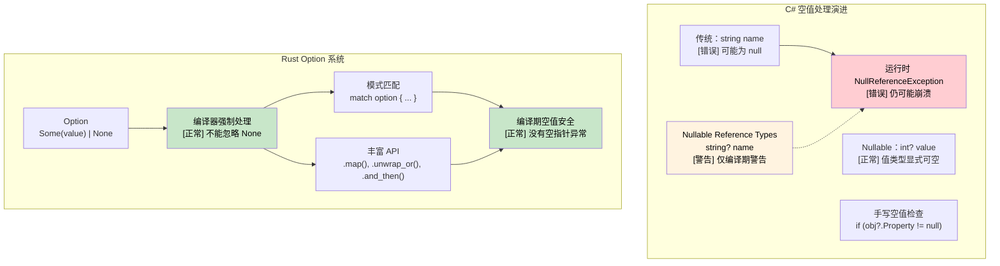

# 穷尽匹配与空值安全

## 穷尽模式匹配：编译器保证 vs 运行时错误

> **你将学到什么：** 为什么 C# `switch` 表达式会悄悄漏掉分支，而 Rust 的 `match` 会在编译期捕获这些问题；用于空值安全的 `Option<T>` 与 `Nullable<T>` 对比；以及使用 `Result<T, E>` 定义自定义错误类型。
>
> **难度：** 🟡 中级

### C# Switch 表达式：仍然不完整

```csharp
// C# switch 表达式看起来是穷尽的，但没有保证
public enum HttpStatus { Ok, NotFound, ServerError, Unauthorized }

public string HandleResponse(HttpStatus status) => status switch
{
	HttpStatus.Ok => "Success",
	HttpStatus.NotFound => "Resource not found",
	HttpStatus.ServerError => "Internal error",
	// 漏掉 Unauthorized 分支：会产生 CS8524 警告，但不是错误！
	// 运行时：如果 status 是 Unauthorized，会抛 SwitchExpressionException
};

// 即使启用了 nullable 警告，这段也能编译：
public class User 
{
	public string Name { get; set; }
	public bool IsActive { get; set; }
}

public string ProcessUser(User? user) => user switch
{
	{ IsActive: true } => $"Active: {user.Name}",
	{ IsActive: false } => $"Inactive: {user.Name}",
	// 漏掉 null 分支：编译器警告 CS8655，但不是错误！
	// 运行时：user 为 null 时抛 SwitchExpressionException
};
```

```csharp
// 后续添加 enum 变体，不会让已有 switch 编译失败
public enum HttpStatus 
{ 
	Ok, 
	NotFound, 
	ServerError, 
	Unauthorized,
	Forbidden  // 添加这个只会产生另一个 CS8524 警告，不会中断编译！
}
```

### Rust 模式匹配：真正穷尽

```rust
#[derive(Debug)]
enum HttpStatus {
	Ok,
	NotFound, 
	ServerError,
	Unauthorized,
}

fn handle_response(status: HttpStatus) -> &'static str {
	match status {
		HttpStatus::Ok => "Success",
		HttpStatus::NotFound => "Resource not found", 
		HttpStatus::ServerError => "Internal error",
		HttpStatus::Unauthorized => "Authentication required",
		// 如果漏掉任何分支，编译器会报错！
		// 这段代码真的无法通过编译
	}
}

// 添加新变体会让所有使用处编译失败
#[derive(Debug)]
enum HttpStatus {
	Ok,
	NotFound,
	ServerError, 
	Unauthorized,
	Forbidden,  // 添加这个会让 handle_response() 编译失败
}
// 编译器强制你处理所有情况

// Option<T> 的模式匹配同样是穷尽的
fn process_optional_value(value: Option<i32>) -> String {
	match value {
		Some(n) => format!("Got value: {}", n),
		None => "No value".to_string(),
		// 忘记任意一种情况都会导致编译错误
	}
}
```



***

## 空值安全：`Nullable<T>` vs `Option<T>`

### C# 空值处理的演进

```csharp
// C# - 传统空值处理（容易出错）
public class User
{
	public string Name { get; set; }  // 可能为 null！
	public string Email { get; set; } // 可能为 null！
}

public string GetUserDisplayName(User user)
{
	if (user?.Name != null)  // 空条件运算符
	{
		return user.Name;
	}
	return "Unknown User";
}
```

```csharp
// C# 8+ Nullable Reference Types
public class User
{
	public string Name { get; set; }    // 不可为 null
	public string? Email { get; set; }  // 显式可为 null
}

// C# Nullable<T> 用于值类型
int? maybeNumber = GetNumber();
if (maybeNumber.HasValue)
{
	Console.WriteLine(maybeNumber.Value);
}
```

### Rust `Option<T>` 系统

```rust
// Rust - 使用 Option<T> 显式处理空值
#[derive(Debug)]
pub struct User {
	name: String,           // 永不为 null
	email: Option<String>,  // 显式可选
}

impl User {
	pub fn get_display_name(&self) -> &str {
		&self.name  // 不需要空值检查，保证存在
	}
    
	pub fn get_email_or_default(&self) -> String {
		self.email
			.as_ref()
			.map(|e| e.clone())
			.unwrap_or_else(|| "no-email@example.com".to_string())
	}
}

// 模式匹配强制处理 None 情况
fn handle_optional_user(user: Option<User>) {
	match user {
		Some(u) => println!("User: {}", u.get_display_name()),
		None => println!("No user found"),
		// 如果不处理 None，编译器会报错！
	}
}
```



***

```rust
#[derive(Debug)]
struct Point {
	x: i32,
	y: i32,
}

fn describe_point(point: Point) -> String {
	match point {
		Point { x: 0, y: 0 } => "origin".to_string(),
		Point { x: 0, y } => format!("on y-axis at y={}", y),
		Point { x, y: 0 } => format!("on x-axis at x={}", x),
		Point { x, y } if x == y => format!("on diagonal at ({}, {})", x, y),
		Point { x, y } => format!("point at ({}, {})", x, y),
	}
}
```

### Option 与 Result 类型

```csharp
// C# nullable reference types（C# 8+）
public class PersonService
{
	private Dictionary<int, string> people = new();
    
	public string? FindPerson(int id)
	{
		return people.TryGetValue(id, out string? name) ? name : null;
	}
    
	public string GetPersonOrDefault(int id)
	{
		return FindPerson(id) ?? "Unknown";
	}
    
	// 基于异常的错误处理
	public void SavePerson(int id, string name)
	{
		if (string.IsNullOrEmpty(name))
			throw new ArgumentException("Name cannot be empty");
        
		people[id] = name;
	}
}
```

```rust
use std::collections::HashMap;

// Rust 使用 Option<T>，而不是 null
struct PersonService {
	people: HashMap<i32, String>,
}

impl PersonService {
	fn new() -> Self {
		PersonService {
			people: HashMap::new(),
		}
	}
    
	// 返回 Option<T>，没有 null！
	fn find_person(&self, id: i32) -> Option<&String> {
		self.people.get(&id)
	}
    
	// 对 Option 做模式匹配
	fn get_person_or_default(&self, id: i32) -> String {
		match self.find_person(id) {
			Some(name) => name.clone(),
			None => "Unknown".to_string(),
		}
	}
    
	// 使用 Option 方法（更偏函数式风格）
	fn get_person_or_default_functional(&self, id: i32) -> String {
		self.find_person(id)
			.map(|name| name.clone())
			.unwrap_or_else(|| "Unknown".to_string())
	}
    
	// Result<T, E> 用于错误处理
	fn save_person(&mut self, id: i32, name: String) -> Result<(), String> {
		if name.is_empty() {
			return Err("Name cannot be empty".to_string());
		}
        
		self.people.insert(id, name);
		Ok(())
	}
    
	// 链式操作
	fn get_person_length(&self, id: i32) -> Option<usize> {
		self.find_person(id).map(|name| name.len())
	}
}

fn main() {
	let mut service = PersonService::new();
    
	// 处理 Result
	match service.save_person(1, "Alice".to_string()) {
		Ok(()) => println!("Person saved successfully"),
		Err(error) => println!("Error: {}", error),
	}
    
	// 处理 Option
	match service.find_person(1) {
		Some(name) => println!("Found: {}", name),
		None => println!("Person not found"),
	}
    
	// Option 的函数式风格
	let name_length = service.get_person_length(1)
		.unwrap_or(0);
	println!("Name length: {}", name_length);
    
	// 问号运算符用于提前返回
	fn try_operation(service: &mut PersonService) -> Result<String, String> {
		service.save_person(2, "Bob".to_string())?; // 出错时提前返回
		let name = service.find_person(2).ok_or("Person not found")?; // 将 Option 转为 Result
		Ok(format!("Hello, {}", name))
	}
    
	match try_operation(&mut service) {
		Ok(message) => println!("{}", message),
		Err(error) => println!("Operation failed: {}", error),
	}
}
```

### 自定义错误类型

```rust
// 定义自定义错误 enum
#[derive(Debug)]
enum PersonError {
	NotFound(i32),
	InvalidName(String),
	DatabaseError(String),
}

impl std::fmt::Display for PersonError {
	fn fmt(&self, f: &mut std::fmt::Formatter<'_>) -> std::fmt::Result {
		match self {
			PersonError::NotFound(id) => write!(f, "Person with ID {} not found", id),
			PersonError::InvalidName(name) => write!(f, "Invalid name: '{}'", name),
			PersonError::DatabaseError(msg) => write!(f, "Database error: {}", msg),
		}
	}
}

impl std::error::Error for PersonError {}

// 使用自定义错误增强 PersonService
impl PersonService {
	fn save_person_enhanced(&mut self, id: i32, name: String) -> Result<(), PersonError> {
		if name.is_empty() || name.len() > 50 {
			return Err(PersonError::InvalidName(name));
		}
        
		// 模拟可能失败的数据库操作
		if id < 0 {
			return Err(PersonError::DatabaseError("Negative IDs not allowed".to_string()));
		}
        
		self.people.insert(id, name);
		Ok(())
	}
    
	fn find_person_enhanced(&self, id: i32) -> Result<&String, PersonError> {
		self.people.get(&id).ok_or(PersonError::NotFound(id))
	}
}

fn demo_error_handling() {
	let mut service = PersonService::new();
    
	// 处理不同错误类型
	match service.save_person_enhanced(-1, "Invalid".to_string()) {
		Ok(()) => println!("Success"),
		Err(PersonError::NotFound(id)) => println!("Not found: {}", id),
		Err(PersonError::InvalidName(name)) => println!("Invalid name: {}", name),
		Err(PersonError::DatabaseError(msg)) => println!("DB Error: {}", msg),
	}
}
```

---

## 练习

<details>
<summary><strong>🏋️ 练习：Option 组合子</strong>（点击展开）</summary>

使用 Rust `Option` 组合子（`and_then`、`map`、`unwrap_or`）重写下面这段深层嵌套的 C# 空值检查代码：

```csharp
string GetCityName(User? user)
{
	if (user != null)
		if (user.Address != null)
			if (user.Address.City != null)
				return user.Address.City.ToUpper();
	return "UNKNOWN";
}
```

使用这些 Rust 类型：

```rust
struct User { address: Option<Address> }
struct Address { city: Option<String> }
```

把它写成**单个表达式**，不使用 `if let` 或 `match`。

<details>
<summary>🔑 参考答案</summary>

```rust
struct User { address: Option<Address> }
struct Address { city: Option<String> }

fn get_city_name(user: Option<&User>) -> String {
	user.and_then(|u| u.address.as_ref())
		.and_then(|a| a.city.as_ref())
		.map(|c| c.to_uppercase())
		.unwrap_or_else(|| "UNKNOWN".to_string())
}

fn main() {
	let user = User {
		address: Some(Address { city: Some("seattle".to_string()) }),
	};
	assert_eq!(get_city_name(Some(&user)), "SEATTLE");
	assert_eq!(get_city_name(None), "UNKNOWN");

	let no_city = User { address: Some(Address { city: None }) };
	assert_eq!(get_city_name(Some(&no_city)), "UNKNOWN");
}
```

**关键洞察**：`and_then` 就是 Rust 中用于 `Option` 的 `?.` 运算符。每一步都返回 `Option`，遇到 `None` 时链式调用会短路，这和 C# 的空条件运算符 `?.` 一样，但更显式，也具有类型安全。

</details>
</details>

***
