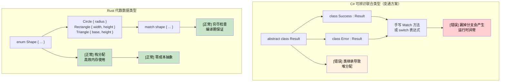

# 6. 枚举与模式匹配

<a id="algebraic-data-types-vs-c-unions"></a>

## 代数数据类型 vs C# Union

> **你将学到什么：** Rust 的代数数据类型（带数据的枚举）与 C# 中有限的可辨识联合类型，带穷尽检查的 `match` 表达式，guard clause，以及嵌套模式解构。
>
> **难度：** 🟡 中级

### C# 可辨识联合类型（能力有限）

```csharp
// C# - 使用继承模拟有限的 union 支持
public abstract class Result
{
	public abstract T Match<T>(Func<Success, T> onSuccess, Func<Error, T> onError);
}

public class Success : Result
{
	public string Value { get; }
	public Success(string value) => Value = value;
    
	public override T Match<T>(Func<Success, T> onSuccess, Func<Error, T> onError)
		=> onSuccess(this);
}

public class Error : Result
{
	public string Message { get; }
	public Error(string message) => Message = message;
    
	public override T Match<T>(Func<Success, T> onSuccess, Func<Error, T> onError)
		=> onError(this);
}

// C# 9+ record 搭配模式匹配（更好一些）
public abstract record Shape;
public record Circle(double Radius) : Shape;
public record Rectangle(double Width, double Height) : Shape;

public static double Area(Shape shape) => shape switch
{
	Circle(var radius) => Math.PI * radius * radius,
	Rectangle(var width, var height) => width * height,
	_ => throw new ArgumentException("Unknown shape")  // [错误] 仍可能出现运行时错误
};
```

### Rust 代数数据类型（Enum）

```rust
// Rust - 真正的代数数据类型，带穷尽模式匹配
#[derive(Debug, Clone)]
pub enum Result<T, E> {
	Ok(T),
	Err(E),
}

#[derive(Debug, Clone)]
pub enum Shape {
	Circle { radius: f64 },
	Rectangle { width: f64, height: f64 },
	Triangle { base: f64, height: f64 },
}

impl Shape {
	pub fn area(&self) -> f64 {
		match self {
			Shape::Circle { radius } => std::f64::consts::PI * radius * radius,
			Shape::Rectangle { width, height } => width * height,
			Shape::Triangle { base, height } => 0.5 * base * height,
			// [正常] 如果漏掉任何变体，编译器会报错！
		}
	}
}

// 进阶：enum 可以保存不同类型的数据
#[derive(Debug)]
pub enum Value {
	Integer(i64),
	Float(f64),
	Text(String),
	Boolean(bool),
	List(Vec<Value>),  // 递归类型！
}

impl Value {
	pub fn type_name(&self) -> &'static str {
		match self {
			Value::Integer(_) => "integer",
			Value::Float(_) => "float",
			Value::Text(_) => "text",
			Value::Boolean(_) => "boolean",
			Value::List(_) => "list",
		}
	}
}
```



***

## Enum 与模式匹配

Rust 的 enum 比 C# 的 enum 强大得多：它们可以携带数据，并且是类型安全编程的基础。

### C# Enum 的局限

```csharp
// C# enum - 只是具名常量
public enum Status
{
	Pending,
	Approved,
	Rejected
}

// 带底层值的 C# enum
public enum HttpStatusCode
{
	OK = 200,
	NotFound = 404,
	InternalServerError = 500
}

// 复杂数据需要单独的类
public abstract class Result
{
	public abstract bool IsSuccess { get; }
}

public class Success : Result
{
	public string Value { get; }
	public override bool IsSuccess => true;
    
	public Success(string value)
	{
		Value = value;
	}
}

public class Error : Result
{
	public string Message { get; }
	public override bool IsSuccess => false;
    
	public Error(string message)
	{
		Message = message;
	}
}
```

### Rust Enum 的能力

```rust
// 简单 enum（类似 C# enum）
#[derive(Debug, PartialEq)]
enum Status {
	Pending,
	Approved,
	Rejected,
}

// 带数据的 enum（这正是 Rust 闪光的地方！）
#[derive(Debug)]
enum Result<T, E> {
	Ok(T),      // 成功变体，保存 T 类型的值
	Err(E),     // 错误变体，保存 E 类型的错误
}

// 带不同数据类型的复杂 enum
#[derive(Debug)]
enum Message {
	Quit,                       // 无数据
	Move { x: i32, y: i32 },   // 类似结构体的变体
	Write(String),             // 类似元组的变体
	ChangeColor(i32, i32, i32), // 多个值
}

// 真实场景示例：HTTP Response
#[derive(Debug)]
enum HttpResponse {
	Ok { body: String, headers: Vec<String> },
	NotFound { path: String },
	InternalError { message: String, code: u16 },
	Redirect { location: String },
}
```

### 使用 Match 进行模式匹配

```csharp
// C# switch 语句（能力有限）
public string HandleStatus(Status status)
{
	switch (status)
	{
		case Status.Pending:
			return "Waiting for approval";
		case Status.Approved:
			return "Request approved";
		case Status.Rejected:
			return "Request rejected";
		default:
			return "Unknown status"; // 总是需要 default
	}
}

// C# 模式匹配（C# 8+）
public string HandleResult(Result result)
{
	return result switch
	{
		Success success => $"Success: {success.Value}",
		Error error => $"Error: {error.Message}",
		_ => "Unknown result" // 仍然需要兜底分支
	};
}
```

```rust
// Rust match：穷尽且强大
fn handle_status(status: Status) -> String {
	match status {
		Status::Pending => "Waiting for approval".to_string(),
		Status::Approved => "Request approved".to_string(),
		Status::Rejected => "Request rejected".to_string(),
		// 不需要 default：编译器会确保穷尽
	}
}

// 带数据提取的模式匹配
fn handle_result<T, E>(result: Result<T, E>) -> String 
where 
	T: std::fmt::Debug,
	E: std::fmt::Debug,
{
	match result {
		Result::Ok(value) => format!("Success: {:?}", value),
		Result::Err(error) => format!("Error: {:?}", error),
		// 穷尽匹配：不需要 default
	}
}

// 复杂模式匹配
fn handle_message(msg: Message) -> String {
	match msg {
		Message::Quit => "Goodbye!".to_string(),
		Message::Move { x, y } => format!("Move to ({}, {})", x, y),
		Message::Write(text) => format!("Write: {}", text),
		Message::ChangeColor(r, g, b) => format!("Change color to RGB({}, {}, {})", r, g, b),
	}
}

// HTTP response 处理
fn handle_http_response(response: HttpResponse) -> String {
	match response {
		HttpResponse::Ok { body, headers } => {
			format!("Success! Body: {}, Headers: {:?}", body, headers)
		},
		HttpResponse::NotFound { path } => {
			format!("404: Path '{}' not found", path)
		},
		HttpResponse::InternalError { message, code } => {
			format!("Error {}: {}", code, message)
		},
		HttpResponse::Redirect { location } => {
			format!("Redirect to: {}", location)
		},
	}
}
```

<a id="guards-and-advanced-patterns"></a>

### Guard 与高级模式

```rust
// 带 guard 的模式匹配
fn describe_number(x: i32) -> String {
	match x {
		n if n < 0 => "negative".to_string(),
		0 => "zero".to_string(),
		n if n < 10 => "single digit".to_string(),
		n if n < 100 => "double digit".to_string(),
		_ => "large number".to_string(),
	}
}

// 匹配范围
fn describe_age(age: u32) -> String {
	match age {
		0..=12 => "child".to_string(),
		13..=19 => "teenager".to_string(),
		20..=64 => "adult".to_string(),
		65.. => "senior".to_string(),
	}
}

// 解构结构体和元组
```

<details>
<summary><strong>🏋️ 练习：命令解析器</strong>（点击展开）</summary>

**挑战**：使用 Rust enum 建模一个 CLI 命令系统。把字符串输入解析为 `Command` enum，并执行每个变体。用合适的错误处理应对未知命令。

```rust
// 起始代码：补全空白处
#[derive(Debug)]
enum Command {
	// TODO: 添加 Quit、Echo(String)、Move { x: i32, y: i32 }、Count(u32) 等变体
}

fn parse_command(input: &str) -> Result<Command, String> {
	let parts: Vec<&str> = input.splitn(2, ' ').collect();
	// TODO: 对 parts[0] 进行 match，并解析参数
	todo!()
}

fn execute(cmd: &Command) -> String {
	// TODO: match 每个变体并返回描述文本
	todo!()
}
```

<details>
<summary>🔑 参考答案</summary>

```rust
#[derive(Debug)]
enum Command {
	Quit,
	Echo(String),
	Move { x: i32, y: i32 },
	Count(u32),
}

fn parse_command(input: &str) -> Result<Command, String> {
	let parts: Vec<&str> = input.splitn(2, ' ').collect();
	match parts[0] {
		"quit" => Ok(Command::Quit),
		"echo" => {
			let msg = parts.get(1).unwrap_or(&"").to_string();
			Ok(Command::Echo(msg))
		}
		"move" => {
			let args = parts.get(1).ok_or("move requires 'x y'")?;
			let coords: Vec<&str> = args.split_whitespace().collect();
			let x = coords.get(0).ok_or("missing x")?.parse::<i32>().map_err(|e| e.to_string())?;
			let y = coords.get(1).ok_or("missing y")?.parse::<i32>().map_err(|e| e.to_string())?;
			Ok(Command::Move { x, y })
		}
		"count" => {
			let n = parts.get(1).ok_or("count requires a number")?
				.parse::<u32>().map_err(|e| e.to_string())?;
			Ok(Command::Count(n))
		}
		other => Err(format!("Unknown command: {other}")),
	}
}

fn execute(cmd: &Command) -> String {
	match cmd {
		Command::Quit           => "Goodbye!".to_string(),
		Command::Echo(msg)      => msg.clone(),
		Command::Move { x, y }  => format!("Moving to ({x}, {y})"),
		Command::Count(n)       => format!("Counted to {n}"),
	}
}
```

**关键要点**：

- 每个 enum 变体都可以保存不同数据，不需要类层次结构。
- `match` 强制你处理每个变体，避免遗忘分支。
- `?` 运算符可以干净地串联错误传播，不需要嵌套 try-catch。

</details>
</details>
