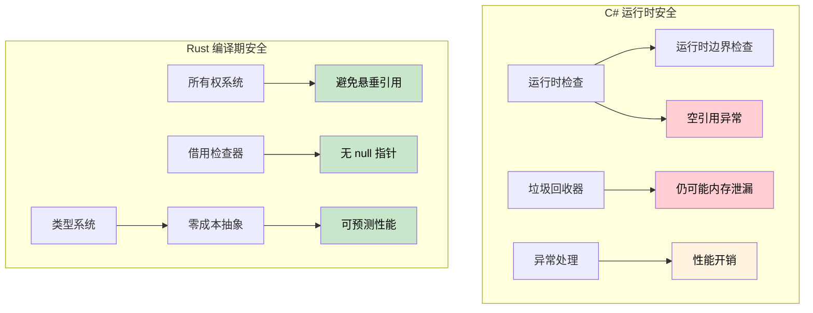

# 内存安全深入解析

<a id="references-vs-pointers"></a>

## 引用 vs 指针

> **你将学到什么：** Rust 引用与 C# 指针和 unsafe 上下文的对比，生命周期基础，以及为什么编译期安全证明比 C# 的运行时检查（边界检查、null guard）更强。
>
> **难度：** 🟡 中级

### C# 指针（Unsafe 上下文）

```csharp
// C# unsafe 指针（很少使用）
unsafe void UnsafeExample()
{
	int value = 42;
	int* ptr = &value;  // 指向 value 的指针
	*ptr = 100;         // 解引用并修改
	Console.WriteLine(value);  // 100
}
```

### Rust 引用（默认安全）

```rust
// Rust 引用（始终安全）
fn safe_example() {
	let mut value = 42;
	let ptr = &mut value;  // 可变引用
	*ptr = 100;           // 解引用并修改
	println!("{}", value); // 100
}

// 不需要 unsafe 关键字，借用检查器会保证安全
```

### 面向 C# 开发者的生命周期基础

```csharp
// C# - 可以返回可能失效的引用
public class LifetimeIssues
{
	public string GetFirstWord(string input)
	{
		return input.Split(' ')[0];  // 返回新字符串（安全）
	}
    
	public unsafe char* GetFirstChar(string input)
	{
		// 这会很危险：返回指向托管内存的指针
		fixed (char* ptr = input)
			return ptr;  // ❌ 糟糕：方法结束后 ptr 会失效
	}
}
```

```rust
// Rust - 生命周期检查防止悬垂引用
fn get_first_word(input: &str) -> &str {
	input.split_whitespace().next().unwrap_or("")
	// ✅ 安全：返回引用与 input 拥有相同生命周期
}

fn invalid_reference() -> &str {
	let temp = String::from("hello");
	&temp  // ❌ 编译错误：temp 活得不够久
	// temp 会在函数结束时被丢弃
}

fn valid_reference() -> String {
	let temp = String::from("hello");
	temp  // ✅ 正常：所有权转移给调用者
}
```

***

## 内存安全：运行时检查 vs 编译期证明

### C# - 运行时安全网

```csharp
// C# 依赖运行时检查和 GC
public class Buffer
{
	private byte[] data;
    
	public Buffer(int size)
	{
		data = new byte[size];
	}
    
	public void ProcessData(int index)
	{
		// 运行时边界检查
		if (index >= data.Length)
			throw new IndexOutOfRangeException();
            
		data[index] = 42;  // 安全，但在运行时检查
	}
    
	// 事件/static 引用仍可能造成内存泄漏
	public static event Action<string> GlobalEvent;
    
	public void Subscribe()
	{
		GlobalEvent += HandleEvent;  // 可能造成内存泄漏
		// 忘记取消订阅，对象就不会被回收
	}
    
	private void HandleEvent(string message) { /* ... */ }
    
	// 空引用异常仍然可能发生
	public void ProcessUser(User user)
	{
		Console.WriteLine(user.Name.ToUpper());  // user.Name 为 null 时抛 NullReferenceException
	}
    
	// 数组访问可能在运行时失败
	public int GetValue(int[] array, int index)
	{
		return array[index];  // 可能抛 IndexOutOfRangeException
	}
}
```

### Rust - 编译期保证

```rust
struct Buffer {
	data: Vec<u8>,
}

impl Buffer {
	fn new(size: usize) -> Self {
		Buffer {
			data: vec![0; size],
		}
	}
    
	fn process_data(&mut self, index: usize) {
		// 当编译器能证明安全时，边界检查可以被优化掉
		if let Some(item) = self.data.get_mut(index) {
			*item = 42;  // 安全访问，在编译期可证明
		}
		// 或使用带显式边界检查的索引：
		// self.data[index] = 42;  // debug 中 panic，但仍然内存安全
	}
    
	// 所有权系统防止悬垂引用，并让清理路径明确
	fn process_with_closure<F>(&mut self, processor: F) 
	where F: FnOnce(&mut Vec<u8>)
	{
		processor(&mut self.data);
		// processor 离开作用域时会被自动清理
		// 无法创建悬垂引用；泄漏模式仍需通过设计避免
	}
    
	// 安全引用不能为 null，因此这里不会出现空引用解引用
	fn process_user(&self, user: &User) {
		println!("{}", user.name.to_uppercase());  // user.name 不可能为 null
	}
    
	// 数组访问要么有边界检查，要么显式 unsafe
	fn get_value(array: &[i32], index: usize) -> Option<i32> {
		array.get(index).copied()  // 越界时返回 None
	}
    
	// 如果你确实知道自己在做什么，也可以显式 unsafe：
	/// # Safety
	/// `index` must be less than `array.len()`.
	unsafe fn get_value_unchecked(array: &[i32], index: usize) -> i32 {
		*array.get_unchecked(index)  // 快，但必须手动证明边界
	}
}

struct User {
	name: String,  // Rust 中 String 不可能为 null
}

// 所有权阻止 use-after-free
fn ownership_example() {
	let data = vec![1, 2, 3, 4, 5];
	let reference = &data[0];  // 借用 data
    
	// drop(data);  // 错误：借用期间不能 drop
	println!("{}", reference);  // 这里保证安全
}

// 借用阻止数据竞争
fn borrowing_example(data: &mut Vec<i32>) {
	let first = &data[0];  // 不可变借用
	// data.push(6);  // 错误：不可变借用期间不能可变借用
	println!("{}", first);  // 保证没有数据竞争
}
```



---

## 练习

<details>
<summary><strong>🏋️ 练习：找出安全性 bug</strong>（点击展开）</summary>

下面这段 C# 代码有一个微妙的安全性 bug。指出它，然后写出 Rust 等价版本，并解释为什么 Rust 版本**无法编译**：

```csharp
public List<int> GetEvenNumbers(List<int> numbers)
{
	var result = new List<int>();
	foreach (var n in numbers)
	{
		if (n % 2 == 0)
		{
			result.Add(n);
			numbers.Remove(n);  // Bug：迭代期间修改集合
		}
	}
	return result;
}
```

<details>
<summary>🔑 参考答案</summary>

**C# bug**：在迭代 `numbers` 时修改它，会在**运行时**抛出 `InvalidOperationException`。代码审查时很容易漏掉。

```rust
fn get_even_numbers(numbers: &mut Vec<i32>) -> Vec<i32> {
	let mut result = Vec::new();
	for &n in numbers.iter() {
		if n % 2 == 0 {
			result.push(n);
			// numbers.retain(|&x| x != n);
			// ❌ 错误：不能把 `*numbers` 可变借用，因为它已经
			//    被迭代器不可变借用了
		}
	}
	result
}

// 惯用 Rust：使用 partition 或 retain
fn get_even_numbers_idiomatic(numbers: &mut Vec<i32>) -> Vec<i32> {
	let evens: Vec<i32> = numbers.iter().copied().filter(|n| n % 2 == 0).collect();
	numbers.retain(|n| n % 2 != 0); // 迭代后移除偶数
	evens
}

fn main() {
	let mut nums = vec![1, 2, 3, 4, 5, 6];
	let evens = get_even_numbers_idiomatic(&mut nums);
	assert_eq!(evens, vec![2, 4, 6]);
	assert_eq!(nums, vec![1, 3, 5]);
}
```

**关键洞察**：Rust 的借用检查器会在编译期阻止“迭代期间修改”这一整类 bug。C# 在运行时捕获它，许多语言则完全捕获不到。

</details>
</details>

***
