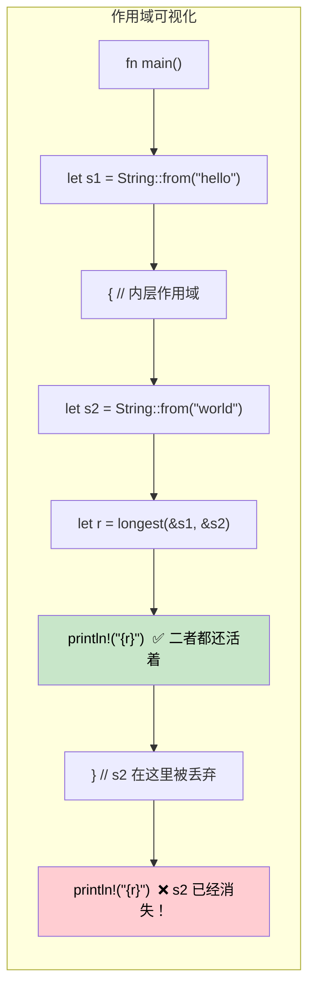

# 生命周期深入解析

<a id="lifetimes-telling-the-compiler-how-long-references-live"></a>

## 生命周期：告诉编译器引用能活多久

> **你将学到什么：** 为什么生命周期存在（没有 GC 时，编译器需要证明），生命周期标注语法，省略规则，结构体生命周期，`'static` 生命周期，以及常见借用检查器错误与修复方式。
>
> **难度：** 🔴 高级

C# 开发者通常不需要思考引用生命周期，因为垃圾回收器会处理可达性。在 Rust 中，编译器需要有**证明**：每个引用在被使用期间都有效。生命周期就是这个证明。

### 为什么生命周期存在

```rust
// 这段无法编译：编译器无法证明返回引用是有效的
fn longest(a: &str, b: &str) -> &str {
	if a.len() > b.len() { a } else { b }
}
// 错误：missing lifetime specifier
// 编译器不知道返回值是从 `a` 借用，还是从 `b` 借用
```

### 生命周期标注

```rust
// 生命周期 'a 表示：“返回值至少和两个输入一样活得久”
fn longest<'a>(a: &'a str, b: &'a str) -> &'a str {
	if a.len() > b.len() { a } else { b }
}

fn main() {
	let result;
	let string1 = String::from("long string");
	{
		let string2 = String::from("xyz");
		result = longest(&string1, &string2);
		println!("Longest: {result}"); // ✅ 两个引用在这里都仍然有效
	}
	// println!("{result}"); // ❌ 错误：string2 活得不够久
}
```

### 与 C# 对比

```csharp
// C# — 只要还有引用，GC 就会让对象保持存活
string Longest(string a, string b) => a.Length > b.Length ? a : b;

// 没有生命周期问题，GC 会自动跟踪可达性
// 但代价是：GC 暂停、不可预测的内存使用、缺少编译期证明
```

### 生命周期省略规则

大多数时候你**不需要手写生命周期标注**。编译器会自动应用三条规则：

| 规则 | 说明 | 示例 |
|------|------|------|
| **规则 1** | 每个引用参数都有自己的生命周期 | `fn foo(x: &str, y: &str)` → `fn foo<'a, 'b>(x: &'a str, y: &'b str)` |
| **规则 2** | 如果只有一个输入生命周期，它会被赋给所有输出生命周期 | `fn first(s: &str) -> &str` → `fn first<'a>(s: &'a str) -> &'a str` |
| **规则 3** | 如果某个输入是 `&self` 或 `&mut self`，它的生命周期会被赋给所有输出 | `fn name(&self) -> &str` 能工作就是因为 &self |

```rust
// 这两个等价，编译器会自动添加生命周期：
fn first_word(s: &str) -> &str { /* ... */ }           // 省略写法
fn first_word<'a>(s: &'a str) -> &'a str { /* ... */ } // 显式写法

// 但这个必须显式标注：两个输入，输出到底从哪个输入借用？
fn longest<'a>(a: &'a str, b: &'a str) -> &'a str { /* ... */ }
```

### 结构体生命周期

```rust
// 借用数据的结构体（而不是拥有数据）
struct Excerpt<'a> {
	text: &'a str,  // 从某个 String 借用；该 String 必须比这个结构体活得更久
}

impl<'a> Excerpt<'a> {
	fn new(text: &'a str) -> Self {
		Excerpt { text }
	}

	fn first_sentence(&self) -> &str {
		self.text.split('.').next().unwrap_or(self.text)
	}
}

fn main() {
	let novel = String::from("Call me Ishmael. Some years ago...");
	let excerpt = Excerpt::new(&novel); // excerpt 从 novel 借用
	println!("First sentence: {}", excerpt.first_sentence());
	// 只要 excerpt 还存在，novel 就必须保持存活
}
```

```csharp
// C# 等价写法：没有生命周期顾虑，但也没有编译期保证
class Excerpt
{
	public string Text { get; }
	public Excerpt(string text) => Text = text;
	public string FirstSentence() => Text.Split('.')[0];
}
// 如果字符串在别处被修改了呢？这是运行时意外。
```

### `'static` 生命周期

```rust
// 'static 表示“能在整个程序期间存活”
let s: &'static str = "I'm a string literal"; // 存在二进制中，始终有效

// 常见 'static 出现位置：
// 1. 字符串字面量
// 2. 全局常量
// 3. Thread::spawn 要求 'static（线程可能比调用者活得更久）
std::thread::spawn(move || {
	// 发送到线程的闭包必须拥有自己的数据，或使用 'static 引用
	println!("{s}"); // OK：&'static str
});

// 'static 不表示“永生”，而是表示“如果需要，可以活到程序结束”
let owned = String::from("hello");
// owned 不是 'static，但它可以被移动进线程（所有权转移）
```

### 常见借用检查器错误与修复

| 错误 | 原因 | 修复 |
|------|------|------|
| `missing lifetime specifier` | 多个输入引用，输出来源不明确 | 添加 `<'a>` 标注，把输出绑定到正确输入 |
| `does not live long enough` | 引用比它指向的数据活得更久 | 延长数据作用域，或返回拥有所有权的数据 |
| `cannot borrow as mutable` | 不可变借用仍然活跃 | 先使用不可变引用再修改，或重构代码 |
| `cannot move out of borrowed content` | 试图取得已借用数据的所有权 | 使用 `.clone()`，或重构以避免移动 |
| `lifetime may not live long enough` | 结构体借用比来源数据活得更久 | 确保来源数据的作用域覆盖结构体使用期间 |

### 可视化生命周期作用域



### 多个生命周期参数

有时引用来自不同来源，生命周期也不同：

```rust
// 两个独立生命周期：返回值只从 'a 借用，不从 'b 借用
fn first_with_context<'a, 'b>(data: &'a str, _context: &'b str) -> &'a str {
	// 返回值只从 data 借用，context 可以有更短生命周期
	data.split(',').next().unwrap_or(data)
}

fn main() {
	let data = String::from("alice,bob,charlie");
	let result;
	{
		let context = String::from("user lookup"); // 更短生命周期
		result = first_with_context(&data, &context);
	} // context 被丢弃，但 result 从 data 借用，不从 context 借用 ✅
	println!("{result}");
}
```

```csharp
// C# — 没有生命周期跟踪，也就无法表达“从 A 借用但不从 B 借用”
string FirstWithContext(string data, string context) => data.Split(',')[0];
// 对 GC 语言来说这没问题，但 Rust 可以在没有 GC 的情况下证明安全
```

### 真实世界中的生命周期模式

**模式 1：返回引用的迭代器**

```rust
// 一个解析器，从输入中产出借用的切片
struct CsvRow<'a> {
	fields: Vec<&'a str>,
}

fn parse_csv_line(line: &str) -> CsvRow<'_> {
	// '_ 告诉编译器“从输入推断生命周期”
	CsvRow {
		fields: line.split(',').collect(),
	}
}
```

**模式 2：“拿不准时返回 owned 值”**

```rust
// 当生命周期变复杂时，返回拥有所有权的数据是务实修复
fn format_greeting(first: &str, last: &str) -> String {
	// 返回拥有所有权的 String，不需要生命周期标注
	format!("Hello, {first} {last}!")
}

// 只在这些情况下借用：
// 1. 性能重要（避免分配）
// 2. 输入和输出生命周期关系非常清晰
```

**模式 3：泛型上的生命周期边界**

```rust
// “T 必须至少和 'a 一样活得久”
fn store_reference<'a, T: 'a>(cache: &mut Vec<&'a T>, item: &'a T) {
	cache.push(item);
}

// 在 trait object 中常见：Box<dyn Display + 'a>
fn make_printer<'a>(text: &'a str) -> Box<dyn std::fmt::Display + 'a> {
	Box::new(text)
}
```

### 什么时候使用 `'static`

| 场景 | 使用 `'static`？ | 替代方案 |
|------|:---------------:|----------|
| 字符串字面量 | ✅ 是，它们总是 `'static` | — |
| `thread::spawn` 闭包 | 通常需要，线程可能比调用者活得更久 | 对借用数据使用 `thread::scope` |
| 全局配置 | ✅ `lazy_static!` 或 `OnceLock` | 通过参数传递引用 |
| 长期存储的 trait object | 通常需要，`Box<dyn Trait + 'static>` | 用 `'a` 参数化容器 |
| 临时借用 | ❌ 不要，约束过度 | 使用实际生命周期 |

<details>
<summary><strong>🏋️ 练习：生命周期标注</strong>（点击展开）</summary>

**挑战**：添加正确的生命周期标注，让下面代码通过编译：

```rust
struct Config {
	db_url: String,
	api_key: String,
}

// TODO: 添加生命周期标注
fn get_connection_info(config: &Config) -> (&str, &str) {
	(&config.db_url, &config.api_key)
}

// TODO: 这个结构体从 Config 借用，添加生命周期参数
struct ConnectionInfo {
	db_url: &str,
	api_key: &str,
}
```

<details>
<summary>🔑 参考答案</summary>

```rust
struct Config {
	db_url: String,
	api_key: String,
}

// 规则 3 不适用（没有 &self），规则 2 适用（一个输入 → 输出）
// 所以编译器会自动处理这里，不需要标注！
fn get_connection_info(config: &Config) -> (&str, &str) {
	(&config.db_url, &config.api_key)
}

// 结构体需要生命周期标注：
struct ConnectionInfo<'a> {
	db_url: &'a str,
	api_key: &'a str,
}

fn make_info<'a>(config: &'a Config) -> ConnectionInfo<'a> {
	ConnectionInfo {
		db_url: &config.db_url,
		api_key: &config.api_key,
	}
}
```

**关键要点**：生命周期省略通常能让你不用在函数上写标注，但借用数据的结构体总是需要显式 `<'a>`。

</details>
</details>

***
