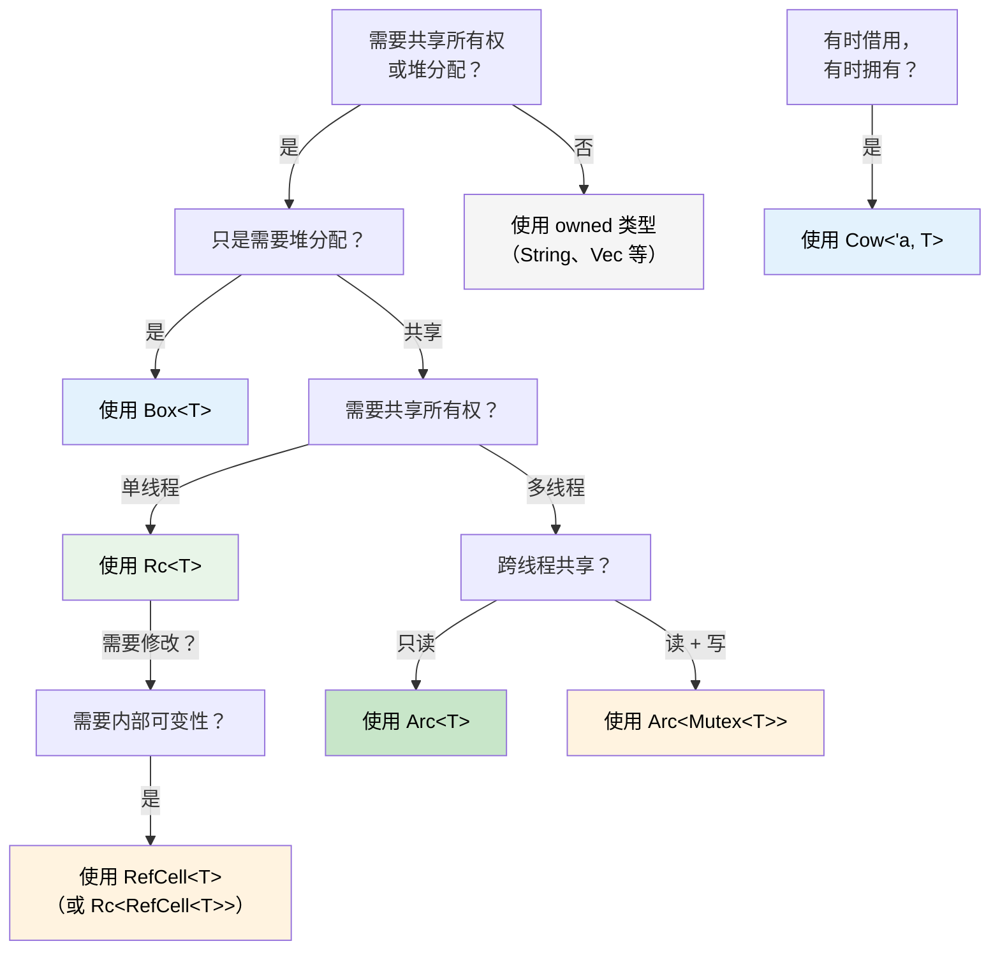

# 智能指针：超越单一所有权

## 智能指针：当单一所有权不够用时

> **你将学到什么：** `Box<T>`、`Rc<T>`、`Arc<T>`、`Cell<T>`、`RefCell<T>` 和 `Cow<'a, T>`：什么时候使用它们，它们如何对应 C# 的 GC 托管引用，作为 Rust 版 `IDisposable` 的 `Drop`，Deref coercion，以及选择智能指针的决策树。
>
> **难度：** 🔴 高级

在 C# 中，每个对象本质上都由 GC 管理引用。在 Rust 中，单一所有权是默认模式，但有时你确实需要共享所有权、堆分配或内部可变性。这就是智能指针登场的地方。

### Box&lt;T&gt;：简单堆分配

```rust
// 栈分配（Rust 默认）
let x = 42;           // 在栈上

// 使用 Box 进行堆分配
let y = Box::new(42); // 在堆上，类似 C# 的 `new int(42)`（装箱）
println!("{}", y);     // 自动解引用：打印 42

// 常见用途：递归类型（编译期不知道大小）
#[derive(Debug)]
enum List {
	Cons(i32, Box<List>),  // Box 提供已知的指针大小
	Nil,
}

let list = List::Cons(1, Box::new(List::Cons(2, Box::new(List::Nil))));
```

```csharp
// C# — 引用类型本来就在堆上
// Rust 需要 Box<T>，是因为栈分配才是默认
var list = new LinkedListNode<int>(1);  // 总是分配在堆上
```

### Rc&lt;T&gt;：共享所有权（单线程）

```rust
use std::rc::Rc;

// 同一份数据的多个所有者，类似多个 C# 引用
let shared = Rc::new(vec![1, 2, 3]);
let clone1 = Rc::clone(&shared); // 引用计数：2
let clone2 = Rc::clone(&shared); // 引用计数：3

println!("Count: {}", Rc::strong_count(&shared)); // 3
// 最后一个 Rc 离开作用域时，数据被丢弃

// 常见用途：共享配置、图节点、树结构
```

### Arc&lt;T&gt;：共享所有权（线程安全）

```rust
use std::sync::Arc;
use std::thread;

// Arc = Atomic Reference Counting，可以安全跨线程共享
let data = Arc::new(vec![1, 2, 3]);

let handles: Vec<_> = (0..3).map(|i| {
	let data = Arc::clone(&data);
	thread::spawn(move || {
		println!("Thread {i}: {:?}", data);
	})
}).collect();

for h in handles { h.join().unwrap(); }
```

```csharp
// C# — 所有引用默认都可跨线程使用（由 GC 处理）
var data = new List<int> { 1, 2, 3 };
// 可以自由跨线程共享（但可变访问仍然不安全！）
```

### Cell&lt;T&gt; 与 RefCell&lt;T&gt;：内部可变性

```rust
use std::cell::RefCell;

// 有时你需要通过共享引用修改背后的数据。
// RefCell 会把借用检查从编译期移动到运行时。
struct Logger {
	entries: RefCell<Vec<String>>,
}

impl Logger {
	fn new() -> Self {
		Logger { entries: RefCell::new(Vec::new()) }
	}

	fn log(&self, msg: &str) { // &self，不是 &mut self！
		self.entries.borrow_mut().push(msg.to_string());
	}

	fn dump(&self) {
		for entry in self.entries.borrow().iter() {
			println!("{entry}");
		}
	}
}
// ⚠️ 如果违反借用规则，RefCell 会在运行时 panic
// 谨慎使用；能用编译期检查时优先使用编译期检查
```

### Cow&lt;'a, str&gt;：写时克隆

```rust
use std::borrow::Cow;

// 有时你有一个 &str，它可能需要变成 String
fn normalize(input: &str) -> Cow<'_, str> {
	if input.contains('\t') {
		// 只有需要修改时才分配
		Cow::Owned(input.replace('\t', "    "))
	} else {
		// 借用原始数据，零分配
		Cow::Borrowed(input)
	}
}

let clean = normalize("hello");           // Cow::Borrowed，无分配
let dirty = normalize("hello\tworld");    // Cow::Owned，发生分配
// 两者都可以通过 Deref 当作 &str 使用
println!("{clean} / {dirty}");
```

<a id="drop-rusts-idisposable"></a>

### Drop：Rust 的 `IDisposable`

在 C# 中，`IDisposable` + `using` 负责资源清理。Rust 中对应的是 `Drop` trait，但它是**自动执行**的，不需要你选择性启用：

```csharp
// C# — 必须记得使用 using 或调用 Dispose()
using var file = File.OpenRead("data.bin");
// 作用域结束时调用 Dispose()

// 忘记 using 就会造成资源泄漏！
var file2 = File.OpenRead("data.bin");
// GC 最终可能会 finalize，但时机不可预测
```

```rust
// Rust — 值离开作用域时自动运行 Drop
{
	let file = File::open("data.bin")?;
	// 使用 file...
}   // file.drop() 在这里确定性调用，不需要 using

// 自定义 Drop（类似实现 IDisposable）
struct TempFile {
	path: std::path::PathBuf,
}

impl Drop for TempFile {
	fn drop(&mut self) {
		// TempFile 离开作用域时保证运行
		let _ = std::fs::remove_file(&self.path);
		println!("Cleaned up {:?}", self.path);
	}
}

fn main() {
	let tmp = TempFile { path: "scratch.tmp".into() };
	// ... 使用 tmp ...
}   // scratch.tmp 在这里自动删除
```

**与 C# 的关键差异：** 在 Rust 中，**每个**类型都可以拥有确定性清理。你不会忘记 `using`，因为没有什么需要记；所有者离开作用域时 `Drop` 会自动运行。这种模式叫 **RAII**（Resource Acquisition Is Initialization）。

> **规则**：如果你的类型持有资源（文件句柄、网络连接、锁守卫、临时文件），就实现 `Drop`。所有权系统保证它恰好运行一次。

### Deref Coercion：自动解包智能指针

当你调用方法或把智能指针传给函数时，Rust 会自动“解包”智能指针。这叫 **Deref coercion**：

```rust
let boxed: Box<String> = Box::new(String::from("hello"));

// Deref coercion 链：Box<String> → String → str
println!("Length: {}", boxed.len());   // 调用 str::len()，自动解引用！

fn greet(name: &str) {
	println!("Hello, {name}");
}

let s = String::from("Alice");
greet(&s);       // &String 通过 Deref coercion 转为 &str
greet(&boxed);   // &Box<String> → &String → &str，两层转换！
```

```csharp
// C# 没有等价机制，需要显式转换或 .ToString()
// 最接近的是隐式转换运算符，但那些需要显式定义
```

**为什么这很重要：** 你可以把 `&String` 传给期望 `&str` 的地方，把 `&Vec<T>` 传给期望 `&[T]` 的地方，把 `&Box<T>` 传给期望 `&T` 的地方，全都不需要显式转换。这也是 Rust API 通常接受 `&str` 和 `&[T]`，而不是 `&String` 和 `&Vec<T>` 的原因。

### Rc vs Arc：什么时候用哪个

| | `Rc<T>` | `Arc<T>` |
|---|---|---|
| **线程安全** | ❌ 仅单线程 | ✅ 线程安全（原子操作） |
| **开销** | 更低（非原子引用计数） | 更高（原子引用计数） |
| **编译器强制** | 不能跨 `thread::spawn` 编译 | 到处都能用 |
| **配合使用** | `RefCell<T>` 用于可变访问 | `Mutex<T>` 或 `RwLock<T>` 用于可变访问 |

**经验法则：** 从 `Rc` 开始。如果需要 `Arc`，编译器会告诉你。

### 决策树：该选哪个智能指针？



<details>
<summary><strong>🏋️ 练习：选择正确的智能指针</strong>（点击展开）</summary>

**挑战**：针对每个场景，选择正确的智能指针，并解释原因。

1. 递归树形数据结构。
2. 单线程中，多个组件读取一个共享配置对象。
3. 在多个 HTTP handler 线程之间共享请求计数器。
4. 一个缓存可能返回借用字符串，也可能返回拥有所有权的字符串。
5. 一个日志缓冲区需要通过共享引用进行修改。

<details>
<summary>🔑 参考答案</summary>

1. **`Box<T>`**：递归类型需要间接层，才能在编译期拥有已知大小。
2. **`Rc<T>`**：单线程共享只读访问，不需要 `Arc` 的开销。
3. **`Arc<Mutex<u64>>`**：跨线程共享用 `Arc`，可变访问用 `Mutex`。
4. **`Cow<'a, str>`**：有时返回 `&str`（缓存命中），有时返回 `String`（缓存未命中）。
5. **`RefCell<Vec<String>>`**：在单线程中，通过 `&self` 背后的内部可变性修改缓冲区。

**经验法则**：从 owned 类型开始。需要间接层时使用 `Box`，需要共享时使用 `Rc`/`Arc`，需要内部可变性时使用 `RefCell`/`Mutex`，想让常见路径零拷贝时使用 `Cow`。

</details>
</details>

***
