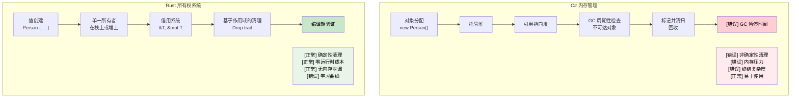

# 7. 所有权与借用

<a id="understanding-ownership"></a>

## 理解所有权

> **你将学到什么：** Rust 的所有权系统，为什么 `let s2 = s1` 会让 `s1` 失效（不同于 C# 的引用复制），所有权三条规则，`Copy` 类型与移动类型，使用 `&` 和 `&mut` 借用，以及借用检查器如何替代垃圾回收。
>
> **难度：** 🟡 中级

所有权是 Rust 最独特的特性，也是 C# 开发者最大的概念转变。我们一步一步来。

### C# 内存模型（回顾）

```csharp
// C# - 自动内存管理
public void ProcessData()
{
	var data = new List<int> { 1, 2, 3, 4, 5 };
	ProcessList(data);
	// 这里仍然可以访问 data
	Console.WriteLine(data.Count);  // 正常工作
    
	// 当没有引用剩余时，GC 会清理
}

public void ProcessList(List<int> list)
{
	list.Add(6);  // 修改原始 list
}
```

### Rust 所有权规则

1. **每个值都有且只有一个所有者**（除非你显式选择 `Rc<T>`/`Arc<T>` 这样的共享所有权，见 [智能指针](ch07-3-smart-pointers-beyond-single-ownership.md)）。
2. **当所有者离开作用域时，值会被丢弃**（确定性清理，见 [Drop](ch07-3-smart-pointers-beyond-single-ownership.md#drop-rusts-idisposable)）。
3. **所有权可以被转移（移动）**。

```rust
// Rust - 显式所有权管理
fn process_data() {
	let data = vec![1, 2, 3, 4, 5];  // data 拥有这个 vector
	process_list(data);              // 所有权移动到函数中
	// println!("{:?}", data);       // ❌ 错误：这里不再拥有 data
}

fn process_list(mut list: Vec<i32>) {  // list 现在拥有这个 vector
	list.push(6);
	// 函数结束时 list 在这里被丢弃
}
```

### 面向 C# 开发者理解“移动”

```csharp
// C# - 引用会被复制，对象留在原处
// （只有引用类型，也就是 class，是这样；
//  C# 的值类型如 struct 行为不同）
var original = new List<int> { 1, 2, 3 };
var reference = original;  // 两个变量指向同一个对象
original.Add(4);
Console.WriteLine(reference.Count);  // 4，同一个对象
```

```rust
// Rust - 所有权被转移
let original = vec![1, 2, 3];
let moved = original;       // 所有权被转移
// println!("{:?}", original);  // ❌ 错误：original 不再拥有数据
println!("{:?}", moved);    // ✅ 正常：moved 现在拥有数据
```

### Copy 类型 vs 移动类型

```rust
// Copy 类型（类似 C# 值类型）：复制，而不是移动
let x = 5;        // i32 实现 Copy
let y = x;        // x 被复制到 y
println!("{}", x); // ✅ 正常：x 仍然有效

// 移动类型（类似 C# 引用类型）：移动，而不是复制
let s1 = String::from("hello");  // String 没有实现 Copy
let s2 = s1;                     // s1 被移动到 s2
// println!("{}", s1);           // ❌ 错误：s1 不再有效
```

### 实用示例：交换值

```csharp
// C# - 简单引用交换
public void SwapLists(ref List<int> a, ref List<int> b)
{
	var temp = a;
	a = b;
	b = temp;
}
```

```rust
// Rust - 感知所有权的交换
fn swap_vectors(a: &mut Vec<i32>, b: &mut Vec<i32>) {
	std::mem::swap(a, b);  // 内置 swap 函数
}

// 或者手写方式
fn manual_swap() {
	let mut a = vec![1, 2, 3];
	let mut b = vec![4, 5, 6];
    
	let temp = a;  // 将 a 移动到 temp
	a = b;         // 将 b 移动到 a
	b = temp;      // 将 temp 移动到 b
    
	println!("a: {:?}, b: {:?}", a, b);
}
```

***

<a id="borrowing-basics"></a>

## 借用基础

借用类似在 C# 中取得引用，但带有编译期安全保证。

### C# 引用参数

```csharp
// C# - ref 和 out 参数
public void ModifyValue(ref int value)
{
	value += 10;
}

public void ReadValue(in int value)  // readonly reference
{
	Console.WriteLine(value);
}

public bool TryParse(string input, out int result)
{
	return int.TryParse(input, out result);
}
```

### Rust 借用

```rust
// Rust - 使用 & 和 &mut 借用
fn modify_value(value: &mut i32) {  // 可变借用
	*value += 10;
}

fn read_value(value: &i32) {        // 不可变借用
	println!("{}", value);
}

fn main() {
	let mut x = 5;
    
	read_value(&x);       // 不可变借用
	modify_value(&mut x); // 可变借用
    
	println!("{}", x);   // x 的所有权仍在这里
}
```

### 借用规则（编译期强制执行！）

```rust
fn borrowing_rules() {
	let mut data = vec![1, 2, 3];
    
	// 规则 1：可以有多个不可变借用
	let r1 = &data;
	let r2 = &data;
	println!("{:?} {:?}", r1, r2);  // ✅ 正常
    
	// 规则 2：同一时间只能有一个可变借用
	let r3 = &mut data;
	// let r4 = &mut data;  // ❌ 错误：不能可变借用两次
	// let r5 = &data;      // ❌ 错误：可变借用期间不能不可变借用
    
	r3.push(4);  // 使用这个可变借用
	// r3 的使用到这里结束
    
	// 规则 3：先前借用结束后，可以再次借用
	let r6 = &data;  // ✅ 现在可以
	println!("{:?}", r6);
}
```

### C# vs Rust：引用安全

```csharp
// C# - 潜在运行时错误
public class ReferenceSafety
{
	private List<int> data = new List<int>();
    
	public List<int> GetData() => data;  // 返回内部数据的引用
    
	public void UnsafeExample()
	{
		var reference = GetData();
        
		// 另一个线程可能在这里修改 data！
		Thread.Sleep(1000);
        
		// reference 可能已经无效或发生变化
		reference.Add(42);  // 潜在竞态条件
	}
}
```

```rust
// Rust - 编译期安全
pub struct SafeContainer {
	data: Vec<i32>,
}

impl SafeContainer {
	// 返回不可变借用，调用者不能修改
	// 优先返回 &[i32] 而不是 &Vec<i32>，接受更宽泛的类型
	pub fn get_data(&self) -> &[i32] {
		&self.data
	}
    
	// 返回可变借用，保证独占访问
	pub fn get_data_mut(&mut self) -> &mut Vec<i32> {
		&mut self.data
	}
}

fn safe_example() {
	let mut container = SafeContainer { data: vec![1, 2, 3] };
    
	let reference = container.get_data();
	// container.get_data_mut();  // ❌ 错误：不可变借用期间不能可变借用
    
	println!("{:?}", reference);  // 使用不可变引用
	// reference 的使用到这里结束
    
	let mut_reference = container.get_data_mut();  // ✅ 现在可以
	mut_reference.push(4);
}
```

***

<a id="move-semantics"></a>

## 移动语义

### C# 值类型 vs 引用类型

```csharp
// C# - 值类型会被复制
struct Point
{
	public int X { get; set; }
	public int Y { get; set; }
}

var p1 = new Point { X = 1, Y = 2 };
var p2 = p1;  // 复制
p2.X = 10;
Console.WriteLine(p1.X);  // 仍然是 1

// C# - 引用类型共享对象
var list1 = new List<int> { 1, 2, 3 };
var list2 = list1;  // 引用复制
list2.Add(4);
Console.WriteLine(list1.Count);  // 4，同一个对象
```

### Rust 移动语义

```rust
// Rust - 非 Copy 类型默认移动
#[derive(Debug)]
struct Point {
	x: i32,
	y: i32,
}

fn move_example() {
	let p1 = Point { x: 1, y: 2 };
	let p2 = p1;  // 移动（不是复制）
	// println!("{:?}", p1);  // ❌ 错误：p1 已经被移动
	println!("{:?}", p2);    // ✅ 正常
}

// 要启用复制，实现 Copy trait
#[derive(Debug, Copy, Clone)]
struct CopyablePoint {
	x: i32,
	y: i32,
}

fn copy_example() {
	let p1 = CopyablePoint { x: 1, y: 2 };
	let p2 = p1;  // 复制（因为它实现了 Copy）
	println!("{:?}", p1);  // ✅ 正常
	println!("{:?}", p2);  // ✅ 正常
}
```

### 什么时候会发生移动

```rust
fn demonstrate_moves() {
	let s = String::from("hello");
    
	// 1. 赋值会移动
	let s2 = s;  // s 移动到 s2
    
	// 2. 函数调用会移动
	take_ownership(s2);  // s2 移动进函数
    
	// 3. 从函数返回会移动
	let s3 = give_ownership();  // 返回值移动到 s3
    
	println!("{}", s3);  // s3 有效
}

fn take_ownership(s: String) {
	println!("{}", s);
	// s 在这里被丢弃
}

fn give_ownership() -> String {
	String::from("yours")  // 所有权移动给调用者
}
```

### 用借用避免移动

```rust
fn demonstrate_borrowing() {
	let s = String::from("hello");
    
	// 借用，而不是移动
	let len = calculate_length(&s);  // s 被借用
	println!("'{}' has length {}", s, len);  // s 仍然有效
}

fn calculate_length(s: &String) -> usize {
	s.len()  // s 不归这里所有，所以不会被丢弃
}
```

***

## 内存管理：GC vs RAII

### C# 垃圾回收

```csharp
// C# - 自动内存管理
public class Person
{
	public string Name { get; set; }
	public List<string> Hobbies { get; set; } = new List<string>();
    
	public void AddHobby(string hobby)
	{
		Hobbies.Add(hobby);  // 自动分配内存
	}
    
	// 不需要显式清理，GC 会处理
	// 但资源需要 IDisposable 模式
}

using var file = new FileStream("data.txt", FileMode.Open);
// using 确保 Dispose() 会被调用
```

### Rust 所有权与 RAII

```rust
// Rust - 编译期内存管理
pub struct Person {
	name: String,
	hobbies: Vec<String>,
}

impl Person {
	pub fn add_hobby(&mut self, hobby: String) {
		self.hobbies.push(hobby);  // 内存管理在编译期被跟踪
	}
    
	// Drop trait 会自动参与，清理有保证
	// 对应 C# 的 IDisposable：
	//   C#:   using var file = new FileStream(...)    // using 块结束时调用 Dispose()
	//   Rust: let file = File::open(...)?             // 作用域结束时调用 drop()，不需要 using
}

// RAII - Resource Acquisition Is Initialization
{
	let file = std::fs::File::open("data.txt")?;
	// file 离开作用域时自动关闭
	// 不需要 using 语句，由类型系统处理
}
```



***

<details>
<summary><strong>🏋️ 练习：修复借用检查器错误</strong>（点击展开）</summary>

**挑战**：下面每段代码都有一个借用检查器错误。在不改变输出的前提下修复它们。

```rust
// 1. 使用后移动
fn problem_1() {
	let name = String::from("Alice");
	let greeting = format!("Hello, {name}!");
	let upper = name.to_uppercase();  // 提示：借用而不是移动
	println!("{greeting} — {upper}");
}

// 2. 可变借用与不可变借用重叠
fn problem_2() {
	let mut numbers = vec![1, 2, 3];
	let first = &numbers[0];
	numbers.push(4);            // 提示：调整操作顺序
	println!("first = {first}");
}

// 3. 返回局部变量的引用
fn problem_3() -> String {
	let s = String::from("hello");
	s   // 提示：返回拥有所有权的值，而不是 &str
}
```

<details>
<summary>🔑 参考答案</summary>

```rust
// 1. format! 本来就会借用参数，这里的修复是显式传引用。
//    原代码实际上可以编译！但如果写成 `let greeting = name;`，
//    就要通过 &name 来修复：
fn solution_1() {
	let name = String::from("Alice");
	let greeting = format!("Hello, {}!", &name); // 借用
	let upper = name.to_uppercase();             // name 仍然有效
	println!("{greeting} — {upper}");
}

// 2. 在可变操作前使用不可变借用：
fn solution_2() {
	let mut numbers = vec![1, 2, 3];
	let first = numbers[0]; // 复制 i32 值（i32 是 Copy）
	numbers.push(4);
	println!("first = {first}");
}

// 3. 返回拥有所有权的 String（这本来就是正确的，初学者常误解）：
fn solution_3() -> String {
	let s = String::from("hello");
	s // 所有权转移给调用者，这是正确模式
}
```

**关键要点**：

- `format!()` 会借用参数，不会移动它们。
- `i32` 这样的基本类型实现了 `Copy`，因此索引访问会复制值。
- 返回拥有所有权的值会把所有权转移给调用者，不会产生生命周期问题。

</details>
</details>
