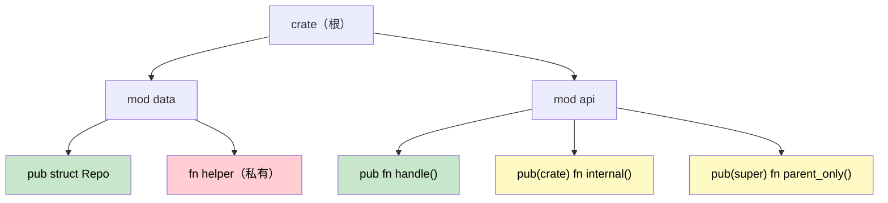

# 8. crate 与模块

## 代码组织

> **你将学到什么：** Rust 的模块系统与 C# 命名空间、程序集之间的对比，`pub`/`pub(crate)`/`pub(super)` 可见性，基于文件的模块组织方式，以及 crate 如何对应 .NET assembly。
>
> **难度：** 🟢 初级

理解 Rust 的模块系统，是组织代码和管理依赖的基础。对 C# 开发者来说，这相当于理解命名空间、assembly 和 NuGet 包。

<a id="rust-modules-vs-c-namespaces"></a>

### Rust 模块与 C# 命名空间

#### C# 命名空间组织

```csharp
// File: Models/User.cs
namespace MyApp.Models
{
    public class User
    {
        public string Name { get; set; }
        public int Age { get; set; }
    }
}

// File: Services/UserService.cs
using MyApp.Models;

namespace MyApp.Services
{
    public class UserService
    {
        public User CreateUser(string name, int age)
        {
            return new User { Name = name, Age = age };
        }
    }
}

// File: Program.cs
using MyApp.Models;
using MyApp.Services;

namespace MyApp
{
    class Program
    {
        static void Main(string[] args)
        {
            var service = new UserService();
            var user = service.CreateUser("Alice", 30);
        }
    }
}
```

#### Rust 模块组织

```rust
// File: src/models.rs
pub struct User {
    pub name: String,
    pub age: u32,
}

impl User {
    pub fn new(name: String, age: u32) -> User {
        User { name, age }
    }
}

// File: src/services.rs
use crate::models::User;

pub struct UserService;

impl UserService {
    pub fn create_user(name: String, age: u32) -> User {
        User::new(name, age)
    }
}

// File: src/lib.rs (or main.rs)
pub mod models;
pub mod services;

use models::User;
use services::UserService;

fn main() {
    let service = UserService;
    let user = UserService::create_user("Alice".to_string(), 30);
}
```

### 模块层级与可见性



> 🟢 绿色 = 到处公开 &nbsp;|&nbsp; 🟡 黄色 = 受限可见性 &nbsp;|&nbsp; 🔴 红色 = 私有

#### C# 可见性修饰符

```csharp
namespace MyApp.Data
{
    // public：任何地方都能访问
    public class Repository
    {
        // private：只能在这个类内部访问
        private string connectionString;
        
        // internal：同一 assembly 内可访问
        internal void Connect() { }
        
        // protected：当前类和子类可访问
        protected virtual void Initialize() { }
        
        // public：任何地方都能访问
        public void Save(object data) { }
    }
}
```

#### Rust 可见性规则

```rust
// Rust 中所有东西默认都是私有的
mod data {
    struct Repository {  // 私有结构体
        connection_string: String,  // 私有字段
    }
    
    impl Repository {
        fn new() -> Repository {  // 私有函数
            Repository {
                connection_string: "localhost".to_string(),
            }
        }
        
        pub fn connect(&self) {  // 公开方法
            // 由于 Repository 本身私有，外部仍然不能直接调用它
        }
        
        pub(crate) fn initialize(&self) {  // crate 级公开
            // 这个 crate 内的任何位置都能访问
        }
        
        pub(super) fn internal_method(&self) {  // 对父模块公开
            // 父模块中可以访问
        }
    }
    
    // 公开结构体：模块外部也能访问
    pub struct PublicRepository {
        pub data: String,  // 公开字段
        private_data: String,  // 私有字段（没有 pub）
    }
}

pub use data::PublicRepository;  // 重新导出，方便外部使用
```

### 模块文件组织

#### C# 项目结构

```text
MyApp/
├── MyApp.csproj
├── Models/
│   ├── User.cs
│   └── Product.cs
├── Services/
│   ├── UserService.cs
│   └── ProductService.cs
├── Controllers/
│   └── ApiController.cs
└── Program.cs
```

#### Rust 模块文件结构

```text
my_app/
├── Cargo.toml
└── src/
    ├── main.rs (or lib.rs)
    ├── models/
    │   ├── mod.rs        // 模块声明
    │   ├── user.rs
    │   └── product.rs
    ├── services/
    │   ├── mod.rs        // 模块声明
    │   ├── user_service.rs
    │   └── product_service.rs
    └── controllers/
        ├── mod.rs
        └── api_controller.rs
```

#### 模块声明模式

```rust
// src/models/mod.rs
pub mod user;      // 将 user.rs 声明为子模块
pub mod product;   // 将 product.rs 声明为子模块

// 重新导出常用类型
pub use user::User;
pub use product::Product;

// src/main.rs
mod models;     // 将 models/ 声明为模块
mod services;   // 将 services/ 声明为模块

// 导入特定条目
use models::{User, Product};
use services::UserService;

// 或导入整个模块
use models::user::*;  // 导入 user 模块中的所有公开条目
```

***

<a id="crates-vs-net-assemblies"></a>

## crate 与 .NET Assembly

### 理解 crate

在 Rust 中，**crate** 是编译和代码分发的基本单元，类似于 .NET 中 **assembly** 的角色。

#### C# Assembly 模型

```csharp
// MyLibrary.dll：已编译的 assembly
namespace MyLibrary
{
    public class Calculator
    {
        public int Add(int a, int b) => a + b;
    }
}

// MyApp.exe：引用 MyLibrary.dll 的可执行 assembly
using MyLibrary;

class Program
{
    static void Main()
    {
        var calc = new Calculator();
        Console.WriteLine(calc.Add(2, 3));
    }
}
```

#### Rust crate 模型

```toml
# library crate 的 Cargo.toml
[package]
name = "my_calculator"
version = "0.1.0"
edition = "2021"

[lib]
name = "my_calculator"
```

```rust
// src/lib.rs：Library crate
pub struct Calculator;

impl Calculator {
    pub fn add(&self, a: i32, b: i32) -> i32 {
        a + b
    }
}
```

```toml
# 使用该库的 binary crate 的 Cargo.toml
[package]
name = "my_app"
version = "0.1.0"
edition = "2021"

[dependencies]
my_calculator = { path = "../my_calculator" }
```

```rust
// src/main.rs：Binary crate
use my_calculator::Calculator;

fn main() {
    let calc = Calculator;
    println!("{}", calc.add(2, 3));
}
```

### crate 类型对比

| C# 概念 | Rust 对应概念 | 用途 |
|------------|----------------|---------|
| Class Library (.dll) | Library crate | 可复用代码 |
| Console App (.exe) | Binary crate | 可执行程序 |
| NuGet Package | Published crate | 分发单元 |
| Assembly (.dll/.exe) | Compiled crate | 编译单元 |
| Solution (.sln) | Workspace | 多项目组织 |

### Workspace 与 Solution

#### C# Solution 结构

```xml
<!-- MySolution.sln structure -->
<Solution>
    <Project Include="WebApi/WebApi.csproj" />
    <Project Include="Business/Business.csproj" />
    <Project Include="DataAccess/DataAccess.csproj" />
    <Project Include="Tests/Tests.csproj" />
</Solution>
```

#### Rust Workspace 结构

```toml
# 工作区根目录下的 Cargo.toml
[workspace]
members = [
    "web_api",
    "business",
    "data_access",
    "tests"
]

[workspace.dependencies]
serde = "1.0"           # 共享依赖版本
tokio = "1.0"
```

```toml
# web_api/Cargo.toml
[package]
name = "web_api"
version = "0.1.0"
edition = "2021"

[dependencies]
business = { path = "../business" }
serde = { workspace = true }    # 使用 workspace 版本
tokio = { workspace = true }
```

---

## 练习

<details>
<summary><strong>🏋️ 练习：设计模块树</strong>（点击展开）</summary>

给定下面这个 C# 项目布局，设计等价的 Rust 模块树：

```csharp
// C#
namespace MyApp.Services { public class AuthService { } }
namespace MyApp.Services { internal class TokenStore { } }
namespace MyApp.Models { public class User { } }
namespace MyApp.Models { public class Session { } }
```

要求：

1. `AuthService` 和两个模型都必须公开。
2. `TokenStore` 必须只对 `services` 模块私有。
3. 给出文件布局，以及 `lib.rs` 中的 `mod` / `pub` 声明。

<details>
<summary>🔑 参考答案</summary>

文件布局：

```
src/
├── lib.rs
├── services/
│   ├── mod.rs
│   ├── auth_service.rs
│   └── token_store.rs
└── models/
    ├── mod.rs
    ├── user.rs
    └── session.rs
```

```rust,ignore
// src/lib.rs
pub mod services;
pub mod models;

// src/services/mod.rs
mod token_store;          // 私有，类似 C# internal
pub mod auth_service;     // 公开

// src/services/auth_service.rs
use super::token_store::TokenStore; // 在同一模块树内可见

pub struct AuthService;

impl AuthService {
    pub fn login(&self) { /* internally uses TokenStore */ }
}

// src/services/token_store.rs
pub(super) struct TokenStore; // 只对父模块 services 可见

// src/models/mod.rs
pub mod user;
pub mod session;

// src/models/user.rs
pub struct User {
    pub name: String,
}

// src/models/session.rs
pub struct Session {
    pub user_id: u64,
}
```

</details>
</details>

***
