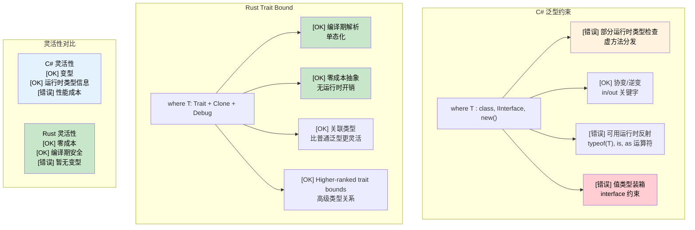

<a id="generic-constraints-where-vs-trait-bounds"></a>

# 泛型约束：where 与 trait bound

> **你将学到什么：** Rust 的 trait bound 与 C# 的 `where` 约束对比，`where` 子句语法，条件 trait 实现，关联类型，以及 higher-ranked trait bounds（HRTB，高阶生命周期约束）。
>
> **难度：** 🔴 高级

### C# 泛型约束

```csharp
// C# 带 where 子句的泛型约束
public class Repository<T> where T : class, IEntity, new()
{
    public T Create()
    {
        return new T();  // new() 约束允许无参构造函数
    }
    
    public void Save(T entity)
    {
        if (entity.Id == 0)  // IEntity 约束提供 Id 属性
        {
            entity.Id = GenerateId();
        }
        // 保存到数据库
    }
}

// 带约束的多个类型参数
public class Converter<TInput, TOutput> 
    where TInput : IConvertible
    where TOutput : class, new()
{
    public TOutput Convert(TInput input)
    {
        var output = new TOutput();
        // 使用 IConvertible 的转换逻辑
        return output;
    }
}

// 泛型变型
public interface IRepository<out T> where T : IEntity
{
    IEnumerable<T> GetAll();  // 协变：可以返回更派生的类型
}

public interface IWriter<in T> where T : IEntity
{
    void Write(T entity);  // 逆变：可以接受更基础的类型
}
```

### 使用 Trait Bound 的 Rust 泛型约束

```rust
use std::fmt::{Debug, Display};
use std::clone::Clone;

// 基本 trait bound
pub struct Repository<T> 
where 
    T: Clone + Debug + Default,
{
    items: Vec<T>,
}

impl<T> Repository<T> 
where 
    T: Clone + Debug + Default,
{
    pub fn new() -> Self {
        Repository { items: Vec::new() }
    }
    
    pub fn create(&self) -> T {
        T::default()  // Default trait 提供默认值
    }
    
    pub fn add(&mut self, item: T) {
        println!("Adding item: {:?}", item);  // Debug trait 用于打印
        self.items.push(item);
    }
    
    pub fn get_all(&self) -> Vec<T> {
        self.items.clone()  // Clone trait 用于复制
    }
}

// 多个 trait bound 的不同语法
pub fn process_data<T, U>(input: T) -> U 
where 
    T: Display + Clone,
    U: From<T> + Debug,
{
    println!("Processing: {}", input);  // Display trait
    let cloned = input.clone();         // Clone trait
    let output = U::from(cloned);       // From trait 用于转换
    println!("Result: {:?}", output);   // Debug trait
    output
}

// 关联类型（类似 C# 泛型约束中的类型关系）
pub trait Iterator {
    type Item;  // 用关联类型，而不是泛型参数
    
    fn next(&mut self) -> Option<Self::Item>;
}

pub trait Collect<T> {
    fn collect<I: Iterator<Item = T>>(iter: I) -> Self;
}

// Higher-ranked trait bounds（高级）
fn apply_to_all<F>(items: &[String], f: F) -> Vec<String>
where 
    F: for<'a> Fn(&'a str) -> String,  // 这个函数能处理任意生命周期
{
    items.iter().map(|s| f(s)).collect()
}

// 条件 trait 实现
impl<T> PartialEq for Repository<T> 
where 
    T: PartialEq + Clone + Debug + Default,
{
    fn eq(&self, other: &Self) -> bool {
        self.items == other.items
    }
}
```



---

## 练习

<details>
<summary><strong>🏋️ 练习：泛型 Repository</strong>（点击展开）</summary>

把下面这个 C# 泛型 repository interface 翻译成 Rust trait：

```csharp
public interface IRepository<T> where T : IEntity, new()
{
    T GetById(int id);
    IEnumerable<T> Find(Func<T, bool> predicate);
    void Save(T entity);
}
```

要求：

1. 定义一个 `Entity` trait，包含 `fn id(&self) -> u64`。
2. 定义一个 `Repository<T>` trait，其中 `T: Entity + Clone`。
3. 实现一个 `InMemoryRepository<T>`，用 `Vec<T>` 存储条目。
4. `find` 方法应接受 `impl Fn(&T) -> bool`。

<details>
<summary>🔑 参考答案</summary>

```rust
trait Entity: Clone {
    fn id(&self) -> u64;
}

trait Repository<T: Entity> {
    fn get_by_id(&self, id: u64) -> Option<&T>;
    fn find(&self, predicate: impl Fn(&T) -> bool) -> Vec<&T>;
    fn save(&mut self, entity: T);
}

struct InMemoryRepository<T> {
    items: Vec<T>,
}

impl<T: Entity> InMemoryRepository<T> {
    fn new() -> Self { Self { items: Vec::new() } }
}

impl<T: Entity> Repository<T> for InMemoryRepository<T> {
    fn get_by_id(&self, id: u64) -> Option<&T> {
        self.items.iter().find(|item| item.id() == id)
    }
    fn find(&self, predicate: impl Fn(&T) -> bool) -> Vec<&T> {
        self.items.iter().filter(|item| predicate(item)).collect()
    }
    fn save(&mut self, entity: T) {
        if let Some(pos) = self.items.iter().position(|e| e.id() == entity.id()) {
            self.items[pos] = entity;
        } else {
            self.items.push(entity);
        }
    }
}

#[derive(Clone, Debug)]
struct User { user_id: u64, name: String }

impl Entity for User {
    fn id(&self) -> u64 { self.user_id }
}

fn main() {
    let mut repo = InMemoryRepository::new();
    repo.save(User { user_id: 1, name: "Alice".into() });
    repo.save(User { user_id: 2, name: "Bob".into() });

    let found = repo.find(|u| u.name.starts_with('A'));
    assert_eq!(found.len(), 1);
}
```

**与 C# 的关键区别：** Rust 没有 `new()` 约束，通常使用 `Default` trait 替代。`Fn(&T) -> bool` 替代 `Func<T, bool>`。返回 `Option`，而不是抛异常。

</details>
</details>

***
