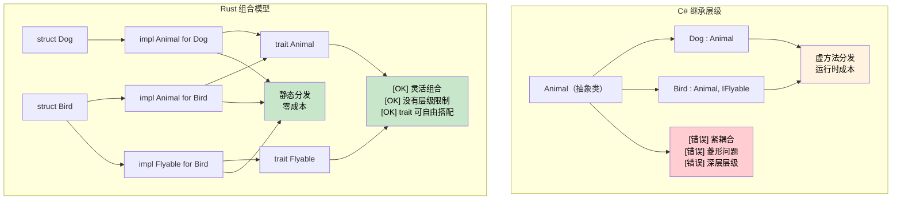

<a id="inheritance-vs-composition"></a>

# 继承与组合

> **你将学到什么：** 为什么 Rust 没有类继承，trait + struct 如何替代深层类层级，以及如何通过组合实现多态的实用模式。
>
> **难度：** 🟡 中级

```csharp
// C#：基于类的继承
public abstract class Animal
{
    public string Name { get; protected set; }
    public abstract void MakeSound();
    
    public virtual void Sleep()
    {
        Console.WriteLine($"{Name} is sleeping");
    }
}

public class Dog : Animal
{
    public Dog(string name) { Name = name; }
    
    public override void MakeSound()
    {
        Console.WriteLine("Woof!");
    }
    
    public void Fetch()
    {
        Console.WriteLine($"{Name} is fetching");
    }
}

// 基于 interface 的契约
public interface IFlyable
{
    void Fly();
}

public class Bird : Animal, IFlyable
{
    public Bird(string name) { Name = name; }
    
    public override void MakeSound()
    {
        Console.WriteLine("Tweet!");
    }
    
    public void Fly()
    {
        Console.WriteLine($"{Name} is flying");
    }
}
```

### Rust 组合模型

```rust
// Rust：用 trait 实现组合优于继承
pub trait Animal {
    fn name(&self) -> &str;
    fn make_sound(&self);
    
    // 默认实现（类似 C# virtual 方法）
    fn sleep(&self) {
        println!("{} is sleeping", self.name());
    }
}

pub trait Flyable {
    fn fly(&self);
}

// 数据与行为分离
#[derive(Debug)]
pub struct Dog {
    name: String,
}

#[derive(Debug)]
pub struct Bird {
    name: String,
    wingspan: f64,
}

// 为类型实现行为
impl Animal for Dog {
    fn name(&self) -> &str {
        &self.name
    }
    
    fn make_sound(&self) {
        println!("Woof!");
    }
}

impl Dog {
    pub fn new(name: String) -> Self {
        Dog { name }
    }
    
    pub fn fetch(&self) {
        println!("{} is fetching", self.name);
    }
}

impl Animal for Bird {
    fn name(&self) -> &str {
        &self.name
    }
    
    fn make_sound(&self) {
        println!("Tweet!");
    }
}

impl Flyable for Bird {
    fn fly(&self) {
        println!("{} is flying with {:.1}m wingspan", self.name, self.wingspan);
    }
}

// 多个 trait bound（类似多个 interface）
fn make_flying_animal_sound<T>(animal: &T) 
where 
    T: Animal + Flyable,
{
    animal.make_sound();
    animal.fly();
}
```



---

## 练习

<details>
<summary><strong>🏋️ 练习：用 trait 替代继承</strong>（点击展开）</summary>

下面这段 C# 代码使用继承。请用 Rust 的 trait 组合重写它：

```csharp
public abstract class Shape { public abstract double Area(); }
public abstract class Shape3D : Shape { public abstract double Volume(); }
public class Cylinder : Shape3D
{
    public double Radius { get; }
    public double Height { get; }
    public Cylinder(double r, double h) { Radius = r; Height = h; }
    public override double Area() => 2.0 * Math.PI * Radius * (Radius + Height);
    public override double Volume() => Math.PI * Radius * Radius * Height;
}
```

要求：

1. `HasArea` trait，包含 `fn area(&self) -> f64`。
2. `HasVolume` trait，包含 `fn volume(&self) -> f64`。
3. `Cylinder` 结构体同时实现二者。
4. 一个函数 `fn print_shape_info(shape: &(impl HasArea + HasVolume))`，注意这里是 trait bound 组合，不需要继承。

<details>
<summary>🔑 参考答案</summary>

```rust
use std::f64::consts::PI;

trait HasArea {
    fn area(&self) -> f64;
}

trait HasVolume {
    fn volume(&self) -> f64;
}

struct Cylinder {
    radius: f64,
    height: f64,
}

impl HasArea for Cylinder {
    fn area(&self) -> f64 {
        2.0 * PI * self.radius * (self.radius + self.height)
    }
}

impl HasVolume for Cylinder {
    fn volume(&self) -> f64 {
        PI * self.radius * self.radius * self.height
    }
}

fn print_shape_info(shape: &(impl HasArea + HasVolume)) {
    println!("Area:   {:.2}", shape.area());
    println!("Volume: {:.2}", shape.volume());
}

fn main() {
    let c = Cylinder { radius: 3.0, height: 5.0 };
    print_shape_info(&c);
}
```

**关键洞察：** C# 需要 3 层层级（Shape → Shape3D → Cylinder）。Rust 使用扁平的 trait 组合，`impl HasArea + HasVolume` 可以组合能力，不需要继承深度。

</details>
</details>

***
