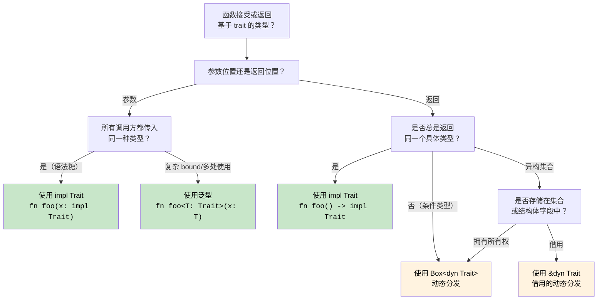

# 10. trait 与泛型

<a id="traits---rusts-interfaces"></a>

## Trait：Rust 的接口

> **你将学到什么：** trait 与 C# interface 的对比，默认方法实现，trait object（`dyn Trait`）与泛型约束（`impl Trait`），派生 trait，常见标准库 trait，关联类型，以及通过 trait 实现运算符重载。
>
> **难度：** 🟡 中级

trait 是 Rust 定义共享行为的方式，类似于 C# 中的 interface，但能力更强。

### 与 C# Interface 对比

```csharp
// C# interface 定义
public interface IAnimal
{
    string Name { get; }
    void MakeSound();
    
    // 默认实现（C# 8+）
    string Describe()
    {
        return $"{Name} makes a sound";
    }
}

// C# interface 实现
public class Dog : IAnimal
{
    public string Name { get; }
    
    public Dog(string name)
    {
        Name = name;
    }
    
    public void MakeSound()
    {
        Console.WriteLine("Woof!");
    }
    
    // 可以覆盖默认实现
    public string Describe()
    {
        return $"{Name} is a loyal dog";
    }
}

// 泛型约束
public void ProcessAnimal<T>(T animal) where T : IAnimal
{
    animal.MakeSound();
    Console.WriteLine(animal.Describe());
}
```

### Rust Trait 定义与实现

```rust
// Trait 定义
trait Animal {
    fn name(&self) -> &str;
    fn make_sound(&self);
    
    // 默认实现
    fn describe(&self) -> String {
        format!("{} makes a sound", self.name())
    }
    
    // 使用其他 trait 方法的默认实现
    fn introduce(&self) {
        println!("Hi, I'm {}", self.name());
        self.make_sound();
    }
}

// 结构体定义
#[derive(Debug)]
struct Dog {
    name: String,
    breed: String,
}

impl Dog {
    fn new(name: String, breed: String) -> Dog {
        Dog { name, breed }
    }
}

// Trait 实现
impl Animal for Dog {
    fn name(&self) -> &str {
        &self.name
    }
    
    fn make_sound(&self) {
        println!("Woof!");
    }
    
    // 覆盖默认实现
    fn describe(&self) -> String {
        format!("{} is a loyal {} dog", self.name, self.breed)
    }
}

// 另一个实现
#[derive(Debug)]
struct Cat {
    name: String,
    indoor: bool,
}

impl Animal for Cat {
    fn name(&self) -> &str {
        &self.name
    }
    
    fn make_sound(&self) {
        println!("Meow!");
    }
    
    // 使用默认的 describe() 实现
}

// 带 trait bound 的泛型函数
fn process_animal<T: Animal>(animal: &T) {
    animal.make_sound();
    println!("{}", animal.describe());
    animal.introduce();
}

// 多个 trait bound
fn process_animal_debug<T: Animal + std::fmt::Debug>(animal: &T) {
    println!("Debug: {:?}", animal);
    process_animal(animal);
}

fn main() {
    let dog = Dog::new("Buddy".to_string(), "Golden Retriever".to_string());
    let cat = Cat { name: "Whiskers".to_string(), indoor: true };
    
    process_animal(&dog);
    process_animal(&cat);
    
    process_animal_debug(&dog);
}
```

### Trait Object 与动态分发

```csharp
// C# 动态多态
public void ProcessAnimals(List<IAnimal> animals)
{
    foreach (var animal in animals)
    {
        animal.MakeSound(); // 动态分发
        Console.WriteLine(animal.Describe());
    }
}

// 用法
var animals = new List<IAnimal>
{
    new Dog("Buddy"),
    new Cat("Whiskers"),
    new Dog("Rex")
};

ProcessAnimals(animals);
```

```rust
// Rust trait object 用于动态分发
fn process_animals(animals: &[Box<dyn Animal>]) {
    for animal in animals {
        animal.make_sound(); // 动态分发
        println!("{}", animal.describe());
    }
}

// 另一种方式：使用引用
fn process_animal_refs(animals: &[&dyn Animal]) {
    for animal in animals {
        animal.make_sound();
        println!("{}", animal.describe());
    }
}

fn main() {
    // 使用 Box<dyn Trait>
    let animals: Vec<Box<dyn Animal>> = vec![
        Box::new(Dog::new("Buddy".to_string(), "Golden Retriever".to_string())),
        Box::new(Cat { name: "Whiskers".to_string(), indoor: true }),
        Box::new(Dog::new("Rex".to_string(), "German Shepherd".to_string())),
    ];
    
    process_animals(&animals);
    
    // 使用引用
    let dog = Dog::new("Buddy".to_string(), "Golden Retriever".to_string());
    let cat = Cat { name: "Whiskers".to_string(), indoor: true };
    
    let animal_refs: Vec<&dyn Animal> = vec![&dog, &cat];
    process_animal_refs(&animal_refs);
}
```

### 派生 trait

```rust
// 自动派生常见 trait
#[derive(Debug, Clone, PartialEq, Eq, Hash)]
struct Person {
    name: String,
    age: u32,
}

// 它大致会生成这些代码（简化版）：
impl std::fmt::Debug for Person {
    fn fmt(&self, f: &mut std::fmt::Formatter<'_>) -> std::fmt::Result {
        f.debug_struct("Person")
            .field("name", &self.name)
            .field("age", &self.age)
            .finish()
    }
}

impl Clone for Person {
    fn clone(&self) -> Self {
        Person {
            name: self.name.clone(),
            age: self.age,
        }
    }
}

impl PartialEq for Person {
    fn eq(&self, other: &Self) -> bool {
        self.name == other.name && self.age == other.age
    }
}

// 用法
fn main() {
    let person1 = Person {
        name: "Alice".to_string(),
        age: 30,
    };
    
    let person2 = person1.clone(); // Clone trait
    
    println!("{:?}", person1); // Debug trait
    println!("Equal: {}", person1 == person2); // PartialEq trait
}
```

<a id="common-standard-library-traits"></a>

### 常见标准库 trait

```rust
use std::collections::HashMap;

// Display trait 用于面向用户的输出
impl std::fmt::Display for Person {
    fn fmt(&self, f: &mut std::fmt::Formatter<'_>) -> std::fmt::Result {
        write!(f, "{} (age {})", self.name, self.age)
    }
}

// From trait 用于转换
impl From<(String, u32)> for Person {
    fn from((name, age): (String, u32)) -> Self {
        Person { name, age }
    }
}

// 实现 From 后，Into 会自动可用
fn create_person() {
    let person: Person = ("Alice".to_string(), 30).into();
    println!("{}", person);
}

// Iterator trait 实现
struct PersonIterator {
    people: Vec<Person>,
    index: usize,
}

impl Iterator for PersonIterator {
    type Item = Person;
    
    fn next(&mut self) -> Option<Self::Item> {
        if self.index < self.people.len() {
            let person = self.people[self.index].clone();
            self.index += 1;
            Some(person)
        } else {
            None
        }
    }
}

impl Person {
    fn iterator(people: Vec<Person>) -> PersonIterator {
        PersonIterator { people, index: 0 }
    }
}

fn main() {
    let people = vec![
        Person::from(("Alice".to_string(), 30)),
        Person::from(("Bob".to_string(), 25)),
        Person::from(("Charlie".to_string(), 35)),
    ];
    
    // 使用我们自定义的迭代器
    for person in Person::iterator(people.clone()) {
        println!("{}", person); // 使用 Display trait
    }
}
```

***


<details>
<summary><strong>🏋️ 练习：基于 trait 的绘图系统</strong>（点击展开）</summary>

**挑战：** 实现一个 `Drawable` trait，包含 `area()` 方法和一个默认的 `draw()` 方法。创建 `Circle` 和 `Rect` 结构体。编写一个接受 `&[Box<dyn Drawable>]` 的函数，并打印总面积。

<details>
<summary>🔑 参考答案</summary>

```rust
use std::f64::consts::PI;

trait Drawable {
    fn area(&self) -> f64;

    fn draw(&self) {
        println!("Drawing shape with area {:.2}", self.area());
    }
}

struct Circle { radius: f64 }
struct Rect   { w: f64, h: f64 }

impl Drawable for Circle {
    fn area(&self) -> f64 { PI * self.radius * self.radius }
}

impl Drawable for Rect {
    fn area(&self) -> f64 { self.w * self.h }
}

fn total_area(shapes: &[Box<dyn Drawable>]) -> f64 {
    shapes.iter().map(|s| s.area()).sum()
}

fn main() {
    let shapes: Vec<Box<dyn Drawable>> = vec![
        Box::new(Circle { radius: 5.0 }),
        Box::new(Rect { w: 4.0, h: 6.0 }),
        Box::new(Circle { radius: 2.0 }),
    ];
    for s in &shapes { s.draw(); }
    println!("Total area: {:.2}", total_area(&shapes));
}
```

**关键要点：**

- `dyn Trait` 提供运行时多态，类似 C# 的 `IDrawable`。
- `Box<dyn Trait>` 分配在堆上，异构集合需要它。
- 默认方法的作用与 C# 8+ 默认 interface 方法非常接近。

</details>
</details>

### 关联类型：带类型成员的 trait

C# interface 没有关联类型，Rust trait 有。`Iterator` 就是这样工作的：

```rust
// Iterator trait 有一个关联类型 'Item'
trait Iterator {
    type Item;                         // 每个实现者都定义自己的 Item 类型
    fn next(&mut self) -> Option<Self::Item>;
}

struct Counter { max: u32, current: u32 }

impl Iterator for Counter {
    type Item = u32;                   // 这个 Counter 产出 u32 值
    fn next(&mut self) -> Option<u32> {
        if self.current < self.max {
            self.current += 1;
            Some(self.current)
        } else {
            None
        }
    }
}
```

在 C# 中，`IEnumerator<T>` 用泛型参数（`T`）达到类似目的。Rust 的关联类型不同：`Iterator` 的每个实现都有**一个** `Item` 类型，而不是在 trait 层级上带泛型参数。这会让 trait bound 更简洁：`impl Iterator<Item = u32>`，对比 C# 的 `IEnumerable<int>`。

### 通过 trait 实现运算符重载

在 C# 中，你会定义 `public static MyType operator+(MyType a, MyType b)`。在 Rust 中，每个运算符都会映射到 `std::ops` 中的一个 trait：

```rust
use std::ops::Add;

#[derive(Debug, Clone, Copy)]
struct Vec2 { x: f64, y: f64 }

impl Add for Vec2 {
    type Output = Vec2;
    fn add(self, rhs: Vec2) -> Vec2 {
        Vec2 { x: self.x + rhs.x, y: self.y + rhs.y }
    }
}

let a = Vec2 { x: 1.0, y: 2.0 };
let b = Vec2 { x: 3.0, y: 4.0 };
let c = a + b;  // 调用 <Vec2 as Add>::add(a, b)
```

| C# | Rust | 说明 |
|----|------|-------|
| `operator+` | `impl Add` | `self` 按值传递，对于非 `Copy` 类型会消耗值 |
| `operator==` | `impl PartialEq` | 通常用 `#[derive(PartialEq)]` |
| `operator<` | `impl PartialOrd` | 通常用 `#[derive(PartialOrd)]` |
| `ToString()` | `impl fmt::Display` | 由 `println!("{}", x)` 使用 |
| 隐式转换 | 无对应概念 | Rust 没有隐式转换，使用 `From`/`Into` |

### 一致性规则：孤儿规则

只有当你拥有 trait 或拥有类型时，才能为某个类型实现某个 trait。这能防止不同 crate 之间出现冲突实现：

```rust
// ✅ OK：你拥有 MyType
impl Display for MyType { ... }

// ✅ OK：你拥有 MyTrait
impl MyTrait for String { ... }

// ❌ ERROR：Display 和 String 都不归你所有
impl Display for String { ... }
```

C# 没有对应限制，任何代码都能给任何类型添加扩展方法，这可能导致歧义。

<!-- ch10.0a: impl Trait and Dispatch Strategies -->
## `impl Trait`：返回 trait 而不装箱

C# 中经常直接把 interface 作为返回类型暴露。在 Rust 中，返回一个 trait 需要做选择：静态分发（`impl Trait`）还是动态分发（`dyn Trait`）。

### 参数位置的 `impl Trait`（泛型简写）

```rust
// 这两种写法等价：
fn print_animal(animal: &impl Animal) { animal.make_sound(); }
fn print_animal<T: Animal>(animal: &T)  { animal.make_sound(); }

// impl Trait 只是泛型参数的语法糖
// 编译器会为每个具体类型生成专门版本（单态化）
```

### 返回位置的 `impl Trait`（关键差异）

```rust
// 返回一个迭代器，但不暴露具体类型
fn even_squares(limit: u32) -> impl Iterator<Item = u32> {
    (0..limit)
        .filter(|n| n % 2 == 0)
        .map(|n| n * n)
}
// 调用方看到的是“某个实现了 Iterator<Item = u32> 的类型”
// 真实类型（Filter<Map<Range<u32>, ...>>）无法轻易命名，impl Trait 正好解决这个问题。

fn main() {
    for n in even_squares(20) {
        print!("{n} ");
    }
    // Output: 0 4 16 36 64 100 144 196 256 324
}
```

```csharp
// C#：返回 interface（隐藏具体迭代器；实际分配和去虚化取决于编译器/JIT）
public IEnumerable<int> EvenSquares(int limit) =>
    Enumerable.Range(0, limit)
        .Where(n => n % 2 == 0)
        .Select(n => n * n);
// 返回类型把具体迭代器隐藏在 IEnumerable interface 后面
// 不同于 Rust 的 Box<dyn Trait>，C# 不需要显式装箱，运行时会处理分配
```

### 返回闭包：`impl Fn` 与 `Box<dyn Fn>`

```rust
// 返回一个闭包：闭包类型无法命名，所以 impl Fn 很关键
fn make_adder(x: i32) -> impl Fn(i32) -> i32 {
    move |y| x + y
}

let add5 = make_adder(5);
println!("{}", add5(3)); // 8

// 如果需要根据条件返回不同闭包，就需要 Box：
fn choose_op(add: bool) -> Box<dyn Fn(i32, i32) -> i32> {
    if add {
        Box::new(|a, b| a + b)
    } else {
        Box::new(|a, b| a * b)
    }
}
// impl Trait 要求返回单一具体类型；不同闭包是不同类型
```

```csharp
// C#：delegate 可以自然处理这种场景；捕获闭包通常需要运行时对象，具体分配由编译器/JIT 决定
Func<int, int> MakeAdder(int x) => y => x + y;
Func<int, int, int> ChooseOp(bool add) => add ? (a, b) => a + b : (a, b) => a * b;
```

### 分发决策：`impl Trait`、`dyn Trait` 与泛型

这是 C# 开发者在 Rust 中很快会遇到的架构选择。下面是一份完整指南：



| 方式 | 分发 | 分配 | 何时使用 |
|----------|----------|------------|-------------|
| `fn foo<T: Trait>(x: T)` | 静态（单态化） | 栈 | 多个 trait bound、需要 turbofish、同一类型重复使用 |
| `fn foo(x: impl Trait)` | 静态（单态化） | 栈 | 简单 bound、语法更干净、一次性参数 |
| `fn foo() -> impl Trait` | 静态 | 栈 | 单一具体返回类型、迭代器、闭包 |
| `fn foo() -> Box<dyn Trait>` | 动态（vtable） | **堆** | 不同返回类型、集合中的 trait object |
| `&dyn Trait` / `&mut dyn Trait` | 动态（vtable） | 无分配 | 借用的异构引用、函数参数 |

```rust
// 总结：从最快到最灵活
fn static_dispatch(x: impl Display)             { /* fastest, no alloc */ }
fn generic_dispatch<T: Display + Clone>(x: T)    { /* fastest, multiple bounds */ }
fn dynamic_dispatch(x: &dyn Display)             { /* vtable lookup, no alloc */ }
fn boxed_dispatch(x: Box<dyn Display>)           { /* vtable lookup + heap alloc */ }
```

***
