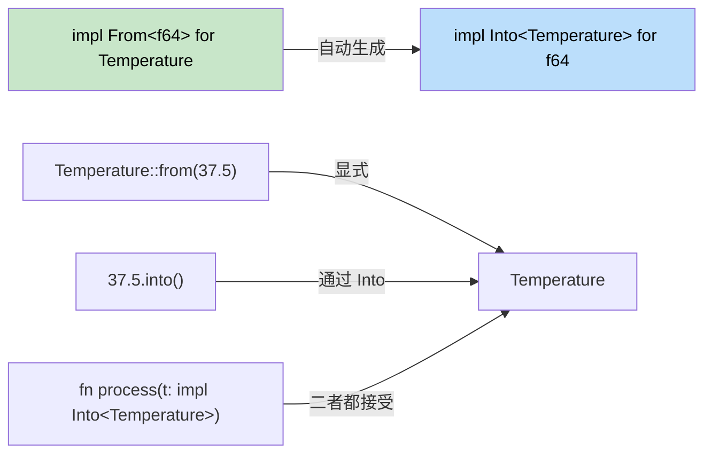

# 11. From 与 Into trait

<a id="type-conversions-in-rust"></a>

## Rust 中的类型转换

> **你将学到什么：** `From`/`Into` trait 与 C# implicit/explicit 运算符的对比，用于可能失败转换的 `TryFrom`/`TryInto`，用于解析的 `FromStr`，以及符合 Rust 惯用法的字符串转换模式。
>
> **难度：** 🟡 中级

C# 使用 implicit/explicit 转换和强制转换运算符。Rust 使用 `From` 和 `Into` trait 来进行安全、显式的转换。

### C# 转换模式

```csharp
// C# implicit/explicit 转换
public class Temperature
{
    public double Celsius { get; }
    
    public Temperature(double celsius) { Celsius = celsius; }
    
    // 隐式转换
    public static implicit operator double(Temperature t) => t.Celsius;
    
    // 显式转换
    public static explicit operator Temperature(double d) => new Temperature(d);
}

double temp = new Temperature(100.0);  // 隐式
Temperature t = (Temperature)37.5;     // 显式
```

<a id="rust-from-and-into"></a>

### Rust From 与 Into

```rust
#[derive(Debug)]
struct Temperature {
    celsius: f64,
}

impl From<f64> for Temperature {
    fn from(celsius: f64) -> Self {
        Temperature { celsius }
    }
}

impl From<Temperature> for f64 {
    fn from(temp: Temperature) -> f64 {
        temp.celsius
    }
}

fn main() {
    // From
    let temp = Temperature::from(100.0);
    
    // Into（实现 From 后会自动可用）
    let temp2: Temperature = 37.5.into();
    
    // 函数参数里也能使用
    fn process_temp(temp: impl Into<Temperature>) {
        let t: Temperature = temp.into();
        println!("Temperature: {:.1}°C", t.celsius);
    }
    
    process_temp(98.6);
    process_temp(Temperature { celsius: 0.0 });
}
```



> **经验法则：** 实现 `From`，你就会免费得到 `Into`。调用方可以选择读起来更自然的写法。

### TryFrom：可能失败的转换

```rust
use std::convert::TryFrom;

impl TryFrom<i32> for Temperature {
    type Error = String;
    
    fn try_from(value: i32) -> Result<Self, Self::Error> {
        if value < -273 {
            Err(format!("Temperature {}°C is below absolute zero", value))
        } else {
            Ok(Temperature { celsius: value as f64 })
        }
    }
}

fn main() {
    match Temperature::try_from(-300) {
        Ok(t) => println!("Valid: {:?}", t),
        Err(e) => println!("Error: {}", e),
    }
}
```

### 字符串转换

```rust
// 通过 Display trait 获得 ToString
impl std::fmt::Display for Temperature {
    fn fmt(&self, f: &mut std::fmt::Formatter<'_>) -> std::fmt::Result {
        write!(f, "{:.1}°C", self.celsius)
    }
}

// 现在 .to_string() 会自动可用
let s = Temperature::from(100.0).to_string(); // "100.0°C"

// FromStr 用于解析
use std::str::FromStr;

impl FromStr for Temperature {
    type Err = String;
    
    fn from_str(s: &str) -> Result<Self, Self::Err> {
        let s = s.trim_end_matches("°C").trim();
        let celsius: f64 = s.parse().map_err(|e| format!("Invalid temp: {}", e))?;
        Ok(Temperature { celsius })
    }
}

let t: Temperature = "100.0°C".parse().unwrap();
```

---

## 练习

<details>
<summary><strong>🏋️ 练习：货币转换器</strong>（点击展开）</summary>

创建一个 `Money` 结构体，展示完整的转换生态：

1. `Money { cents: i64 }`（用分存储金额，避免浮点误差）。
2. 实现 `From<i64>`（把输入视为整美元，`cents = dollars * 100`）。
3. 实现 `TryFrom<f64>`，拒绝负数金额，并四舍五入到最接近的分。
4. 实现 `Display`，显示 `"$1.50"` 格式。
5. 实现 `FromStr`，把 `"$1.50"` 或 `"1.50"` 解析回 `Money`。
6. 编写函数 `fn total(items: &[impl Into<Money> + Copy]) -> Money` 来求和。

<details>
<summary>🔑 参考答案</summary>

```rust
use std::fmt;
use std::str::FromStr;

#[derive(Debug, Clone, Copy)]
struct Money { cents: i64 }

impl From<i64> for Money {
    fn from(dollars: i64) -> Self {
        Money { cents: dollars * 100 }
    }
}

impl TryFrom<f64> for Money {
    type Error = String;
    fn try_from(value: f64) -> Result<Self, Self::Error> {
        if value < 0.0 {
            Err(format!("negative amount: {value}"))
        } else {
            Ok(Money { cents: (value * 100.0).round() as i64 })
        }
    }
}

impl fmt::Display for Money {
    fn fmt(&self, f: &mut fmt::Formatter<'_>) -> fmt::Result {
        write!(f, "${}.{:02}", self.cents / 100, self.cents.abs() % 100)
    }
}

impl FromStr for Money {
    type Err = String;
    fn from_str(s: &str) -> Result<Self, Self::Err> {
        let s = s.trim_start_matches('$');
        let val: f64 = s.parse().map_err(|e| format!("{e}"))?;
        Money::try_from(val)
    }
}

fn main() {
    let a = Money::from(10);                       // $10.00
    let b = Money::try_from(3.50).unwrap();         // $3.50
    let c: Money = "$7.25".parse().unwrap();        // $7.25
    println!("{a} + {b} + {c}");
}
```

</details>
</details>

***
