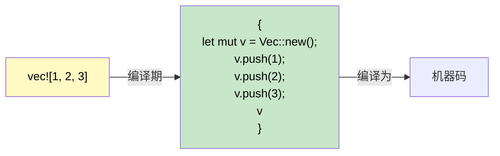

# 宏入门

<a id="macros-code-that-writes-code"></a>

## 宏：编写代码的代码

> **你将学到什么：** Rust 为什么需要宏（没有重载、没有可变参数），`macro_rules!` 基础，`!` 后缀约定，常见 derive 宏，以及用 `dbg!()` 快速调试。
>
> **难度：** 🟡 中级

C# 没有与 Rust 宏直接对应的功能。理解宏为什么存在、如何工作，可以消除 C# 开发者学习 Rust 时的一大困惑来源。

### Rust 为什么需要宏



```csharp
// C# 拥有一些让宏不那么必要的特性：
Console.WriteLine("Hello");           // 方法重载（1-16 个参数）
Console.WriteLine("{0}, {1}", a, b);  // 通过 params 数组实现可变参数
var list = new List<int> { 1, 2, 3 }; // 集合初始化器语法
```

```rust
// Rust 没有函数重载，没有可变参数，也没有这类特殊语法。
// 宏填补了这些空白：
println!("Hello");                    // 宏：编译期处理 0+ 个参数
println!("{}, {}", a, b);             // 宏：编译期检查格式字符串
let list = vec![1, 2, 3];            // 宏：展开为 Vec::new() + push()
```

### 识别宏：`!` 后缀

每次宏调用都以 `!` 结尾。如果你看到 `!`，那是宏，不是函数：

```rust
println!("hello");     // 宏：编译期生成格式化代码
format!("{x}");        // 宏：返回 String，编译期检查格式
vec![1, 2, 3];         // 宏：创建并填充 Vec
todo!();               // 宏：panic，并显示 "not yet implemented"
dbg!(expression);      // 宏：打印 file:line + 表达式 + 值，并返回该值
assert_eq!(a, b);      // 宏：如果 a ≠ b，panic 并显示差异
cfg!(target_os = "linux"); // 宏：编译期平台检测
```

### 使用 `macro_rules!` 编写简单宏

```rust
// 定义一个从键值对创建 HashMap 的宏
macro_rules! hashmap {
    // 模式：用逗号分隔的 key => value 对
    ( $( $key:expr => $value:expr ),* $(,)? ) => {{
        let mut map = std::collections::HashMap::new();
        $( map.insert($key, $value); )*
        map
    }};
}

fn main() {
    let scores = hashmap! {
        "Alice" => 100,
        "Bob"   => 85,
        "Carol" => 92,
    };
    println!("{scores:?}");
}
```

### Derive 宏：自动实现 trait

```rust
// #[derive] 是过程宏，会生成 trait 实现
#[derive(Debug, Clone, PartialEq, Eq, Hash)]
struct User {
    name: String,
    age: u32,
}
// 编译器会检查结构体字段，并自动生成 Debug::fmt、Clone::clone、PartialEq::eq 等实现。
```

```csharp
// C# 中没有完全等价物，你通常要手写 IEquatable、ICloneable 等。
// 或者使用 record：public record User(string Name, int Age);
// record 会自动生成 Equals、GetHashCode、ToString，思路类似！
```

### 常见 Derive 宏

| Derive | 用途 | C# 对应概念 |
|--------|---------|---------------|
| `Debug` | `{:?}` 格式化输出 | `ToString()` override |
| `Clone` | 通过 `.clone()` 深拷贝 | `ICloneable` |
| `Copy` | 隐式按位复制（不需要 `.clone()`） | 值类型（`struct`）语义 |
| `PartialEq`, `Eq` | `==` 比较 | `IEquatable<T>` |
| `PartialOrd`, `Ord` | `<`、`>` 比较与排序 | `IComparable<T>` |
| `Hash` | 为 `HashMap` key 提供哈希 | `GetHashCode()` |
| `Default` | 通过 `Default::default()` 获得默认值 | 无参构造函数 |
| `Serialize`, `Deserialize` | JSON/TOML 等（serde） | `[JsonProperty]` 属性 |

> **经验法则：** 每个类型先加 `#[derive(Debug)]`。需要时再加 `Clone`、`PartialEq`。任何跨边界的类型（API、文件、数据库）再加 `Serialize, Deserialize`。

### 过程宏与属性宏（了解即可）

derive 宏是**过程宏**的一种，也就是在编译期运行、生成代码的代码。你还会遇到另外两种形式：

**属性宏**，通过 `#[...]` 附加到条目上：

```rust
#[tokio::main]          // 把 main() 转换成异步运行时入口
async fn main() { }

#[test]                 // 标记一个函数为单元测试
fn it_works() { assert_eq!(2 + 2, 4); }

#[cfg(test)]            // 只在测试时条件编译这个模块
mod tests { /* ... */ }
```

**函数式宏**，看起来像函数调用：

```rust
// sqlx::query! 会在编译期根据数据库验证 SQL
let users = sqlx::query!("SELECT id, name FROM users WHERE active = $1", true)
    .fetch_all(&pool)
    .await?;
```

> **给 C# 开发者的关键洞察：** 你很少需要自己**编写**过程宏，它们是高级库作者工具。但你会不断**使用**它们（`#[derive(...)]`、`#[tokio::main]`、`#[test]`）。可以把它们想成 C# source generator：你受益于它们，但通常不需要亲自实现它们。

### 使用 `#[cfg]` 条件编译

Rust 的 `#[cfg]` 属性类似 C# 的 `#if DEBUG` 预处理指令，但会经过类型检查：

```rust
// 只在 Linux 上编译这个函数
#[cfg(target_os = "linux")]
fn platform_specific() {
    println!("Running on Linux");
}

// 只在 debug 模式下启用的断言（类似 C# Debug.Assert）
#[cfg(debug_assertions)]
fn expensive_check(data: &[u8]) {
    assert!(data.len() < 1_000_000, "data unexpectedly large");
}

// Feature flag（类似 C# #if FEATURE_X，但在 Cargo.toml 中声明）
#[cfg(feature = "json")]
pub fn to_json<T: Serialize>(val: &T) -> String {
    serde_json::to_string(val).unwrap()
}
```

```csharp
// C# 等价写法
#if DEBUG
    Debug.Assert(data.Length < 1_000_000);
#endif
```

### `dbg!()`：调试时的好朋友

```rust
fn calculate(x: i32) -> i32 {
    let intermediate = dbg!(x * 2);     // prints: [src/main.rs:3] x * 2 = 10
    let result = dbg!(intermediate + 1); // prints: [src/main.rs:4] intermediate + 1 = 11
    result
}
// dbg! 输出到 stderr，包含 file:line，并返回原值
// 调试时比 Console.WriteLine 更好用！
```

<details>
<summary><strong>🏋️ 练习：编写一个 min! 宏</strong>（点击展开）</summary>

**挑战：** 编写一个 `min!` 宏，接受 2 个或更多参数，并返回最小值。

```rust
// 应该像这样工作：
let smallest = min!(5, 3, 8, 1, 4); // → 1
let pair = min!(10, 20);             // → 10
```

<details>
<summary>🔑 参考答案</summary>

```rust
macro_rules! min {
    // 基本情况：单个值
    ($x:expr) => ($x);
    // 递归：把第一个值与剩余值的 min 进行比较
    ($x:expr, $($rest:expr),+) => {{
        let first = $x;
        let rest = min!($($rest),+);
        if first < rest { first } else { rest }
    }};
}

fn main() {
    assert_eq!(min!(5, 3, 8, 1, 4), 1);
    assert_eq!(min!(10, 20), 10);
    assert_eq!(min!(42), 42);
    println!("All assertions passed!");
}
```

**关键要点：** `macro_rules!` 使用 token tree 上的模式匹配，它有点像 `match`，只是匹配的是代码结构而不是运行时值。

</details>
</details>

***
