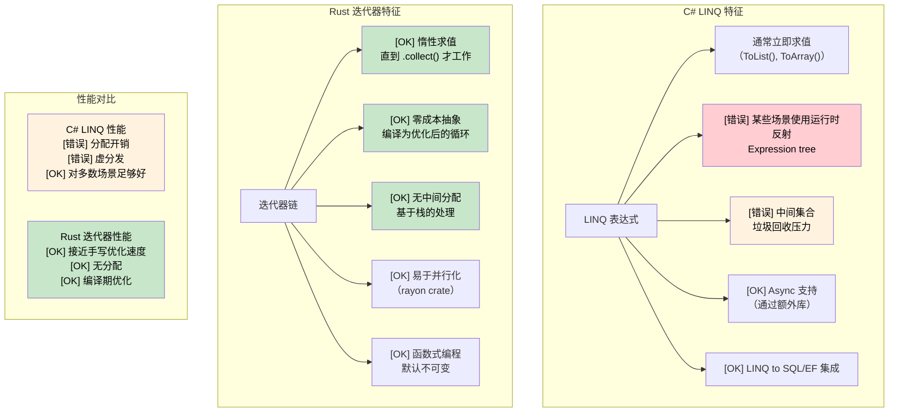

# 12. 闭包与迭代器

<a id="rust-closures"></a>

## Rust 闭包

> **你将学到什么：** 带所有权感知捕获的闭包（`Fn`/`FnMut`/`FnOnce`）与 C# lambda 的对比，Rust 迭代器如何以零成本抽象替代 LINQ，惰性求值与立即求值，以及使用 `rayon` 进行并行迭代。
>
> **难度：** 🟡 中级

Rust 闭包与 C# lambda 和 delegate 类似，但捕获外部变量时会受到所有权规则约束。

### C# Lambda 与 Delegate

```csharp
// C#：lambda 按引用捕获
Func<int, int> doubler = x => x * 2;
Action<string> printer = msg => Console.WriteLine(msg);

// 闭包捕获外部变量
int multiplier = 3;
Func<int, int> multiply = x => x * multiplier;
Console.WriteLine(multiply(5)); // 15

// LINQ 大量使用 lambda
var evens = numbers.Where(n => n % 2 == 0).ToList();
```

### Rust 闭包

```rust
// Rust 闭包：感知所有权
let doubler = |x: i32| x * 2;
let printer = |msg: &str| println!("{}", msg);

// 闭包默认按引用捕获（不可变捕获）
let multiplier = 3;
let multiply = |x: i32| x * multiplier; // 借用 multiplier
println!("{}", multiply(5)); // 15
println!("{}", multiplier); // 仍然可以访问

// 使用 move 捕获
let data = vec![1, 2, 3];
let owns_data = move || {
    println!("{:?}", data); // data 被移动进闭包
};
owns_data();
// println!("{:?}", data); // ERROR: data 已被移动

// 配合迭代器使用闭包
let numbers = vec![1, 2, 3, 4, 5];
let evens: Vec<&i32> = numbers.iter().filter(|&&n| n % 2 == 0).collect();
```

### 闭包类型

```rust
// Fn：不可变借用捕获值
fn apply_fn(f: impl Fn(i32) -> i32, x: i32) -> i32 {
    f(x)
}

// FnMut：可变借用捕获值
fn apply_fn_mut(mut f: impl FnMut(i32), values: &[i32]) {
    for &v in values {
        f(v);
    }
}

// FnOnce：取得捕获值的所有权
fn apply_fn_once(f: impl FnOnce() -> Vec<i32>) -> Vec<i32> {
    f() // 只能调用一次
}

fn main() {
    // Fn 示例
    let multiplier = 3;
    let result = apply_fn(|x| x * multiplier, 5);
    
    // FnMut 示例
    let mut sum = 0;
    apply_fn_mut(|x| sum += x, &[1, 2, 3, 4, 5]);
    println!("Sum: {}", sum); // 15
    
    // FnOnce 示例
    let data = vec![1, 2, 3];
    let result = apply_fn_once(move || data); // 移动 data
}
```

***

<a id="linq-vs-rust-iterators"></a>

## LINQ 与 Rust 迭代器

### C# LINQ（Language Integrated Query）

```csharp
// C# LINQ：声明式数据处理
var numbers = new[] { 1, 2, 3, 4, 5, 6, 7, 8, 9, 10 };

var result = numbers
    .Where(n => n % 2 == 0)           // 过滤偶数
    .Select(n => n * n)               // 平方
    .Where(n => n > 10)               // 过滤大于 10 的值
    .OrderByDescending(n => n)        // 降序排序
    .Take(3)                          // 取前 3 个
    .ToList();                        // 物化

// 处理复杂对象的 LINQ
var users = GetUsers();
var activeAdults = users
    .Where(u => u.IsActive && u.Age >= 18)
    .GroupBy(u => u.Department)
    .Select(g => new {
        Department = g.Key,
        Count = g.Count(),
        AverageAge = g.Average(u => u.Age)
    })
    .OrderBy(x => x.Department)
    .ToList();

// Async LINQ（需要额外库）
var results = await users
    .ToAsyncEnumerable()
    .WhereAwait(async u => await IsActiveAsync(u.Id))
    .SelectAwait(async u => await EnrichUserAsync(u))
    .ToListAsync();
```

### Rust 迭代器

```rust
// Rust 迭代器：惰性、零成本抽象
let numbers = vec![1, 2, 3, 4, 5, 6, 7, 8, 9, 10];

let result: Vec<i32> = numbers
    .iter()
    .filter(|&&n| n % 2 == 0)        // 过滤偶数
    .map(|&n| n * n)                 // 平方
    .filter(|&n| n > 10)             // 过滤大于 10 的值
    .collect::<Vec<_>>()             // 收集到 Vec
    .into_iter()
    .rev()                           // 反向迭代
    .take(3)                         // 取前 3 个
    .collect();                      // 物化

// 复杂迭代器链
use std::collections::HashMap;

#[derive(Debug, Clone)]
struct User {
    name: String,
    age: u32,
    department: String,
    is_active: bool,
}

fn process_users(users: Vec<User>) -> HashMap<String, (usize, f64)> {
    users
        .into_iter()
        .filter(|u| u.is_active && u.age >= 18)
        .fold(HashMap::new(), |mut acc, user| {
            let entry = acc.entry(user.department.clone()).or_insert((0, 0.0));
            entry.0 += 1;  // count
            entry.1 += user.age as f64;  // 年龄总和
            acc
        })
        .into_iter()
        .map(|(dept, (count, sum))| (dept, (count, sum / count as f64)))  // 平均值
        .collect()
}

// 使用 rayon 并行处理
use rayon::prelude::*;

fn parallel_processing(numbers: Vec<i32>) -> Vec<i32> {
    numbers
        .par_iter()                  // 并行迭代器
        .filter(|&&n| n % 2 == 0)
        .map(|&n| expensive_computation(n))
        .collect()
}

fn expensive_computation(n: i32) -> i32 {
    // 模拟重计算
    (0..1000).fold(n, |acc, _| acc + 1)
}
```



***


<details>
<summary><strong>🏋️ 练习：把 LINQ 翻译成迭代器</strong>（点击展开）</summary>

**挑战：** 把这个 C# LINQ 管道翻译成符合 Rust 惯用法的迭代器代码。

```csharp
// C#：翻译成 Rust
record Employee(string Name, string Dept, int Salary);

var result = employees
    .Where(e => e.Salary > 50_000)
    .GroupBy(e => e.Dept)
    .Select(g => new {
        Department = g.Key,
        Count = g.Count(),
        AvgSalary = g.Average(e => e.Salary)
    })
    .OrderByDescending(x => x.AvgSalary)
    .ToList();
```

<details>
<summary>🔑 参考答案</summary>

```rust
use std::collections::HashMap;

struct Employee { name: String, dept: String, salary: u32 }

#[derive(Debug)]
struct DeptStats { department: String, count: usize, avg_salary: f64 }

fn department_stats(employees: &[Employee]) -> Vec<DeptStats> {
    let mut by_dept: HashMap<&str, Vec<u32>> = HashMap::new();
    for e in employees.iter().filter(|e| e.salary > 50_000) {
        by_dept.entry(&e.dept).or_default().push(e.salary);
    }

    let mut stats: Vec<DeptStats> = by_dept
        .into_iter()
        .map(|(dept, salaries)| {
            let count = salaries.len();
            let avg = salaries.iter().sum::<u32>() as f64 / count as f64;
            DeptStats { department: dept.to_string(), count, avg_salary: avg }
        })
        .collect();

    stats.sort_by(|a, b| b.avg_salary.partial_cmp(&a.avg_salary).unwrap());
    stats
}
```

**关键要点：**

- Rust 迭代器没有内置 `group_by`，`HashMap` + `fold`/`for` 是惯用模式。
- `itertools` crate 添加了 `.group_by()`，语法更接近 LINQ。
- 迭代器链是零成本的，编译器会把它们优化成简单循环。

</details>
</details>


<!-- ch12.0a: itertools — LINQ Power Tools -->
## itertools：补齐 LINQ 常用操作

标准 Rust 迭代器覆盖了 `map`、`filter`、`fold`、`take` 和 `collect`。但习惯 C# `GroupBy`、`Zip`、`Chunk`、`SelectMany` 和 `Distinct` 的开发者会很快发现一些缺口。**`itertools`** crate 正是用来补齐这些能力的。

```toml
# Cargo.toml
[dependencies]
itertools = "0.12"
```

### 并排对照：LINQ 与 itertools

```csharp
// C#：GroupBy
var byDept = employees.GroupBy(e => e.Department)
    .Select(g => new { Dept = g.Key, Count = g.Count() });

// C#：Chunk（分批）
var batches = items.Chunk(100);  // IEnumerable<T[]>

// C#：Distinct / DistinctBy
var unique = users.DistinctBy(u => u.Email);

// C#：SelectMany（展开）
var allTags = posts.SelectMany(p => p.Tags);

// C#：Zip
var pairs = names.Zip(scores, (n, s) => new { Name = n, Score = s });

// C#：滑动窗口
var windows = data.Zip(data.Skip(1), data.Skip(2))
    .Select(triple => (triple.First + triple.Second + triple.Third) / 3.0);
```

```rust
use itertools::Itertools;

// Rust：group_by（要求输入已排序）
let by_dept = employees.iter()
    .sorted_by_key(|e| &e.department)
    .group_by(|e| &e.department);
for (dept, group) in &by_dept {
    println!("{}: {} employees", dept, group.count());
}

// Rust：chunks（分批）
let batches = items.iter().chunks(100);
for batch in &batches {
    process_batch(batch.collect::<Vec<_>>());
}

// Rust：unique / unique_by
let unique: Vec<_> = users.iter().unique_by(|u| &u.email).collect();

// Rust：flat_map（等价于 SelectMany，内置！）
let all_tags: Vec<&str> = posts.iter().flat_map(|p| &p.tags).collect();

// Rust：zip（内置！）
let pairs: Vec<_> = names.iter().zip(scores.iter()).collect();

// Rust：tuple_windows（滑动窗口）
let moving_avg: Vec<f64> = data.iter()
    .tuple_windows::<(_, _, _)>()
    .map(|(a, b, c)| (*a + *b + *c) as f64 / 3.0)
    .collect();
```

### itertools 速查

| LINQ 方法 | itertools 对应方法 | 说明 |
|------------|---------------------|-------|
| `GroupBy(key)` | `.sorted_by_key().group_by()` | 要求输入已排序（不同于 LINQ） |
| `Chunk(n)` | `.chunks(n)` | 返回迭代器的迭代器 |
| `Distinct()` | `.unique()` | 要求 `Eq + Hash` |
| `DistinctBy(key)` | `.unique_by(key)` | |
| `SelectMany()` | `.flat_map()` | 标准库内置，不需要 crate |
| `Zip()` | `.zip()` | 标准库内置 |
| `Aggregate()` | `.fold()` | 标准库内置 |
| `Any()` / `All()` | `.any()` / `.all()` | 标准库内置 |
| `First()` / `Last()` | `.next()` / `.last()` | 标准库内置 |
| `Skip(n)` / `Take(n)` | `.skip(n)` / `.take(n)` | 标准库内置 |
| `OrderBy()` | `.sorted()` / `.sorted_by()` | `itertools` 提供（std 没有） |
| `ThenBy()` | `.sorted_by(\|a,b\| a.x.cmp(&b.x).then(a.y.cmp(&b.y)))` | 链式 `Ordering::then` |
| `Intersect()` | `HashSet` intersection | 没有直接的迭代器方法 |
| `Concat()` | `.chain()` | 标准库内置 |
| 滑动窗口 | `.tuple_windows()` | 固定大小元组 |
| 笛卡尔积 | `.cartesian_product()` | `itertools` |
| 交错合并 | `.interleave()` | `itertools` |
| 排列 | `.permutations(k)` | `itertools` |

### 真实示例：日志分析管道

```rust
use itertools::Itertools;
use std::collections::HashMap;

#[derive(Debug)]
struct LogEntry { level: String, module: String, message: String }

fn analyze_logs(entries: &[LogEntry]) {
    // 最吵的前 5 个模块（类似 LINQ GroupBy + OrderByDescending + Take）
    let noisy: Vec<_> = entries.iter()
        .into_group_map_by(|e| &e.module) // itertools：直接分组到 HashMap
        .into_iter()
        .sorted_by(|a, b| b.1.len().cmp(&a.1.len()))
        .take(5)
        .collect();

    for (module, entries) in &noisy {
        println!("{}: {} entries", module, entries.len());
    }

    // 每 100 条日志一个窗口计算错误率（滑动窗口）
    let error_rates: Vec<f64> = entries.iter()
        .map(|e| if e.level == "ERROR" { 1.0 } else { 0.0 })
        .collect::<Vec<_>>()
        .windows(100)  // std slice 方法
        .map(|w| w.iter().sum::<f64>() / 100.0)
        .collect();

    // 对连续相同消息去重
    let deduped: Vec<_> = entries.iter().dedup_by(|a, b| a.message == b.message).collect();
    println!("Deduped {} → {} entries", entries.len(), deduped.len());
}
```

***
