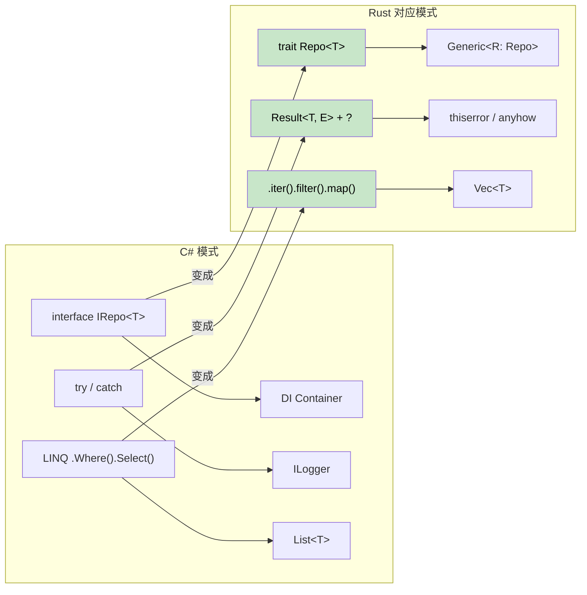

# 15. 迁移模式与案例研究

<a id="common-c-patterns-in-rust"></a>
## Rust 中常见的 C# 模式

> **你将学到什么：** 如何把 C# 中的 Repository Pattern（仓储模式）、Builder Pattern（构建器模式）、依赖注入、LINQ 链、Entity Framework 查询和配置模式翻译成符合 Rust 惯用法的写法。
>
> **难度：** 🟡 中级



### Repository Pattern（仓储模式）

```csharp
// C# Repository Pattern（仓储模式）
public interface IRepository<T> where T : IEntity
{
    Task<T> GetByIdAsync(int id);
    Task<IEnumerable<T>> GetAllAsync();
    Task<T> AddAsync(T entity);
    Task UpdateAsync(T entity);
    Task DeleteAsync(int id);
}

public class UserRepository : IRepository<User>
{
    private readonly DbContext _context;
    
    public UserRepository(DbContext context)
    {
        _context = context;
    }
    
    public async Task<User> GetByIdAsync(int id)
    {
        return await _context.Users.FindAsync(id);
    }
    
    // ... 其他实现
}
```

```rust
// Rust Repository Pattern（仓储模式）：使用 trait 和泛型
use async_trait::async_trait;
use std::fmt::Debug;

#[async_trait]
pub trait Repository<T, E> 
where 
    T: Clone + Debug + Send + Sync,
    E: std::error::Error + Send + Sync,
{
    async fn get_by_id(&self, id: u64) -> Result<Option<T>, E>;
    async fn get_all(&self) -> Result<Vec<T>, E>;
    async fn add(&self, entity: T) -> Result<T, E>;
    async fn update(&self, entity: T) -> Result<T, E>;
    async fn delete(&self, id: u64) -> Result<(), E>;
}

#[derive(Debug, Clone)]
pub struct User {
    pub id: u64,
    pub name: String,
    pub email: String,
}

#[derive(Debug)]
pub enum RepositoryError {
    NotFound(u64),
    DatabaseError(String),
    ValidationError(String),
}

impl std::fmt::Display for RepositoryError {
    fn fmt(&self, f: &mut std::fmt::Formatter<'_>) -> std::fmt::Result {
        match self {
            RepositoryError::NotFound(id) => write!(f, "Entity with id {} not found", id),
            RepositoryError::DatabaseError(msg) => write!(f, "Database error: {}", msg),
            RepositoryError::ValidationError(msg) => write!(f, "Validation error: {}", msg),
        }
    }
}

impl std::error::Error for RepositoryError {}

pub struct UserRepository {
    // 数据库连接池等资源
}

#[async_trait]
impl Repository<User, RepositoryError> for UserRepository {
    async fn get_by_id(&self, id: u64) -> Result<Option<User>, RepositoryError> {
        // 模拟数据库查询
        if id == 0 {
            return Ok(None);
        }
        
        Ok(Some(User {
            id,
            name: format!("User {}", id),
            email: format!("user{}@example.com", id),
        }))
    }
    
    async fn get_all(&self) -> Result<Vec<User>, RepositoryError> {
        // 在这里实现
        Ok(vec![])
    }
    
    async fn add(&self, entity: User) -> Result<User, RepositoryError> {
        // 验证并插入数据库
        if entity.name.is_empty() {
            return Err(RepositoryError::ValidationError("Name cannot be empty".to_string()));
        }
        Ok(entity)
    }
    
    async fn update(&self, entity: User) -> Result<User, RepositoryError> {
        // 在这里实现
        Ok(entity)
    }
    
    async fn delete(&self, id: u64) -> Result<(), RepositoryError> {
        // 在这里实现
        Ok(())
    }
}
```

### Builder Pattern（构建器模式）

```csharp
// C# Builder Pattern（流式接口）
public class HttpClientBuilder
{
    private TimeSpan? _timeout;
    private string _baseAddress;
    private Dictionary<string, string> _headers = new();
    
    public HttpClientBuilder WithTimeout(TimeSpan timeout)
    {
        _timeout = timeout;
        return this;
    }
    
    public HttpClientBuilder WithBaseAddress(string baseAddress)
    {
        _baseAddress = baseAddress;
        return this;
    }
    
    public HttpClientBuilder WithHeader(string name, string value)
    {
        _headers[name] = value;
        return this;
    }
    
    public HttpClient Build()
    {
        var client = new HttpClient();
        if (_timeout.HasValue)
            client.Timeout = _timeout.Value;
        if (!string.IsNullOrEmpty(_baseAddress))
            client.BaseAddress = new Uri(_baseAddress);
        foreach (var header in _headers)
            client.DefaultRequestHeaders.Add(header.Key, header.Value);
        return client;
    }
}

// 用法
var client = new HttpClientBuilder()
    .WithTimeout(TimeSpan.FromSeconds(30))
    .WithBaseAddress("https://api.example.com")
    .WithHeader("Accept", "application/json")
    .Build();
```

```rust
// Rust Builder Pattern（构建器模式）：消耗式构建器
use std::collections::HashMap;
use std::time::Duration;

#[derive(Debug)]
pub struct HttpClient {
    timeout: Duration,
    base_address: String,
    headers: HashMap<String, String>,
}

pub struct HttpClientBuilder {
    timeout: Option<Duration>,
    base_address: Option<String>,
    headers: HashMap<String, String>,
}

impl HttpClientBuilder {
    pub fn new() -> Self {
        HttpClientBuilder {
            timeout: None,
            base_address: None,
            headers: HashMap::new(),
        }
    }
    
    pub fn with_timeout(mut self, timeout: Duration) -> Self {
        self.timeout = Some(timeout);
        self
    }
    
    pub fn with_base_address<S: Into<String>>(mut self, base_address: S) -> Self {
        self.base_address = Some(base_address.into());
        self
    }
    
    pub fn with_header<K: Into<String>, V: Into<String>>(mut self, name: K, value: V) -> Self {
        self.headers.insert(name.into(), value.into());
        self
    }
    
    pub fn build(self) -> Result<HttpClient, String> {
        let base_address = self.base_address.ok_or("Base address is required")?;
        
        Ok(HttpClient {
            timeout: self.timeout.unwrap_or(Duration::from_secs(30)),
            base_address,
            headers: self.headers,
        })
    }
}

// 用法
let client = HttpClientBuilder::new()
    .with_timeout(Duration::from_secs(30))
    .with_base_address("https://api.example.com")
    .with_header("Accept", "application/json")
    .build()?;

// 另一种方式：为常见场景实现 Default trait
impl Default for HttpClientBuilder {
    fn default() -> Self {
        Self::new()
    }
}
```

***

## C# 到 Rust 概念映射

### 依赖注入 → 构造函数注入 + trait

```csharp
// C#：使用 DI container
services.AddScoped<IUserRepository, UserRepository>();
services.AddScoped<IUserService, UserService>();

public class UserService
{
    private readonly IUserRepository _repository;
    
    public UserService(IUserRepository repository)
    {
        _repository = repository;
    }
}
```

```rust
// Rust：使用 trait 做构造函数注入
pub trait UserRepository {
    async fn find_by_id(&self, id: Uuid) -> Result<Option<User>, Error>;
    async fn save(&self, user: &User) -> Result<(), Error>;
}

pub struct UserService<R> 
where 
    R: UserRepository,
{
    repository: R,
}

impl<R> UserService<R> 
where 
    R: UserRepository,
{
    pub fn new(repository: R) -> Self {
        Self { repository }
    }
    
    pub async fn get_user(&self, id: Uuid) -> Result<Option<User>, Error> {
        self.repository.find_by_id(id).await
    }
}

// 用法
let repository = PostgresUserRepository::new(pool);
let service = UserService::new(repository);
```

### LINQ → 迭代器链

```csharp
// C# LINQ
var result = users
    .Where(u => u.Age > 18)
    .Select(u => u.Name.ToUpper())
    .OrderBy(name => name)
    .Take(10)
    .ToList();
```

```rust
// Rust：迭代器链（零成本！）
let mut result: Vec<String> = users
    .iter()
    .filter(|u| u.age > 18)
    .map(|u| u.name.to_uppercase())
    .collect();
result.sort();
result.truncate(10);

// 或使用 itertools crate，写出更像 LINQ 的链式代码
use itertools::Itertools;

let result: Vec<String> = users
    .iter()
    .filter(|u| u.age > 18)
    .map(|u| u.name.to_uppercase())
    .sorted()
    .take(10)
    .collect();
```

### Entity Framework → SQLx + Migration

```csharp
// C# Entity Framework
public class ApplicationDbContext : DbContext
{
    public DbSet<User> Users { get; set; }
}

var user = await context.Users
    .Where(u => u.Email == email)
    .FirstOrDefaultAsync();
```

```rust
// Rust：SQLx 与编译期检查查询
use sqlx::{PgPool, FromRow};

#[derive(FromRow)]
struct User {
    id: Uuid,
    email: String,
    name: String,
}

// 编译期检查查询
let user = sqlx::query_as!(
    User,
    "SELECT id, email, name FROM users WHERE email = $1",
    email
)
.fetch_optional(&pool)
.await?;

// 或使用动态查询
let user = sqlx::query_as::<_, User>(
    "SELECT id, email, name FROM users WHERE email = $1"
)
.bind(email)
.fetch_optional(&pool)
.await?;
```

### Configuration → Config crate

```csharp
// C# Configuration
public class AppSettings
{
    public string DatabaseUrl { get; set; }
    public int Port { get; set; }
}

var config = builder.Configuration.Get<AppSettings>();
```

```rust
// Rust：使用 serde 做配置
use config::{Config, ConfigError, Environment, File};
use serde::Deserialize;

#[derive(Debug, Deserialize)]
struct AppSettings {
    database_url: String,
    port: u16,
}

impl AppSettings {
    pub fn new() -> Result<Self, ConfigError> {
        let s = Config::builder()
            .add_source(File::with_name("config/default"))
            .add_source(Environment::with_prefix("APP"))
            .build()?;

        s.try_deserialize()
    }
}

// 用法
let settings = AppSettings::new()?;
```

---

## 案例研究

### 案例研究 1：CLI 工具迁移（csvtool）

**背景：** 一个团队维护着一个 C# 控制台应用（`CsvProcessor`），它读取大型 CSV 文件，应用转换，然后写出结果。当文件达到 500 MB 时，内存使用会飙升到 4 GB，GC 暂停会造成 30 秒停顿。

**迁移方式：** 用 2 周时间重写为 Rust，一次迁移一个模块。

| 步骤 | 变化内容 | C# → Rust |
|------|-------------|-----------|
| 1 | CSV 解析 | `CsvHelper` → `csv` crate（流式 `Reader`） |
| 2 | 数据模型 | `class Record` → `struct Record`（栈分配，`#[derive(Deserialize)]`） |
| 3 | 转换 | LINQ `.Select().Where()` → `.iter().map().filter()` |
| 4 | 文件 I/O | `StreamReader` → `BufReader<File>` + `?` 错误传播 |
| 5 | CLI 参数 | `System.CommandLine` → 带 derive 宏的 `clap` |
| 6 | 并行处理 | `Parallel.ForEach` → `rayon` 的 `.par_iter()` |

**结果：**

- 内存：4 GB → 12 MB（流式处理，而不是加载整个文件）。
- 速度：处理 500 MB 文件从 45s → 3s。
- 二进制大小：单个 2 MB 可执行文件，无 runtime 依赖。

**关键经验：** 最大收益并不是“Rust 本身更快”，而是 Rust 的所有权模型**迫使**设计走向流式处理。在 C# 中，很容易随手 `.ToList()` 把所有数据装进内存。在 Rust 中，借用检查器会自然把你引向基于 `Iterator` 的处理方式。

### 案例研究 2：微服务替换（auth-gateway）

**背景：** 一个 C# ASP.NET Core 认证网关为 50+ 后端服务处理 JWT 验证和限流。在 10K req/s 时，p99 延迟达到 200ms，并伴随 GC 尖峰。

**迁移方式：** 使用 `axum` + `tower` 替换为 Rust 服务，同时保持 API 契约完全一致。

```rust
// 之前（C#）：services.AddAuthentication().AddJwtBearer(...)
// 之后（Rust）：tower middleware layer

use axum::{Router, middleware};
use tower::ServiceBuilder;

let app = Router::new()
    .route("/api/*path", any(proxy_handler))
    .layer(
        ServiceBuilder::new()
            .layer(middleware::from_fn(validate_jwt))
            .layer(middleware::from_fn(rate_limit))
    );
```

| 指标 | C# (ASP.NET Core) | Rust (axum) |
|--------|-------------------|-------------|
| p50 延迟 | 5ms | 0.8ms |
| p99 延迟 | 200ms（GC 尖峰） | 4ms |
| 内存 | 300 MB | 8 MB |
| Docker 镜像 | 210 MB（.NET runtime） | 12 MB（静态二进制） |
| 冷启动 | 2.1s | 0.05s |

**关键经验：**

1. **保持相同 API 契约**：不需要客户端变更。Rust 服务可以直接替换原服务。
2. **从热点路径开始**：JWT 验证是瓶颈。只迁移这一段 middleware 就可以拿到 80% 的收益。
3. **使用 `tower` middleware**：它对应 ASP.NET Core 的 middleware pipeline 模式，C# 开发者会觉得架构熟悉。
4. **p99 延迟改善**主要来自消除 GC 暂停，而不是代码本身快了很多。Rust 的稳定吞吐只快了大约 2 倍，但没有 GC 让尾延迟变得可预测。

---

## 练习

<details>
<summary><strong>🏋️ 练习：迁移一个 C# Service</strong>（点击展开）</summary>

把下面这个 C# service 翻译成符合 Rust 惯用法的代码：

```csharp
public interface IUserService
{
    Task<User?> GetByIdAsync(int id);
    Task<List<User>> SearchAsync(string query);
}

public class UserService : IUserService
{
    private readonly IDatabase _db;
    public UserService(IDatabase db) { _db = db; }

    public async Task<User?> GetByIdAsync(int id)
    {
        try { return await _db.QuerySingleAsync<User>(id); }
        catch (NotFoundException) { return null; }
    }

    public async Task<List<User>> SearchAsync(string query)
    {
        return await _db.QueryAsync<User>($"SELECT * WHERE name LIKE '%{query}%'");
    }
}
```

**提示：** 使用 trait，用 `Option<User>` 替代 null，用 `Result` 替代 try/catch，并修复 SQL 注入漏洞。

<details>
<summary>🔑 参考答案</summary>

```rust
use async_trait::async_trait;

#[derive(Debug, Clone)]
struct User { id: i64, name: String }

#[async_trait]
trait Database: Send + Sync {
    async fn get_user(&self, id: i64) -> Result<Option<User>, sqlx::Error>;
    async fn search_users(&self, query: &str) -> Result<Vec<User>, sqlx::Error>;
}

#[async_trait]
trait UserService: Send + Sync {
    async fn get_by_id(&self, id: i64) -> Result<Option<User>, AppError>;
    async fn search(&self, query: &str) -> Result<Vec<User>, AppError>;
}

struct UserServiceImpl<D: Database> {
    db: D,  // 不需要 Arc，Rust 的所有权会处理
}

#[async_trait]
impl<D: Database> UserService for UserServiceImpl<D> {
    async fn get_by_id(&self, id: i64) -> Result<Option<User>, AppError> {
        // Option 替代 null；Result 替代 try/catch
        Ok(self.db.get_user(id).await?)
    }

    async fn search(&self, query: &str) -> Result<Vec<User>, AppError> {
        // 参数化查询：没有 SQL 注入！
        // sqlx 使用 $1 占位符，而不是字符串插值
        self.db.search_users(query).await.map_err(Into::into)
    }
}
```

**相对 C# 的关键变化：**

- `null` → `Option<User>`（编译期空值安全）。
- `try/catch` → `Result` + `?`（显式错误传播）。
- 修复 SQL 注入：使用参数化查询，而不是字符串插值。
- `IDatabase _db` → 泛型 `D: Database`（静态分发，无需装箱）。

</details>
</details># 15. 迁移模式与案例研究
