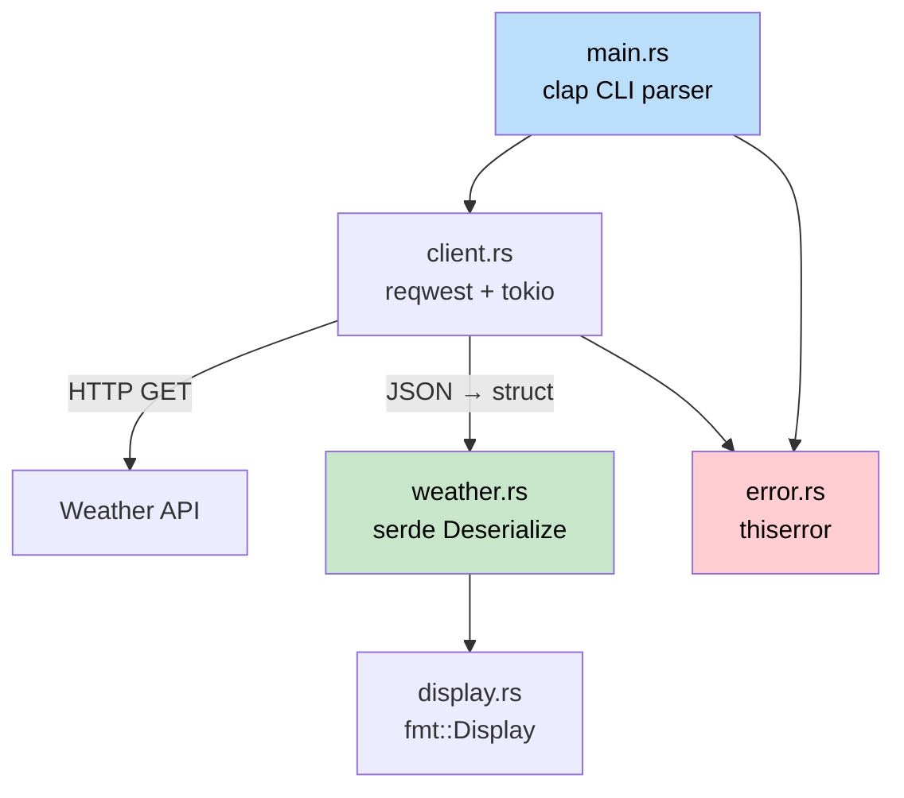

<a id="capstone-project-build-a-cli-weather-tool"></a>
## 综合项目：构建一个 CLI 天气工具

> **你将学到什么：** 如何把整本书的内容组合起来：struct、trait、错误处理、async、模块、serde 和 CLI 参数解析，构建一个可工作的 Rust 应用。这个项目对应 C# 开发者会用 `HttpClient`、`System.Text.Json` 和 `System.CommandLine` 构建的那类工具。
>
> **难度：** 🟡 中级

本综合项目会把全书各部分的概念串起来。你将构建 `weather-cli`：一个从 API 获取天气数据并显示结果的命令行工具。项目会组织成一个小型 crate，包含合理的模块布局、错误类型和测试。

### 项目概览



**你将构建：**

```
$ weather-cli --city "Seattle"
🌧  Seattle: 12°C, Overcast clouds
    Humidity: 82%  Wind: 5.4 m/s
```

**将练习到的概念：**

| 书中章节 | 本项目用到的概念 |
|---|---|
| Ch05（Struct） | `WeatherReport`、`Config` 数据类型 |
| Ch08（模块） | `src/lib.rs`、`src/client.rs`、`src/display.rs` |
| Ch09（错误） | 使用 `thiserror` 的自定义 `WeatherError` |
| Ch10（Trait） | 用 `Display` impl 做格式化输出 |
| Ch11（From/Into） | 通过 `serde` 做 JSON 反序列化 |
| Ch12（迭代器） | 处理 API 响应数组 |
| Ch13（Async） | 使用 `reqwest` + `tokio` 进行 HTTP 调用 |
| Ch14-1（测试） | 单元测试 + 集成测试 |

---

### 步骤 1：项目设置

```bash
cargo new weather-cli
cd weather-cli
```

把依赖添加到 `Cargo.toml`：

```toml
[package]
name = "weather-cli"
version = "0.1.0"
edition = "2021"

[dependencies]
clap = { version = "4", features = ["derive"] }   # CLI 参数（类似 System.CommandLine）
reqwest = { version = "0.12", features = ["json"] } # HTTP 客户端（类似 HttpClient）
serde = { version = "1", features = ["derive"] }    # 序列化（类似 System.Text.Json）
serde_json = "1"
thiserror = "2"                                      # 错误类型
tokio = { version = "1", features = ["full"] }       # 异步运行时
```

```csharp
// C# 等价依赖：
// dotnet add package System.CommandLine
// dotnet add package System.Net.Http.Json
// （System.Text.Json 和 HttpClient 是内置的）
```

### 步骤 2：定义数据类型

创建 `src/weather.rs`：

```rust
use serde::Deserialize;

/// 原始 API 响应（匹配 JSON 形状）
#[derive(Deserialize, Debug)]
pub struct ApiResponse {
    pub main: MainData,
    pub weather: Vec<WeatherCondition>,
    pub wind: WindData,
    pub name: String,
}

#[derive(Deserialize, Debug)]
pub struct MainData {
    pub temp: f64,
    pub humidity: u32,
}

#[derive(Deserialize, Debug)]
pub struct WeatherCondition {
    pub description: String,
    pub icon: String,
}

#[derive(Deserialize, Debug)]
pub struct WindData {
    pub speed: f64,
}

/// 我们自己的领域类型（干净，并与 API 解耦）
#[derive(Debug, Clone)]
pub struct WeatherReport {
    pub city: String,
    pub temp_celsius: f64,
    pub description: String,
    pub humidity: u32,
    pub wind_speed: f64,
}

impl From<ApiResponse> for WeatherReport {
    fn from(api: ApiResponse) -> Self {
        let description = api.weather
            .first()
            .map(|w| w.description.clone())
            .unwrap_or_else(|| "Unknown".to_string());

        WeatherReport {
            city: api.name,
            temp_celsius: api.main.temp,
            description,
            humidity: api.main.humidity,
            wind_speed: api.wind.speed,
        }
    }
}
```

```csharp
// C# 等价写法：
// public record ApiResponse(MainData Main, List<WeatherCondition> Weather, ...);
// public record WeatherReport(string City, double TempCelsius, ...);
// 手动映射或使用 AutoMapper
```

**关键差异：** `#[derive(Deserialize)]` + `From` impl 替代了 C# 的 `JsonSerializer.Deserialize<T>()` + AutoMapper。两者在 Rust 中都发生在编译期，不依赖反射。

### 步骤 3：错误类型

创建 `src/error.rs`：

```rust
use thiserror::Error;

#[derive(Error, Debug)]
pub enum WeatherError {
    #[error("HTTP request failed: {0}")]
    Http(#[from] reqwest::Error),

    #[error("City not found: {0}")]
    CityNotFound(String),

    #[error("API key not set — export WEATHER_API_KEY")]
    MissingApiKey,
}

pub type Result<T> = std::result::Result<T, WeatherError>;
```

### 步骤 4：HTTP 客户端

创建 `src/client.rs`：

```rust
use crate::error::{WeatherError, Result};
use crate::weather::{ApiResponse, WeatherReport};

pub struct WeatherClient {
    api_key: String,
    http: reqwest::Client,
}

impl WeatherClient {
    pub fn new(api_key: String) -> Self {
        WeatherClient {
            api_key,
            http: reqwest::Client::new(),
        }
    }

    pub async fn get_weather(&self, city: &str) -> Result<WeatherReport> {
        let url = format!(
            "https://api.openweathermap.org/data/2.5/weather?q={}&appid={}&units=metric",
            city, self.api_key
        );

        let response = self.http.get(&url).send().await?;

        if response.status() == reqwest::StatusCode::NOT_FOUND {
            return Err(WeatherError::CityNotFound(city.to_string()));
        }

        let api_data: ApiResponse = response.json().await?;
        Ok(WeatherReport::from(api_data))
    }
}
```

```csharp
// C# 等价写法：
// var response = await _httpClient.GetAsync(url);
// if (response.StatusCode == HttpStatusCode.NotFound)
//     throw new CityNotFoundException(city);
// var data = await response.Content.ReadFromJsonAsync<ApiResponse>();
```

**关键差异：**

- `?` 运算符替代 `try/catch`：错误会通过 `Result` 自动传播。
- `WeatherReport::from(api_data)` 使用 `From` trait，而不是 AutoMapper。
- 不需要 `IHttpClientFactory`：`reqwest::Client` 内部会处理连接池。

### 步骤 5：显示格式化

创建 `src/display.rs`：

```rust
use std::fmt;
use crate::weather::WeatherReport;

impl fmt::Display for WeatherReport {
    fn fmt(&self, f: &mut fmt::Formatter<'_>) -> fmt::Result {
        let icon = weather_icon(&self.description);
        writeln!(f, "{}  {}: {:.0}°C, {}",
            icon, self.city, self.temp_celsius, self.description)?;
        write!(f, "    Humidity: {}%  Wind: {:.1} m/s",
            self.humidity, self.wind_speed)
    }
}

fn weather_icon(description: &str) -> &str {
    let desc = description.to_lowercase();
    if desc.contains("clear") { "☀️" }
    else if desc.contains("cloud") { "☁️" }
    else if desc.contains("rain") || desc.contains("drizzle") { "🌧" }
    else if desc.contains("snow") { "❄️" }
    else if desc.contains("thunder") { "⛈" }
    else { "🌡" }
}
```

### 步骤 6：把所有部分连接起来

`src/lib.rs`：

```rust
pub mod client;
pub mod display;
pub mod error;
pub mod weather;
```

`src/main.rs`：

```rust
use clap::Parser;
use weather_cli::{client::WeatherClient, error::WeatherError};

#[derive(Parser)]
#[command(name = "weather-cli", about = "从命令行获取天气数据")]
struct Cli {
    /// 要查询的城市名
    #[arg(short, long)]
    city: String,
}

#[tokio::main]
async fn main() {
    let cli = Cli::parse();

    let api_key = match std::env::var("WEATHER_API_KEY") {
        Ok(key) => key,
        Err(_) => {
            eprintln!("Error: {}", WeatherError::MissingApiKey);
            std::process::exit(1);
        }
    };

    let client = WeatherClient::new(api_key);

    match client.get_weather(&cli.city).await {
        Ok(report) => println!("{report}"),
        Err(WeatherError::CityNotFound(city)) => {
            eprintln!("City not found: {city}");
            std::process::exit(1);
        }
        Err(e) => {
            eprintln!("Error: {e}");
            std::process::exit(1);
        }
    }
}
```

### 步骤 7：测试

```rust
// 位于 src/weather.rs 或 tests/weather_test.rs
#[cfg(test)]
mod tests {
    use super::*;

    fn sample_api_response() -> ApiResponse {
        serde_json::from_str(r#"{
            "main": {"temp": 12.3, "humidity": 82},
            "weather": [{"description": "overcast clouds", "icon": "04d"}],
            "wind": {"speed": 5.4},
            "name": "Seattle"
        }"#).unwrap()
    }

    #[test]
    fn api_response_to_weather_report() {
        let report = WeatherReport::from(sample_api_response());
        assert_eq!(report.city, "Seattle");
        assert!((report.temp_celsius - 12.3).abs() < 0.01);
        assert_eq!(report.description, "overcast clouds");
    }

    #[test]
    fn display_format_includes_icon() {
        let report = WeatherReport {
            city: "Test".into(),
            temp_celsius: 20.0,
            description: "clear sky".into(),
            humidity: 50,
            wind_speed: 3.0,
        };
        let output = format!("{report}");
        assert!(output.contains("☀️"));
        assert!(output.contains("20°C"));
    }

    #[test]
    fn empty_weather_array_defaults_to_unknown() {
        let json = r#"{
            "main": {"temp": 0.0, "humidity": 0},
            "weather": [],
            "wind": {"speed": 0.0},
            "name": "Nowhere"
        }"#;
        let api: ApiResponse = serde_json::from_str(json).unwrap();
        let report = WeatherReport::from(api);
        assert_eq!(report.description, "Unknown");
    }
}
```

---

### 最终文件布局

```
weather-cli/
├── Cargo.toml
├── src/
│   ├── main.rs        # CLI 入口点（clap）
│   ├── lib.rs         # 模块声明
│   ├── client.rs      # HTTP 客户端（reqwest + tokio）
│   ├── weather.rs     # 数据类型 + From impl + 测试
│   ├── display.rs     # Display 格式化
│   └── error.rs       # WeatherError + Result 别名
└── tests/
    └── integration.rs # 集成测试
```

与 C# 等价结构对比：

```
WeatherCli/
├── WeatherCli.csproj
├── Program.cs
├── Services/
│   └── WeatherClient.cs
├── Models/
│   ├── ApiResponse.cs
│   └── WeatherReport.cs
└── Tests/
    └── WeatherTests.cs
```

**Rust 版本在结构上非常相似。** 主要差异是：

- 使用 `mod` 声明，而不是 namespace。
- 使用 `Result<T, E>`，而不是异常。
- 使用 `From` trait，而不是 AutoMapper。
- 显式使用 `#[tokio::main]`，而不是内置异步运行时。

### 加分：集成测试桩

创建 `tests/integration.rs`，在不访问真实服务器的情况下测试公共 API：

```rust
// tests/integration.rs
use weather_cli::weather::WeatherReport;

#[test]
fn weather_report_display_roundtrip() {
    let report = WeatherReport {
        city: "Seattle".into(),
        temp_celsius: 12.3,
        description: "overcast clouds".into(),
        humidity: 82,
        wind_speed: 5.4,
    };

    let output = format!("{report}");
    assert!(output.contains("Seattle"));
    assert!(output.contains("12°C"));
    assert!(output.contains("82%"));
}
```

用 `cargo test` 运行测试：Rust 会自动发现 `src/` 中的测试（`#[cfg(test)]` 模块）和 `tests/` 中的集成测试。不需要配置测试框架。可以和 C# 中设置 xUnit/NUnit 的流程对比一下。

---

### 扩展挑战

项目跑通后，尝试这些任务来加深技能：

1. **添加缓存**：把上一次 API 响应存到文件中。启动时检查它是否小于 10 分钟，若是则跳过 HTTP 调用。这个练习会用到 `std::fs`、`serde_json::to_writer` 和 `SystemTime`。

2. **添加多个城市**：接受 `--city "Seattle,Portland,Vancouver"`，并用 `tokio::join!` 并发获取所有城市天气。这个练习会训练并发 async。

3. **添加 `--format json` 标志**：使用 `serde_json::to_string_pretty` 输出 JSON，而不是人类可读文本。这个练习会训练条件格式化和 `Serialize`。

4. **编写集成测试**：创建 `tests/integration.rs`，用 `wiremock` 模拟 HTTP 服务器，测试完整流程。这个练习会用到 ch14-1 中介绍的 `tests/` 目录模式。# 17. 综合项目：构建 CLI 天气工具
